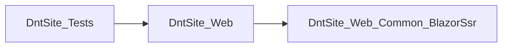

# DevContext -. NET Project Analysis
*Generated*: 2026-05-31 00: 42: 20
*Profile*: Depth=Balanced, Focus=Feature
*Token-Compact*: ON

# Solution Overview
*Root*: C: \code\DevContext\experiments\DntSite
*Tot. csproj*: 3
*Frameworks*: net10. 0
*Type*: Library/App

# Dependency Graph

# Code Structure
*Files*: 106. cs
_Showing only files near the provided entry point(s) for targeted context. _
*src\DntSite. Web\Features\UserProfiles\Components*: Activation. razor. cs, ChangePassword. razor. cs, ChangeUserPassword. razor. cs, EditProfileOptions. razor. cs, EditUserProfile. razor. cs. . . (+17)
*src\DntSite. Web\Features\UserProfiles\EfConfig*: RoleConfig. cs, UserConfig. cs, UserProfileBookmarkConfig. cs, UserProfileCommentBookmarkConfig. cs, UserProfileCommentConfig. cs. . . (+7)
*src\DntSite. Web\Features\UserProfiles\Endpoints*: ChangePasswordEndpoint. cs
*src\DntSite. Web\Features\UserProfiles\Entities*: Role. cs, User. cs, UserProfileBookmark. cs, UserProfileComment. cs, UserProfileCommentBookmark. cs. . . (+9)
*src\DntSite. Web\Features\UserProfiles\Models*: AccountModel. cs, ActivatedAccountModel. cs, ActivationEmailModel. cs, AdminAction. cs, BaseCaptchaModel. cs. . . (+24)
*src\DntSite. Web\Features\UserProfiles\ModelsMappings*: UserMappersExtensions. cs
*src\DntSite. Web\Features\UserProfiles\RoutingConstants*: UserProfilesBreadCrumbs. cs, UserProfilesRoutingConstants. cs
*src\DntSite. Web\Features\UserProfiles\ScheduledTasks*: DailyBirthDatesEmailJob. cs, DisableInactiveUsersJob. cs, NewPersianYearEmailsJob. cs, SendActivationEmailsJob. cs
*src\DntSite. Web\Features\UserProfiles\Services*: AdminsEmailsService. cs, CookieValidatorService. cs, CurrentUserService. cs, DeviceDetectionService. cs, HumansTxtFileService. cs. . . (+6)
*src\DntSite. Web\Features\UserProfiles\Services\Contracts*: IAdminsEmailsService. cs, ICookieValidatorService. cs, ICurrentUserService. cs, IDeviceDetectionService. cs, IHumansTxtFileService. cs. . . (+5)

### tests\DntSite. Tests\RaviAiParserTests. cs
pub void ParseSuccessRecordWellFormedShouldSucceed() ; pub void ParseSuccessRecordWithShuffledOrderShouldWork() ; pub void ParseFallbackRecordShouldMapEnumCorrectly() ; pub void AutoRepairShouldFixStatusWithoutColon() ; pub void TagsShouldHandleBracketsAndExtraSpaces() ; pub void MissingOptionalFieldsShouldNotThrow() ; pub void NoiseBeforeRecordShouldBeIgnored() ; pub void ParsedValuesShouldNotContainRecordMarkers() ; pub void ParseSuccessRecordWithRealDataShouldSucceed()

### src\DntSite. Web. Common. BlazorSsr\Components\DntAlert. razor. cs
pub void HideAlert() ; pub void ShowAlert(AlertType, str? , str? )

### src\DntSite. Web. Common. BlazorSsr\Components\DntCacheComponent. razor. cs
pub void InvalidateCache()

### src\DntSite. Web. Common. BlazorSsr\Extensions\DntQueryBuilderExtensions. cs
pub stat str ToGridifyFilter(IL<DntQueryBuilderSearchRule<TRecord>>? )

### src\DntSite. Web. Common. BlazorSsr\Models\BreadCrumb. cs
pub new bool Equals(obj? , obj? ) ; pub int GetHashCode(obj? ) ; pub bool Equals(BreadCrumb? , BreadCrumb? ) ; pub int GetHashCode(BreadCrumb)

### src\DntSite. Web. Common. BlazorSsr\Models\ButtonType. cs
pub new bool Equals(obj? , obj? ) ; pub int GetHashCode(obj? ) ; pub bool Equals(ButtonType? , ButtonType? ) ; pub int GetHashCode(ButtonType)

### src\DntSite. Web\Features\ServicesConfigs\AuthenticationConfig. cs
pub stat ISC AddCustomizedAuthentication(ISC, StartupSettingsModel, IWebHostEnvironment)

### src\DntSite. Web\Features\ServicesConfigs\DataProtectionConfig. cs
pub stat ISC AddCustomizedDataProtection(ISC, StartupSettingsModel)

### src\DntSite. Web\Features\ServicesConfigs\DbContextConfig. cs
pub stat ISC AddConfiguredDbContext(ISC, StartupSettingsModel, IWebHostEnvironment) ; pub stat void AddEfCoreInterceptors(ISC, IWebHostEnvironment)

### src\DntSite. Web\Features\ServicesConfigs\MvcControllersConfig. cs
pub stat IMvcBuilder AddCustomizedControllers(ISC)

### src\DntSite. Web\Features\ServicesConfigs\SchedulersConfig. cs
pub stat void AddSchedulers(ISC)

### src\DntSite. Web\Features\ServicesConfigs\ServicesRegistry. cs
pub stat void AddCustomizedServices(ISC, IHB, ICfg, IWebHostEnvironment)

### src\DntSite. Web\Features\Advertisements\EfConfig\AdvertisementBookmarkConfig. cs
pub void Configure(EntityTypeBuilder<AdvertisementBookmark>)

### src\DntSite. Web\Features\Advertisements\EfConfig\AdvertisementCommentBookmarkConfig. cs
pub void Configure(EntityTypeBuilder<AdvertisementCommentBookmark>)

### src\DntSite. Web\Features\Advertisements\EfConfig\AdvertisementCommentConfig. cs
pub void Configure(EntityTypeBuilder<AdvertisementComment>)

### src\DntSite. Web\Features\Advertisements\EfConfig\AdvertisementCommentReactionConfig. cs
pub void Configure(EntityTypeBuilder<AdvertisementCommentReaction>)

### src\DntSite. Web\Features\Advertisements\EfConfig\AdvertisementCommentVisitorConfig. cs
pub void Configure(EntityTypeBuilder<AdvertisementCommentVisitor>)

### src\DntSite. Web\Features\Advertisements\EfConfig\AdvertisementConfig. cs
pub void Configure(EntityTypeBuilder<Advertisement>)

### src\DntSite. Web\Features\Advertisements\EfConfig\AdvertisementReactionConfig. cs
pub void Configure(EntityTypeBuilder<AdvertisementReaction>)

### src\DntSite. Web\Features\Advertisements\EfConfig\AdvertisementTagConfig. cs
pub void Configure(EntityTypeBuilder<AdvertisementTag>)

### src\DntSite. Web\Features\Advertisements\EfConfig\AdvertisementUserFileConfig. cs
pub void Configure(EntityTypeBuilder<AdvertisementUserFile>)

### src\DntSite. Web\Features\Advertisements\EfConfig\AdvertisementUserFileVisitorConfig. cs
pub void Configure(EntityTypeBuilder<AdvertisementUserFileVisitor>)

### src\DntSite. Web\Features\Advertisements\EfConfig\AdvertisementVisitorConfig. cs
pub void Configure(EntityTypeBuilder<AdvertisementVisitor>)

### src\DntSite. Web\Features\Advertisements\ModelsMappings\AdvertisementsMappersExtensions. cs
pub stat WhatsNewItemModel MapToWhatsNewItemModel(Advertisement, str, bool) ; pub stat WhatsNewItemModel MapToWhatsNewItemModel(AdvertisementComment, str, bool) ; pub stat Advertisement MapWriteAdvertisementModelToAdvertisement(WriteAdvertisementModel, IAppAntiXssService, Advertisement? ) ; pub stat WriteAdvertisementModel MapAdvertisementToWriteAdvertisementModel(Advertisement)

### src\DntSite. Web\Features\Advertisements\Services\AdvertisementCommentsService. cs
pub VT<AdvertisementComment? >FindAdvertisementCommentAsync(int) ; pub T<AdvertisementComment? >FindAdvertisementCommentIncludeParentAsync(int) ; pub async T<L<AdvertisementComment>>GetRootCommentsOfAdvertisementAsync(int, int, bool) ; pub T<L<AdvertisementComment>>GetLastPagedAdvertisementCommentsAsNoTrackingAsync(int, int, bool) ; pub T<L<AdvertisementComment>>GetLastPagedDeletedAdvertisementCommentsAsNoTrackingAsync(int, int) ; pub T<bool>SaveRatingAsync(int, ReactionType, int? ) ; pub async T MarkAllOfAdvertisementCommentsAsDeletedAsync(int) ; pub AdvertisementComment AddAdvertisementComment(AdvertisementComment) ; pub T<PagedResultModel<AdvertisementComment>>GetPagedLastAdvertisementCommentsIncludeBlogPostAndUserAsync(int, int, bool, PagerSortBy, bool) ; pub T<PagedResultModel<AdvertisementComment>>GetLastPagedAdvertisementsCommentsAsync(str, int, int, bool, PagerSortBy, bool) ; pub async T DeleteCommentAsync(int? ) ; pub async T EditReplyAsync(int? , str) ; pub async T AddReplyAsync(int? , int, str, int) ; pub async T IndexAdvertisementCommentsAsync()

### src\DntSite. Web\Features\Advertisements\Services\AdvertisementsEmailsService. cs
pub T AddAdvertisementSendEmailAsync(Advertisement) ; pub T AdvertisementCommentSendEmailToAdminsAsync(AdvertisementComment) ; pub async T AdvertisementCommentSendEmailToPersonAsync(AdvertisementComment) ; pub async T AdvertisementCommentSendEmailToWritersAsync(AdvertisementComment)

### src\DntSite. Web\Features\Advertisements\Services\AdvertisementsService. cs
pub VT<Advertisement? >FindAdvertisementAsync(int) ; pub T<L<Advertisement>>GetDeletedAnnouncementsListAsync(int, int) ; pub T<bool>SaveRatingAsync(int, ReactionType, int? ) ; pub async T UpdateNumberOfAdvertisementViewsAsync(Advertisement? , bool) ; pub async T UpdateNumberOfAdvertisementViewsAsync(int, bool) ; pub T<PagedResultModel<Advertisement>>GetAllUserAdvertisementsAsync(int, int, int, PagerSortBy, bool) ; pub async T<Advertisement? >AddAdvertisementAsync(WriteAdvertisementModel, User? ) ; pub async T MarkAsDeletedAsync(Advertisement? ) ; pub async T<Advertisement>SaveAdvertisementAsync(Advertisement, IL<AdvertisementTag>, bool) ; pub T<Advertisement? >GetAdvertisementAsync(int, bool) ; pub async T<AdvertisementModel>GetAdvertisementLastAndNextPostAsync(int, bool) ; pub T<PagedResultModel<Advertisement>>GetLastAdvertisementsByTagAsync(str, int, int, bool, PagerSortBy, bool) ; pub T<PagedResultModel<Advertisement>>GetLastAdvertisementsByUserAsync(str, int, int, PagerSortBy, bool) ; pub T<PagedResultModel<Advertisement>>GetAnnouncementsListAsync(int, int, bool, PagerSortBy, bool) ; pub T<PagedResultModel<Advertisement>>GetLastPagedAdvertisementsAsync(DntQueryBuilderModel, bool) ; pub async T UpdateAdvertisementAsync(Advertisement? , WriteAdvertisementModel) ; pub T NotifyAddOrUpdateChangesAsync(Advertisement? ) ; pub async T NotifyDeleteChangesAsync(Advertisement? ) ; pub async T IndexAdvertisementsAsync()

### src\DntSite. Web\Features\Advertisements\Services\AdvertisementTagsService. cs
pub T<str>AvailableTagsToJsonAsync(int) ; pub async T SaveNewAdvertisementTagsAsync(str[], str) ; pub T<L<AdvertisementTag>>FindListOfActualAdvertisementTagsAsync(str[]) ; pub T<L<AdvertisementTag>>GetThisAdvertisementTagsListAsync(int) ; pub T<L<AdvertisementTag>>GetAllAdvertisementTagsListAsNoTrackingAsync(int) ; pub VT<AdvertisementTag? >FindAdvertisementTagAsync(int)

### src\DntSite. Web\Features\AppConfigs\Components\ApplicationState. razor. cs
pub void NavigateToUnauthorizedPage() ; pub void NavigateToTemporarilyUnavailablePage() ; pub void NavigateToNotFoundPage() ; pub void NavigateToNotFound() ; pub void NavigateTo(str, bool, bool) ; pub bool IsCurrentPage(str)

### src\DntSite. Web\Features\AppConfigs\EfConfig\AppDataProtectionKeyConfig. cs
pub void Configure(EntityTypeBuilder<AppDataProtectionKey>)

### src\DntSite. Web\Features\AppConfigs\EfConfig\AppLogItemConfig. cs
pub void Configure(EntityTypeBuilder<AppLogItem>)

### src\DntSite. Web\Features\AppConfigs\EfConfig\AppSettingConfig. cs
pub void Configure(EntityTypeBuilder<AppSetting>)

### src\DntSite. Web\Features\AppConfigs\ModelsMappings\AppSettingsMappersExtensions. cs
pub stat AppSetting MapAppSettingModelToAppSetting(AppSettingModel, AppSetting? ) ; pub stat TelegramBackupGroup MapToTelegramBackupGroup(TelegramBackupGroup) ; pub stat AppSettingModel MapAppSettingToAppSettingModel(AppSetting) ; pub stat AppLogItemModel MapAppLogItemToAppLogItemModel(AppLogItem)

### src\DntSite. Web\Features\AppConfigs\Services\AppAntiXssService. cs
pub str GetSanitizedHtml(str? , str? , str? )

### src\DntSite. Web\Features\AppConfigs\Services\AppConfigsEmailsService. cs
pub async T SendHasNotRemainingSpaceEmailToAdminsAsync(CT) ; pub async T SendNewDotNetVersionEmailToAdminsAsync(CT)

### src\DntSite. Web\Features\AppConfigs\Services\AppFoldersService. cs
pub str GetFolderPath(FileType) ; pub str GetWebRootAppDataFolderPath(str[]) ; pub str GetTempDirectory()

### src\DntSite. Web\Features\AppConfigs\Services\AppLogItemsService. cs
pub T DeleteAllAsync(LogLevel? ) ; pub async T DeleteAsync(int) ; pub T DeleteOlderThanAsync(DT, LogLevel? ) ; pub T<int>GetCountAsync(LogLevel? ) ; pub T<PagedResultModel<AppLogItem>>GetPagedAppLogItemsAsync(DntQueryBuilderModel, LogLevel? )

### src\DntSite. Web\Features\AppConfigs\Services\AppSecurityTrimmingsService. cs
pub stat bool CanCurrentUserCreateALearningPath(ApplicationState? ) ; pub stat bool CanCurrentUserCreateANewBacklog(ApplicationState? ) ; pub stat bool CanCurrentUserCreateANewSurvey(ApplicationState? ) ; pub stat bool CanCurrentUserCreateANewCourse(ApplicationState? ) ; pub stat bool CanCurrentUserCreateANewProject(ApplicationState? ) ; pub stat bool CanUserViewThisPost(CurrentUserModel? , BlogPost? ) ; pub stat bool CanUserViewThisPost(CurrentUserModel? , DailyNewsItem? ) ; pub stat bool CanCurrentUserEditThisItem(ApplicationState? , int? , DT? ) ; pub stat bool CanCurrentUserPostAComment(ApplicationState? , CommentAction, int? , DT? ) ; pub stat bool CanUserEditThisDraft(CurrentUserModel? , BlogPostDraft? )

### src\DntSite. Web\Features\AppConfigs\Services\AppSettingsService. cs
pub async T<bool>IsBannedReferrerAsync(str? ) ; pub async T<bool>IsBannedDomainAndSubDomainAsync(str) ; pub async T<bool>IsBannedSiteAsync(str) ; pub AppSetting AddAppSetting(AppSetting) ; pub async T AddOrUpdateAppSettingsAsync(AppSettingModel? ) ; pub async T<AppSettingModel>GetAppSettingModelAsync() ; pub async T ChangeSiteActiveStateAsync(bool)

### src\DntSite. Web\Features\AppConfigs\Services\CachedAppSettingsProvider. cs
pub async T<AppSetting>GetAppSettingsAsync() ; pub async T<(str? , str? ) >GetSiteRootDomainAsync() ; pub void InvalidateAppSettings()

### src\DntSite. Web\Features\AppConfigs\Services\DatabaseInfoService. cs
pub async T<DatabaseInfoModel>GetDatabaseInfoAsync() ; pub async T<bool>NeedsShrinkDatabaseAsync() ; pub void ShrinkDatabase()

### src\DntSite. Web\Features\AppConfigs\Services\DataProtectionKeyService. cs
pub IReadOnlyC<XElement>GetAllElements() ; pub void StoreElement(XElement, str)

### src\DntSite. Web\Features\AppConfigs\Services\WebServerInfoService. cs
pub async T<WebServerInfoModel? >GetWebServerInfoAsync()

### src\DntSite. Web\Features\Backlogs\EfConfig\BacklogBookmarkConfig. cs
pub void Configure(EntityTypeBuilder<BacklogBookmark>)

### src\DntSite. Web\Features\Backlogs\EfConfig\BacklogCommentBookmarkConfig. cs
pub void Configure(EntityTypeBuilder<BacklogCommentBookmark>)

### src\DntSite. Web\Features\Backlogs\EfConfig\BacklogCommentConfig. cs
pub void Configure(EntityTypeBuilder<BacklogComment>)

### src\DntSite. Web\Features\Backlogs\EfConfig\BacklogCommentReactionConfig. cs
pub void Configure(EntityTypeBuilder<BacklogCommentReaction>)

### src\DntSite. Web\Features\Backlogs\EfConfig\BacklogCommentVisitorConfig. cs
pub void Configure(EntityTypeBuilder<BacklogCommentVisitor>)

### src\DntSite. Web\Features\Backlogs\EfConfig\BacklogConfig. cs
pub void Configure(EntityTypeBuilder<Backlog>)

### src\DntSite. Web\Features\Backlogs\EfConfig\BacklogReactionConfig. cs
pub void Configure(EntityTypeBuilder<BacklogReaction>)

### src\DntSite. Web\Features\Backlogs\EfConfig\BacklogTagConfig. cs
pub void Configure(EntityTypeBuilder<BacklogTag>)

### src\DntSite. Web\Features\Backlogs\EfConfig\BacklogUserFileConfig. cs
pub void Configure(EntityTypeBuilder<BacklogUserFile>)

### src\DntSite. Web\Features\Backlogs\EfConfig\BacklogUserFileVisitorConfig. cs
pub void Configure(EntityTypeBuilder<BacklogUserFileVisitor>)

### src\DntSite. Web\Features\Backlogs\EfConfig\BacklogVisitorConfig. cs
pub void Configure(EntityTypeBuilder<BacklogVisitor>)

### src\DntSite. Web\Features\Backlogs\ModelsMappings\BacklogsMappersExtensions. cs
pub stat WhatsNewItemModel MapToWhatsNewItemModel(Backlog, str, bool) ; pub stat Backlog MapBacklogModelToBacklog(BacklogModel, IAppAntiXssService, Backlog? ) ; pub stat BacklogModel MapBacklogToBacklogModel(Backlog)

### src\DntSite. Web\Features\Backlogs\Services\BacklogEmailsService. cs
pub async T NewBacklogSendEmailToAdminsAsync(Backlog)

### src\DntSite. Web\Features\Backlogs\Services\BacklogsService. cs
pub VT<Backlog? >FindBacklogAsync(int) ; pub T<Backlog? >GetFullBacklogAsync(int, bool) ; pub Backlog AddBacklog(Backlog) ; pub T<PagedResultModel<Backlog>>GetBacklogsAsync(int, int? , int, bool, PagerSortBy, bool, bool, bool, bool) ; pub async T<BacklogsListModel>GetCountsAsync() ; pub T<bool>SaveRatingAsync(int, ReactionType, int? ) ; pub async T<BacklogDetailsModel>BacklogDetailsAsync(int, bool) ; pub T<bool>HasUserAnotherHalfFinishedAssignedBacklogAsync(int) ; pub async T CancelOldOnesAsync(CT) ; pub T<L<Backlog>>GetAllPublicBacklogsOfDateAsync(DT) ; pub T<Backlog? >GetLastActiveBacklogAsync() ; pub T<PagedResultModel<Backlog>>GetBacklogsByTagNameAsync(str, int, int, bool, PagerSortBy, bool) ; pub T<PagedResultModel<Backlog>>GetLastPagedBacklogsAsync(DntQueryBuilderModel, bool) ; pub T<PagedResultModel<Backlog>>GetLastPagedBacklogsAsync(str, int, int, bool, PagerSortBy, bool) ; pub async T MarkAsDeletedAsync(Backlog? ) ; pub async T NotifyDeleteChangesAsync(Backlog? , BacklogModel? ) ; pub async T UpdateBacklogAsync(Backlog? , BacklogModel? ) ; pub async T<Backlog? >AddBacklogAsync(BacklogModel? , User? ) ; pub async T NotifyAddOrUpdateChangesAsync(Backlog? , BacklogModel? ) ; pub async T UpdateStatAsync(int, bool) ; pub async T<OperationResult>TakeBacklogAsync(ManageBacklogModel? , CurrentUserModel? , str? ) ; pub async T<OperationResult>CancelBacklogAsync(ManageBacklogModel? , CurrentUserModel? , str? ) ; pub async T<OperationResult>DoneBacklogAsync(ManageBacklogModel? , CurrentUserModel? , str? ) ; pub async T IndexBackLogsAsync()

### src\DntSite. Web\Features\Bookmarks\Services\BookmarksService. cs
pub T<L<TBookmarkEntity>>GetPostBookmarksAsync(int, int) ; pub T<L<User? >>GetPostBookmarksUsersListAsync(int) ; pub async T<PagedResultModel<TBookmarkEntity>>GetUserBookmarksAsync(int? , int, int, bool) ; pub async T<bool>SavePostBookmarkAsync(int, BookmarkActionType, int? )

### src\DntSite. Web\Features\Common\Controllers\JavaScriptErrorsReportController. cs
pub IAR Log(str)

### src\DntSite. Web\Features\Common\ModelsMappings\GridifyMapings. cs
pub stat IL<GridifyMap<TEntity>>GetDefaultMappings()

### src\DntSite. Web\Features\Common\ScheduledTasks\AppSettingAwareScheduledTaskBase. cs
pub async T RunAsync(CT)

### src\DntSite. Web\Features\Common\Services\CommonService. cs
pub VT<BlogPost? >FindCommentPostAsync(int) ; pub T<L<Role>>FindListOfActualRolesAsync(IL<str>) ; pub T<L<User>>NotValidatedEmailsUsersAsync(DT? ) ; pub T<L<User>>AllValidatedEmailsUsersAsync() ; pub T<AppSetting? >GetBlogConfigAsync() ; pub T<L<User>>GetAllActiveAdminsAsNoTrackingAsync() ; pub T<L<User>>GetAllActiveGroupUsersAsNoTrackingAsync(str) ; pub T<L<User>>GetAllActiveReaderUsersAsNoTrackingAsync() ; pub T<User? >FindUserAsync(str) ; pub VT<User? >FindUserAsync(int? ) ; pub T<L<BlogPostTag>>FindListOfActualArticleTagsAsync(IL<str>) ; pub T<L<DailyNewsItemTag>>FindListOfActualLinkItemTagsAsync(IL<str>) ; pub T<L<ProjectTag>>FindListOfActualProjectTagsAsync(IL<str>) ; pub VT<DailyNewsItem? >FindNewsCommentPostAsync(int) ; pub VT<StackExchangeQuestion? >FindStackExchangeQuestionCommentPostAsync(int) ; pub VT<DailyNewsItemComment? >FindNewsCommentAsync(int) ; pub VT<StackExchangeQuestionComment? >FindStackExchangeQuestionCommentAsync(int) ; pub VT<Project? >FindProjectAsync(int) ; pub VT<ProjectIssueComment? >FindIssueCommentAsync(int) ; pub VT<AdvertisementComment? >FindAdvertisementCommentAsync(int) ; pub T<L<CourseTag>>FindListOfActualCourseTagsAsync(IL<str>) ; pub VT<CourseTopicComment? >FindTopicCommentAsync(int) ; pub VT<Course? >FindCourseAsync(int) ; pub VT<CourseQuestionComment? >FindCourseQuestionCommentAsync(int) ; pub T<L<SurveyTag>>FindListOfActualVoteTagsAsync(IL<str>) ; pub VT<SurveyComment? >FindVoteCommentAsync(int) ; pub VT<BlogPostComment? >FindCommentAsync(int)

### src\DntSite. Web\Features\Common\Services\EmailsFactoryService. cs
pub async T SendEmailAsync(str, str, str, TLayoutModel, str? , str, bool) ; pub async T SendEmailToAllAdminsNormalAsync(str, str, str, str, str) ; pub async T SendNormalEmailAsync(str, str, str, str, str? , str? ) ; pub async T SendEmailToAllAdminsAsync(str, str, str, TLayoutModel, str, CT) ; pub async T SendEmailToIdAsync(str, str, str, TLayoutModel, int? , str) ; pub T SendTextToAllAdminsAsync(str, str) ; pub async T SendEmailToAllUsersAsync(IL<str>, str, str, str, TLayoutModel, str, bool, CT) ; pub async T SendEmailToAllUsersNormalAsync(IL<str>, str, str, str, str, str) ; pub async T InitEmailModelAsync(TLayoutModel)

### src\DntSite. Web\Features\Common\Services\TagsService. cs
pub T<L<DailyNewsItemTag>>GetAllLinkTagsListAsNoTrackingAsync(int) ; pub async T<L<str>>GetTagNamesArrayAsync(int) ; pub async T<str>AvailableTagsToJsonAsync(int) ; pub T<L<StackExchangeQuestionTag>>SaveNewStackExchangeQuestionsTagsAsync(IL<str>? ) ; pub VT<DailyNewsItemTag? >FindLinkTagAsync(int) ; pub async T<str>GetTagPdfFileNameAsync(str, str) ; pub T<L<BlogPostTag>>GetAllPostTagsListAsNoTrackingAsync(int) ; pub T<PagedResultModel<BlogPostTag>>GetPagedAllPostTagsListAsNoTrackingAsync(int, int) ; pub T<PagedResultModel<DailyNewsItemTag>>GetPagedAllLinkTagsListAsNoTrackingAsync(int, int) ; pub T<PagedResultModel<ProjectTag>>GetPagedAllProjectTagsListAsNoTrackingAsync(int, int) ; pub T<PagedResultModel<StackExchangeQuestionTag>>GetPagedAllStackExchangeQuestionTagsListAsNoTrackingAsync(int, int) ; pub T<PagedResultModel<AdvertisementTag>>GetPagedAllAdvertisementTagsListAsNoTrackingAsync(int, int) ; pub T<PagedResultModel<BacklogTag>>GetPagedAllBacklogTagsListAsNoTrackingAsync(int, int) ; pub T<PagedResultModel<CourseTag>>GetPagedAllCoursesTagsListAsNoTrackingAsync(int, int) ; pub T<PagedResultModel<SurveyTag>>GetPagedAllSurveyTagsListAsNoTrackingAsync(int, int) ; pub T<PagedResultModel<LearningPathTag>>GetPagedAllLearningPathTagsListAsNoTrackingAsync(int, int) ; pub T<L<BlogPostTag>>GetThisPostTagsListAsync(int) ; pub VT<BlogPostTag? >FindArticleTagAsync(int) ; pub async T<L<TEntity>>SaveNewTagsAsync(IL<str>? ) ; pub T<L<BlogPostTag>>SaveNewArticleTagsAsync(IL<str>) ; pub T<L<DailyNewsItemTag>>SaveNewLinkItemTagsAsync(IL<str>) ; pub T<L<StackExchangeQuestionTag>>SaveNewQuestionTagsAsync(IL<str>) ; pub T<L<AdvertisementTag>>SaveNewAdvertisementTagsAsync(IL<str>) ; pub T<L<BacklogTag>>SaveNewBacklogTagsAsync(IL<str>) ; pub T<L<ProjectTag>>SaveProjectItemTagsAsync(IL<str>) ; pub T<L<SurveyTag>>SaveVoteTagsAsync(IL<str>) ; pub T<L<CourseTag>>SaveCourseItemTagsAsync(IL<str>) ; pub T<L<LearningPathTag>>SaveNewLearningPathTagsAsync(IL<str>)

### src\DntSite. Web\Features\Courses\EfConfig\CourseBookmarkConfig. cs
pub void Configure(EntityTypeBuilder<CourseBookmark>)

### src\DntSite. Web\Features\Courses\EfConfig\CourseCommentBookmarkConfig. cs
pub void Configure(EntityTypeBuilder<CourseCommentBookmark>)

### src\DntSite. Web\Features\Courses\EfConfig\CourseCommentConfig. cs
pub void Configure(EntityTypeBuilder<CourseComment>)

### src\DntSite. Web\Features\Courses\EfConfig\CourseCommentReactionConfig. cs
pub void Configure(EntityTypeBuilder<CourseCommentReaction>)

### src\DntSite. Web\Features\Courses\EfConfig\CourseCommentVisitorConfig. cs
pub void Configure(EntityTypeBuilder<CourseCommentVisitor>)

### src\DntSite. Web\Features\Courses\EfConfig\CourseConfig. cs
pub void Configure(EntityTypeBuilder<Course>)

### src\DntSite. Web\Features\Courses\EfConfig\CourseQuestionBookmarkConfig. cs
pub void Configure(EntityTypeBuilder<CourseQuestionBookmark>)

### src\DntSite. Web\Features\Courses\EfConfig\CourseQuestionCommentBookmarkConfig. cs
pub void Configure(EntityTypeBuilder<CourseQuestionCommentBookmark>)

### src\DntSite. Web\Features\Courses\EfConfig\CourseQuestionCommentConfig. cs
pub void Configure(EntityTypeBuilder<CourseQuestionComment>)

### src\DntSite. Web\Features\Courses\EfConfig\CourseQuestionCommentReactionConfig. cs
pub void Configure(EntityTypeBuilder<CourseQuestionCommentReaction>)

### src\DntSite. Web\Features\Courses\EfConfig\CourseQuestionCommentVisitorConfig. cs
pub void Configure(EntityTypeBuilder<CourseQuestionCommentVisitor>)

### src\DntSite. Web\Features\Courses\EfConfig\CourseQuestionConfig. cs
pub void Configure(EntityTypeBuilder<CourseQuestion>)

### src\DntSite. Web\Features\Courses\EfConfig\CourseQuestionReactionConfig. cs
pub void Configure(EntityTypeBuilder<CourseQuestionReaction>)

### src\DntSite. Web\Features\Courses\EfConfig\CourseQuestionTagConfig. cs
pub void Configure(EntityTypeBuilder<CourseQuestionTag>)

### src\DntSite. Web\Features\Courses\EfConfig\CourseQuestionUserFileConfig. cs
pub void Configure(EntityTypeBuilder<CourseQuestionUserFile>)

### src\DntSite. Web\Features\Courses\EfConfig\CourseQuestionUserFileVisitorConfig. cs
pub void Configure(EntityTypeBuilder<CourseQuestionUserFileVisitor>)

### src\DntSite. Web\Features\Courses\EfConfig\CourseQuestionVisitorConfig. cs
pub void Configure(EntityTypeBuilder<CourseQuestionVisitor>)

### src\DntSite. Web\Features\Courses\EfConfig\CourseReactionConfig. cs
pub void Configure(EntityTypeBuilder<CourseReaction>)

### src\DntSite. Web\Features\Courses\EfConfig\CourseTagConfig. cs
pub void Configure(EntityTypeBuilder<CourseTag>)

### src\DntSite. Web\Features\Courses\EfConfig\CourseTopicBookmarkConfig. cs
pub void Configure(EntityTypeBuilder<CourseTopicBookmark>)

### src\DntSite. Web\Features\Courses\EfConfig\CourseTopicCommentBookmarkConfig. cs
pub void Configure(EntityTypeBuilder<CourseTopicCommentBookmark>)

### src\DntSite. Web\Features\Courses\EfConfig\CourseTopicCommentConfig. cs
pub void Configure(EntityTypeBuilder<CourseTopicComment>)

### src\DntSite. Web\Features\Courses\EfConfig\CourseTopicCommentReactionConfig. cs
pub void Configure(EntityTypeBuilder<CourseTopicCommentReaction>)

### src\DntSite. Web\Features\Courses\EfConfig\CourseTopicCommentVisitorConfig. cs
pub void Configure(EntityTypeBuilder<CourseTopicCommentVisitor>)

### src\DntSite. Web\Features\Courses\EfConfig\CourseTopicConfig. cs
pub void Configure(EntityTypeBuilder<CourseTopic>)

### src\DntSite. Web\Features\Courses\EfConfig\CourseTopicReactionConfig. cs
pub void Configure(EntityTypeBuilder<CourseTopicReaction>)

### src\DntSite. Web\Features\Courses\EfConfig\CourseTopicTagConfig. cs
pub void Configure(EntityTypeBuilder<CourseTopicTag>)

### src\DntSite. Web\Features\Courses\EfConfig\CourseTopicUserFileConfig. cs
pub void Configure(EntityTypeBuilder<CourseTopicUserFile>)

### src\DntSite. Web\Features\Courses\EfConfig\CourseTopicUserFileVisitorConfig. cs
pub void Configure(EntityTypeBuilder<CourseTopicUserFileVisitor>)

### src\DntSite. Web\Features\Courses\EfConfig\CourseTopicVisitorConfig. cs
pub void Configure(EntityTypeBuilder<CourseTopicVisitor>)

### src\DntSite. Web\Features\Courses\EfConfig\CourseUserFileConfig. cs
pub void Configure(EntityTypeBuilder<CourseUserFile>)

### src\DntSite. Web\Features\Courses\EfConfig\CourseUserFileVisitorConfig. cs
pub void Configure(EntityTypeBuilder<CourseUserFileVisitor>)

### src\DntSite. Web\Features\Courses\EfConfig\CourseVisitorConfig. cs
pub void Configure(EntityTypeBuilder<CourseVisitor>)

### src\DntSite. Web\Features\Courses\ModelsMappings\CourseMappersExtensions. cs
pub stat WhatsNewItemModel MapToWhatsNewItemModel(CourseTopicComment, str, bool) ; pub stat WhatsNewItemModel MapToWhatsNewItemModel(CourseTopic, str, bool) ; pub stat WhatsNewItemModel MapToWhatsNewItemModel(Course, str, bool) ; pub stat Course MapCourseModelToCourse(CourseModel, IAppAntiXssService, Course? ) ; pub stat CourseModel MapCourseToCourseModel(Course) ; pub stat CourseTopic MapCourseTopicItemModelToCourseTopic(CourseTopicItemModel, IAppAntiXssService, CourseTopic? ) ; pub stat CourseTopicItemModel MapCourseTopicToCourseTopicItemModel(CourseTopic)

### src\DntSite. Web\Features\Courses\RoutingConstants\CoursesRoutingConstants. cs
pub stat str GetCommentsUrlTemplate(CourseTopic) ; pub stat str GetPostUrlTemplate(CourseTopic)

### src\DntSite. Web\Features\Courses\Services\CourseQuestionCommentsService. cs
pub async T<L<CourseQuestionComment>>GetRootCommentsOfQuestionsAsync(int, int, bool) ; pub CourseQuestionComment AddCourseQuestionComment(CourseQuestionComment) ; pub VT<CourseQuestionComment? >FindCourseQuestionCommentAsync(int) ; pub T<bool>SaveRatingAsync(int, ReactionType, int? ) ; pub T<PagedResultModel<CourseQuestionComment>>GetLastPagedCommentsAsNoTrackingAsync(int, int, int, bool, PagerSortBy, bool)

### src\DntSite. Web\Features\Courses\Services\CourseQuestionsService. cs
pub CourseQuestion AddCourseQuestion(CourseQuestion) ; pub VT<CourseQuestion? >FindCourseQuestionAsync(int) ; pub T<bool>SaveRatingAsync(int, ReactionType, int? ) ; pub async T<CourseQuestionDetailsModel>GetCourseQuestionLastAndNextPostIncludeAuthorTagsAsync(int, int, bool) ; pub async T UpdateNumberOfViewsAsync(int, bool) ; pub T<PagedResultModel<CourseQuestion>>GetLastPagedCourseQuestionsAsNoTrackingAsync(int, int, int, bool, PagerSortBy, bool)

### src\DntSite. Web\Features\Courses\Services\CoursesEmailsService. cs
pub T AccessAddedEmailToAdminAsync(Course, str, str) ; pub async T AccessAddedEmailToUserAsync(Course, str) ; pub T CourseQuestionCommentSendEmailToAdminsAsync(CourseQuestionComment) ; pub async T CourseQuestionCommentSendEmailToPersonAsync(CourseQuestionComment) ; pub async T CourseQuestionCommentSendEmailToWritersAsync(CourseQuestionComment) ; pub async T CourseTopicCommentSendEmailToAdminsAsync(CourseTopicComment) ; pub async T CourseTopicCommentSendEmailToPersonAsync(CourseTopicComment) ; pub async T CourseTopicCommentSendEmailToWritersAsync(CourseTopicComment) ; pub T NewCourseEmailToAdminsAsync(int, CourseModel) ; pub T NewCourseEmailToUserAsync(int, CourseModel, int) ; pub async T NewQuestionSendEmailToAdminsAsync(CourseQuestion) ; pub async T NewQuestionSendEmailToCourseWritersAsync(CourseQuestion) ; pub T WriteCourseTopicSendEmailAsync(CourseTopic)

### src\DntSite. Web\Features\Courses\Services\CoursesService. cs
pub VT<Course? >FindCourseAsync(int) ; pub Course AddCourse(Course) ; pub T<L<Course>>GetAllUserCoursesAsync(int, bool) ; pub T<L<Course>>GetAllCoursesAsync(bool) ; pub T<Course? >FindCourseIncludeTagsAndUserAsync(int) ; pub T<bool>SaveRatingAsync(int, ReactionType, int? ) ; pub T<PagedResultModel<Course>>GetLastCoursesByTagIncludeAuthorAsync(str, int, int, bool, bool, PagerSortBy, bool) ; pub async T AddUserToCourseAsync(Course, str) ; pub async T RemoveUserFromCourseAsync(Course, str) ; pub T<L<User>>GetCourseAllowedUsersAsync(int, bool) ; pub async T<OperationResult>HasUserAccessToThisCourseForReadingAsync(int, CurrentUserModel? ) ; pub async T<User? >FindCourseAuthorAsync(int) ; pub T<L<CourseTag>>GetAllCourseTagsListAsNoTrackingAsync(int, int, bool) ; pub T<PagedResultModel<Course>>GetPagedCourseItemsIncludeUserAndTagsAsync(int, int, bool, bool, PagerSortBy, bool) ; pub T<PagedResultModel<Course>>GetUserPagedCourseItemsIncludeUserAndTagsAsync(int, int, int, bool, PagerSortBy, bool) ; pub T<PagedResultModel<Course>>GetAuthorPagedCourseItemsIncludeUserAndTagsAsync(str, int, int, bool, bool, PagerSortBy, bool) ; pub T<PagedResultModel<Course>>GetLastPagedCoursesAsync(DntQueryBuilderModel, bool, bool) ; pub async T<CourseItemModel>GetCurrentCourseLastAndNextAsync(int, bool, bool) ; pub T<PagedResultModel<Course>>GetAllPagedCourseItemsAsync(int, int, bool, PagerSortBy, bool) ; pub async T MarkAsDeletedAsync(Course? ) ; pub async T NotifyDeleteChangesAsync(Course? ) ; pub async T UpdateCourseItemAsync(Course? , CourseModel? ) ; pub async T<Course? >AddCourseItemAsync(CourseModel? , User? ) ; pub async T NotifyAddOrUpdateChangesAsync(Course? , CourseModel? , User? ) ; pub async T IndexCoursesAsync()

### src\DntSite. Web\Features\Courses\Services\CourseTagsService. cs
pub T<L<CourseTag>>GetAllCourseTagsListAsNoTrackingAsync(int, bool) ; pub CourseTag AddCourseTag(CourseTag) ; pub VT<CourseTag? >FindCourseTagAsync(int)

### src\DntSite. Web\Features\Courses\Services\CourseTopicCommentsService. cs
pub VT<CourseTopicComment? >FindTopicCommentAsync(int) ; pub T<CourseTopicComment? >FindTopicCommentIncludeParentAsync(int) ; pub CourseTopicComment AddTopicComment(CourseTopicComment) ; pub async T<L<CourseTopicComment>>GetRootCommentsOfTopicsAsync(int, int, bool) ; pub T<L<CourseTopicComment>>GetFlatCommentsOfTopicsAsync(int, int, bool) ; pub T<bool>SaveRatingAsync(int, ReactionType, int? ) ; pub T<L<CourseTopicComment>>GetLastTopicCommentsIncludePostAndUserAsync(int, bool) ; pub T<PagedResultModel<CourseTopicComment>>GetLastPagedCommentsAsNoTrackingAsync(int, int, bool, PagerSortBy, bool) ; pub T<PagedResultModel<CourseTopicComment>>GetLastPagedCommentsAsNoTrackingAsync(str, int, int, bool, PagerSortBy, bool) ; pub T<PagedResultModel<CourseTopicComment>>GetLastPagedCommentsOfCourseAsNoTrackingAsync(int, int, int, bool, PagerSortBy, bool) ; pub async T DeleteCommentAsync(int? ) ; pub async T EditReplyAsync(int? , str) ; pub async T AddReplyAsync(int? , int, str, int) ; pub async T IndexCourseTopicCommentsAsync()

### src\DntSite. Web\Features\Courses\Services\CourseTopicsPdfExportService. cs
pub async T<L<int>>FindIdsNeedUpdateAsync(CT) ; pub async T<IL<ExportDocument>>MapCourseTopicsToExportDocumentsAsync(IL<int>? ) ; pub async T<IL<ExportDocument>>MapCourseTopicsToExportDocumentsAsync(IL<G>? ) ; pub async T<ExportDocument? >MapCoursePostToExportDocumentAsync(int, str) ; pub ExportDocument? MapCourseTopicToExportDocument(CourseTopic? , str) ; pub async T CreateMergedPdfOfCoursesAsync(ExportType, CT) ; pub async T ExportNotProcessedCourseTopicsToSeparatePdfFilesAsync(ExportType, CT) ; pub async T ExportCourseTopicsToSeparatePdfFilesAsync(ExportType, CT, IL<int>? )

### src\DntSite. Web\Features\Courses\Services\CourseTopicsService. cs
pub VT<CourseTopic? >FindCourseTopicAsync(int) ; pub T<CourseTopic? >FindCourseTopicAsync(G) ; pub CourseTopic AddCourseTopic(CourseTopic) ; pub T<PagedResultModel<CourseTopic>>GetPagedCourseTopicsAsync(int, int, bool, int, bool, PagerSortBy, bool) ; pub T<L<CourseTopic>>GetAllCourseTopicsAsync(int, bool) ; pub T<L<CourseTopic>>GetPagedAllActiveCoursesTopicsAsync() ; pub T<L<CourseTopic>>GetPagedAllActiveCoursesTopicsAsync(int, bool) ; pub T<PagedResultModel<CourseTopic>>GetPagedAllCoursesTopicsAsync(int, bool, int, bool, PagerSortBy, bool) ; pub T<CourseTopic? >FindTopicAsync(G, bool) ; pub async T UpdateNumberOfViewsAsync(G, bool, bool) ; pub T<bool>SaveRatingAsync(int, ReactionType, int? ) ; pub T<L<CourseTopic>>GetAllPublicTopicsOfDateAsync(DT) ; pub T<int>GetAllCourseTopicsCountAsync(bool) ; pub async T<CourseTopicModel? >GetTopicAsync(G, bool) ; pub async T<bool>CanUserAddCourseTopicAsync(CurrentUserModel? , int) ; pub async T MarkAsDeletedAsync(CourseTopic? ) ; pub async T UpdateCourseTopicItemAsync(CourseTopic? , CourseTopicItemModel? ) ; pub async T<CourseTopic? >AddCourseTopicItemAsync(CourseTopicItemModel? , User? , int) ; pub async T NotifyAddOrUpdateChangesAsync(CourseTopic? ) ; pub async T IndexCourseTopicsAsync()

### src\DntSite. Web\Features\DbLogger\Services\EfDbLogger. cs
pub IDisposable? BeginScope(TState) ; pub bool IsEnabled(LogLevel) ; pub void Log(LogLevel, EventId, TState, Exception? , F<TState, Exception? , str>)

### src\DntSite. Web\Features\DbLogger\Services\EfDbLoggerFactoryExtensions. cs
pub stat ILoggingBuilder AddDbLogger(ILoggingBuilder)

### src\DntSite. Web\Features\DbLogger\Services\EfDbLoggerProvider. cs
pub ILogger CreateLogger(str)

### src\DntSite. Web\Features\DbSeeder\Services\AdminUserDataSeeder. cs
pub void SeedData()

### src\DntSite. Web\Features\DbSeeder\Services\AIUsersDataSeeder. cs

### src\DntSite. Web\Features\DbSeeder\Services\AppSettingDataSeeder. cs

### src\DntSite. Web\Features\DbSeeder\Services\DataSeedersRunner. cs
pub void RunAllDataSeeders()

### src\DntSite. Web\Features\DbSeeder\Services\DataSeedersRunnerExtensions. cs
pub stat IHost InitializeDb(IHost)

### src\DntSite. Web\Features\DbSeeder\Services\ProjectIssuePrioritiesDataSeeder. cs
pub void SeedData()

### src\DntSite. Web\Features\DbSeeder\Services\ProjectIssueStatusDataSeeder. cs

### src\DntSite. Web\Features\DbSeeder\Services\ProjectIssueTypesDataSeeder. cs

### src\DntSite. Web\Features\DbSeeder\Services\RolesDataSeeder. cs
pub void SeedData()

### src\DntSite. Web\Features\Exports\Controllers\ExportsController. cs
pub IAR Index() ; pub IAR Get(str? , str? )

### src\DntSite. Web\Features\Exports\ModelsMappings\ExportsMappersExtensions. cs
pub stat str ToHtmlDocumentBody(ExportDocument, str) ; pub stat str ToHtmlWithLocalImageUrls(str? , str, str, str) ; pub stat (str? , str? ) GetImagePath(str, str? , str? , str)

### src\DntSite. Web\Features\Exports\Services\EPubExportDataProviderService. cs
pub async T<EPubTocItems>GetEPubTocItemsAsync(CT) ; pub T<PagedResultModel<EPubListItem>>GetArticlesAsync(int, int, CT) ; pub T<L<EPubListItem>>GetAllArticlesAsync(CT) ; pub T<PagedResultModel<EPubListItem>>GetAuthorsAsync(int, int, CT) ; pub T<PagedResultModel<EPubListItem>>GetArticleGroupsAsync(int, int, CT) ; pub T<PagedResultModel<EPubListItem>>GetLearningPathsAsync(int, int, CT) ; pub T<PagedResultModel<EPubListItem>>GetNewsAsync(int, int, CT) ; pub T<L<EPubListItem>>GetAllNewsAsync(CT) ; pub T<PagedResultModel<EPubListItem>>GetCoursesAsync(int, int, CT) ; pub T<L<EPubListItem>>GetAllCoursesAsync(CT)

### src\DntSite. Web\Features\Exports\Services\EPubExportDocsInfoService. cs
pub async T<(str? , str? ) >GetNextLastItemsAsync(WhatsNewItemType, EPubContentItem, bool, int, CT) ; pub str GetEPubTocPath(str, int) ; pub str GetArticlesTocPath(str, int) ; pub str GetAuthorsTocPath(str, int) ; pub str GetTagsTocPath(str, int) ; pub str GetLearningPathsTocPath(str, int) ; pub str GetCoursesTocPath(str, int) ; pub str GetNewsTocPath(str, int) ; pub async T<(str? , str? , str? ) >GetDocInfoAsync(WhatsNewItemType, int, CT) ; pub async T<(str? , str? ) >GetDocPathAsync(WhatsNewItemType, int) ; pub str GetEbookFilePath()

### src\DntSite. Web\Features\Exports\Services\EPubExportHtmlProviderService. cs
pub str ApplyHtmlPageTemplate(str, str, str? ) ; pub async T<str>GetEPubContentItemLinkAsync(WhatsNewItemType, EPubContentItem) ; pub void AddHeader(StringBuilder, str) ; pub str WrapInBadge(str) ; pub async T<str>GetLastAndNextLinksHtmlAsync(WhatsNewItemType, EPubContentItem, CT)

### src\DntSite. Web\Features\Exports\Services\EPubExportService. cs
pub async T StartAsync(CT)

### src\DntSite. Web\Features\Exports\Services\PdfExportService. cs
pub async T<ExportFileLocation? >GetExportFileLocationAsync(WhatsNewItemType? , int) ; pub str GetExportsOutputFolder(WhatsNewItemType) ; pub str? GetPhysicalFilePath(str? , str? ) ; pub void RebuildExports() ; pub IL<(int, FileInfo) >GetAvailableExportedFiles(WhatsNewItemType) ; pub bool HasChangedItem(WhatsNewItemType, IL<int>? ) ; pub async T InvalidateExportedFilesAsync(WhatsNewItemType, IL<int>? ) ; pub async T<str? >CreateSinglePdfFileAsync(ExportType, WhatsNewItemType, int, str, IL<ExportDocument>) ; pub async T<str>GetHtmlDocFilePathAsync(WhatsNewItemType, int) ; pub str GetPageTemplateContent()

### src\DntSite. Web\Features\News\EfConfig\DailyNewsItemAIBacklogConfig. cs
pub void Configure(EntityTypeBuilder<DailyNewsItemAIBacklog>)

### src\DntSite. Web\Features\News\EfConfig\DailyNewsItemBookmarkConfig. cs
pub void Configure(EntityTypeBuilder<DailyNewsItemBookmark>)

### src\DntSite. Web\Features\News\EfConfig\DailyNewsItemCommentBookmarkConfig. cs
pub void Configure(EntityTypeBuilder<DailyNewsItemCommentBookmark>)

### src\DntSite. Web\Features\News\EfConfig\DailyNewsItemCommentConfig. cs
pub void Configure(EntityTypeBuilder<DailyNewsItemComment>)

### src\DntSite. Web\Features\News\EfConfig\DailyNewsItemCommentReactionConfig. cs
pub void Configure(EntityTypeBuilder<DailyNewsItemCommentReaction>)

### src\DntSite. Web\Features\News\EfConfig\DailyNewsItemCommentVisitorConfig. cs
pub void Configure(EntityTypeBuilder<DailyNewsItemCommentVisitor>)

### src\DntSite. Web\Features\News\EfConfig\DailyNewsItemConfig. cs
pub void Configure(EntityTypeBuilder<DailyNewsItem>)

### src\DntSite. Web\Features\News\EfConfig\DailyNewsItemReactionConfig. cs
pub void Configure(EntityTypeBuilder<DailyNewsItemReaction>)

### src\DntSite. Web\Features\News\EfConfig\DailyNewsItemTagConfig. cs
pub void Configure(EntityTypeBuilder<DailyNewsItemTag>)

### src\DntSite. Web\Features\News\EfConfig\DailyNewsItemUserFileConfig. cs
pub void Configure(EntityTypeBuilder<DailyNewsItemUserFile>)

### src\DntSite. Web\Features\News\EfConfig\DailyNewsItemUserFileVisitorConfig. cs
pub void Configure(EntityTypeBuilder<DailyNewsItemUserFileVisitor>)

### src\DntSite. Web\Features\News\EfConfig\DailyNewsItemVisitorConfig. cs
pub void Configure(EntityTypeBuilder<DailyNewsItemVisitor>)

### src\DntSite. Web\Features\News\ModelsMappings\NewsMappersExtensions. cs
pub stat WhatsNewItemModel MapToWhatsNewItemModel(DailyNewsItemComment, str, bool) ; pub stat WhatsNewItemModel MapToAuthorWhatsNewItemModel(DailyNewsItem, bool, str, str) ; pub stat WhatsNewItemModel MapToNewsWhatsNewItemModel(DailyNewsItem, bool, str, str) ; pub stat DailyNewsItem MapDailyNewsItemModelToDailyNewsItem(DailyNewsItemModel, IAppAntiXssService, IUrlNormalizationService, IPasswordHasherService, DailyNewsItem? ) ; pub stat DailyNewsItemModel MapDailyNewsItemToDailyNewsItemModel(DailyNewsItem)

### src\DntSite. Web\Features\News\Services\AIDailyNewsService. cs
pub async T StartProcessingNewsFeedsAsync(CT)

### src\DntSite. Web\Features\News\Services\DailyNewsEmailsService. cs
pub T ConvertedDailyNewsItemsSendEmailAsync(int, str, int) ; pub async T DailyNewsItemsSendEmailAsync(DailyNewsItem, str) ; pub async T PostNewsReplySendEmailToAdminsAsync(DailyNewsItemComment) ; pub async T PostNewsReplySendEmailToPersonAsync(DailyNewsItemComment) ; pub async T PostNewsReplySendEmailToWritersAsync(DailyNewsItemComment) ; pub async T LinkBacklogsToAdminsSendEmailAsync(IL<FeedItem>)

### src\DntSite. Web\Features\News\Services\DailyNewsItemAIBacklogService. cs
pub T<PagedResultModel<DailyNewsItemAIBacklog>>GetLastPagedDailyNewsItemAIBacklogsAsync(int, int, bool, bool, PagerSortBy, bool) ; pub VT<DailyNewsItemAIBacklog? >FindDailyNewsItemAIBacklogAsync(int? ) ; pub async T MarkAsDeletedAsync(int) ; pub async T MarkAsApprovedAsync(int) ; pub async T UpdateFetchRetiresAsync(int) ; pub async T MarkAsProcessedAsync(int, int? ) ; pub DailyNewsItemAIBacklog AddDailyNewsItemAIBacklog(DailyNewsItemAIBacklog) ; pub async T AddDailyNewsItemAIBacklogsAsync(str? , User? ) ; pub T<L<DailyNewsItemAIBacklog>>GetApprovedNotProcessedDailyNewsItemAIBacklogsAsync(CT) ; pub T<L<DailyNewsItemAIBacklog>>GetNotProcessedDailyNewsItemAIBacklogsAsync(CT) ; pub T<L<int>>GetNotProcessedDailyNewsItemAIBacklogIdsAsync(CT) ; pub async T AddFeedItemsAsDailyNewsItemAIBacklogsAsync(CT) ; pub async T MarkAsDeletedOrApprovedAsync(str, IL<int>? , IL<int>? , IL<int>? )

### src\DntSite. Web\Features\News\Services\DailyNewsItemCommentsService. cs
pub async T<L<DailyNewsItemComment>>GetRootCommentsOfNewsAsync(int, int, bool) ; pub VT<DailyNewsItemComment? >FindBlogNewsCommentAsync(int) ; pub T<DailyNewsItemComment? >FindBlogNewsCommentIncludeParentAsync(int) ; pub DailyNewsItemComment AddBlogNewsComment(DailyNewsItemComment) ; pub T<PagedResultModel<DailyNewsItemComment>>GetLastPagedBlogNewsCommentsAsNoTrackingAsync(int, int, bool, PagerSortBy, bool) ; pub T<bool>SaveRatingAsync(int, ReactionType, int? ) ; pub T<L<DailyNewsItemComment>>GetLastBlogNewsCommentsIncludeBlogPostAndUserAsync(int, bool) ; pub T<PagedResultModel<DailyNewsItemComment>>GetLastPagedDailyNewsItemCommentsOfUserAsync(str, int, int, bool, PagerSortBy, bool) ; pub async T DeleteCommentAsync(int? ) ; pub async T EditReplyAsync(int? , str) ; pub async T AddReplyAsync(int? , int, str, int) ; pub async T IndexDailyNewsItemCommentsAsync()

### src\DntSite. Web\Features\News\Services\DailyNewsItemsService. cs
pub async T UpdateStatAsync(int, bool) ; pub DailyNewsItem AddDailyNewsItem(DailyNewsItem) ; pub T<str? >GetRedirectUrlAsync(str, int) ; pub T<DailyNewsItem? >FindDailyNewsItemAsync(str) ; pub VT<DailyNewsItem? >FindDailyNewsItemAsync(int) ; pub T<bool>SaveRatingAsync(int, ReactionType, int? ) ; pub async T<bool>IsTheSameAuthorAsync(int, int) ; pub T<L<DailyNewsItem>>GetLastDailyNewsItemsIncludeUserAsync(int, bool) ; pub T<L<DailyNewsItem>>GetTopDailyNewsItemsOfThisMonthAsync(int, int, bool) ; pub T<L<DailyNewsItem>>GetLastDailyNewsItemsByPopularItemAsNoTrackingAsync(PopularItem, int, int, bool) ; pub async T<L<DailyNewsItem>>GetLastDailyNewsItemsByMonthAsync(int, bool) ; pub T<int>GetAllDailyNewsItemsCountAsync(bool) ; pub T<L<DailyNewsItem>>GetAllPublicNewsOfDateAsync(DT) ; pub async T<NewsDetailsModel>GetNewsLastAndNextIncludeAuthorTagsAsync(int, bool) ; pub T<PagedResultModel<DailyNewsItem>>GetLastPagedDailyNewsItemsIncludeUserAndTagsAsync(int, int, bool, PagerSortBy, bool) ; pub T<PagedResultModel<DailyNewsItem>>GetLastPagedDailyNewsItemsIncludeUserAndTagsAsync(DntQueryBuilderModel, bool) ; pub T<PagedResultModel<DailyNewsItem>>GetLastPagedDailyNewsItemsIncludeUserAndTagAsync(str, int, int, bool, PagerSortBy, bool) ; pub T<PagedResultModel<DailyNewsItem>>GetDailyNewsItemsIncludeUserAndTagByTagNameAsync(str, int, int, bool, PagerSortBy, bool) ; pub T<DailyNewsItem? >GetDailyNewsItemAsync(int, bool) ; pub async T MarkAsDeletedAsync(DailyNewsItem? ) ; pub async T NotifyAddOrUpdateChangesAsync(DailyNewsItem? , DailyNewsItemModel? , User? ) ; pub async T NotifyDeleteChangesAsync(DailyNewsItem? , User? ) ; pub async T<DailyNewsItem>AddNewsItemAsync(DailyNewsItemModel? , User? ) ; pub async T<DailyNewsItem>AddNewsItemAsDeletedAsync(str, User? ) ; pub async T UpdateNewsItemAsync(DailyNewsItem? , DailyNewsItemModel? ) ; pub async T<OperationResult>CheckUrlHashAsync(str? , int? , bool) ; pub async T IndexDailyNewsItemsAsync() ; pub async T UpdateAllNewsLastHttpStatusCodeAsync(UpdateNewsStatusAction, CT) ; pub async T<IL<str>>GetNotProcessedLinksAsync(IE<str? >, CT)

### src\DntSite. Web\Features\News\Services\DailyNewsletter. cs
pub async T<str>GetEmailContentAsync(DT, bool, int)

### src\DntSite. Web\Features\News\Services\DailyNewsPdfExportService. cs
pub async T<L<int>>FindIdsNeedUpdateAsync(CT) ; pub async T<IL<ExportDocument>>MapDailyNewsToExportDocumentsAsync(IL<int>? ) ; pub async T<ExportDocument? >MapDailyNewsItemToExportDocumentAsync(int, str) ; pub ExportDocument? MapDailyNewsItemToExportDocument(DailyNewsItem? , str) ; pub async T ExportNotProcessedDailyNewsToSeparatePdfFilesAsync(ExportType, CT) ; pub async T ExportDailyNewsToSeparatePdfFilesAsync(ExportType, CT, IL<int>? ) ; pub async T CreateMergedPdfOfNewsTagsAsync(ExportType, CT)

### src\DntSite. Web\Features\News\Services\DailyNewsScreenshotsService. cs
pub T<L<DailyNewsItem>>GetNeedScreenshotsItemsAsync(int) ; pub async T DeleteImageAsync(DailyNewsItem? ) ; pub async T<int>DownloadScreenshotsAsync(int, CT) ; pub async T UpdateAllNewsPageThumbnailsAsync() ; pub str GetNewsThumbImage(DailyNewsItem? , str) ; pub async T InvalidateAllYoutubeScreenshotsAsync() ; pub async T TryReDownloadFailedScreenshotsAsync() ; pub (str, str) GetThumbnailImageInfo(int) ; pub async T InvalidateAllScreenshotsAsync()

### src\DntSite. Web\Features\News\Utils\GeminiNewsApiParser. cs
pub stat GeminiApiResult? ParseGeminiOutput(str)

### src\DntSite. Web\Features\Persistence\Interceptors\AuditableEntitiesInterceptor. cs
pub ovr InterceptionResult<int>SavingChanges(DbContextEventData, InterceptionResult<int>) ; pub ovr VT<InterceptionResult<int>>SavingChangesAsync(DbContextEventData, InterceptionResult<int>, CT)

### src\DntSite. Web\Features\Persistence\Interceptors\EfExceptionsInterceptor. cs
pub ovr void CommandFailed(DbCommand, CommandErrorEventData) ; pub ovr T CommandFailedAsync(DbCommand, CommandErrorEventData, CT)

### src\DntSite. Web\Features\Persistence\Interceptors\PersianYeKeCommandInterceptor. cs
pub ovr InterceptionResult<DbDataReader>ReaderExecuting(DbCommand, CommandEventData, InterceptionResult<DbDataReader>) ; pub ovr VT<InterceptionResult<DbDataReader>>ReaderExecutingAsync(DbCommand, CommandEventData, InterceptionResult<DbDataReader>, CT) ; pub ovr InterceptionResult<int>NonQueryExecuting(DbCommand, CommandEventData, InterceptionResult<int>) ; pub ovr VT<InterceptionResult<int>>NonQueryExecutingAsync(DbCommand, CommandEventData, InterceptionResult<int>, CT) ; pub ovr InterceptionResult<obj>ScalarExecuting(DbCommand, CommandEventData, InterceptionResult<obj>) ; pub ovr VT<InterceptionResult<obj>>ScalarExecutingAsync(DbCommand, CommandEventData, InterceptionResult<obj>, CT)

### src\DntSite. Web\Features\Persistence\UnitOfWork\ApplicationDbContext. cs
pub IQ<TEntity>DbSetAll() ; pub void AddRange(IE<TEntity>) ; pub void ExecuteSqlInterpolatedCommand(FormattableString) ; pub void ExecuteSqlRawCommand(str, obj[]) ; pub IQ<TResult>SqlQuery(FormattableString) ; pub IQ<TResult>SqlQueryRaw(str, obj[]) ; pub T? GetShadowPropertyValue(obj, str) ; pub obj? GetShadowPropertyValue(obj, str) ; pub void Migrate(TS) ; pub void MarkAsChanged(TEntity) ; pub void RemoveRange(IE<TEntity>) ; pub DS<TEntity>DbSet() ; pub IQ<TEntity>DbSetAsNoTracking() ; pub async T ExecuteTransactionAsync(F<T>)

### src\DntSite. Web\Features\Persistence\UnitOfWork\SQLiteContextFactory. cs
pub ApplicationDbContext CreateDbContext(str[])

### src\DntSite. Web\Features\Persistence\UnitOfWork\SQLiteServiceCollectionExtensions. cs
pub stat ISC AddConfiguredSqLiteDbContext(ISC) ; pub stat void UseConfiguredSqLite(DbContextOptionsBuilder, ISP)

### src\DntSite. Web\Features\Persistence\Utils\DbSetsConfigs. cs
pub stat void RegisterAllDerivedEntities(ModelBuilder, Type[]) ; pub stat void MakeAllDerivedTableNamesPluralized(ModelBuilder, Type[]) ; pub stat void ConfigureTph(ModelBuilder, Type[])

### src\DntSite. Web\Features\Persistence\Utils\EfCorerExtensions. cs
pub stat str GetValidationErrors(DC) ; pub stat void RejectChanges(DC) ; pub stat str? GetSchemaQualifiedTableName(DC)

### src\DntSite. Web\Features\Persistence\Utils\MigrationHelpers. cs
pub stat void MigrateDbContext(ISP, A<ISP>? )

### src\DntSite. Web\Features\Persistence\Utils\ModelBuilderConfigs. cs
pub stat void SetDecimalPrecision(ModelBuilder) ; pub stat void SetCaseInsensitiveSearchesForSqLite(ModelBuilder)

### src\DntSite. Web\Features\Persistence\Utils\SelfReferencingExtensions. cs
pub stat L<TEntity>ToSelfReferencingTree(IC<TEntity>? )

### src\DntSite. Web\Features\Posts\EfConfig\BlogPostBookmarkConfig. cs
pub void Configure(EntityTypeBuilder<BlogPostBookmark>)

### src\DntSite. Web\Features\Posts\EfConfig\BlogPostCommentBookmarkConfig. cs
pub void Configure(EntityTypeBuilder<BlogPostCommentBookmark>)

### src\DntSite. Web\Features\Posts\EfConfig\BlogPostCommentConfig. cs
pub void Configure(EntityTypeBuilder<BlogPostComment>)

### src\DntSite. Web\Features\Posts\EfConfig\BlogPostCommentReactionConfig. cs
pub void Configure(EntityTypeBuilder<BlogPostCommentReaction>)

### src\DntSite. Web\Features\Posts\EfConfig\BlogPostCommentVisitorConfig. cs
pub void Configure(EntityTypeBuilder<BlogPostCommentVisitor>)

### src\DntSite. Web\Features\Posts\EfConfig\BlogPostConfig. cs
pub void Configure(EntityTypeBuilder<BlogPost>)

### src\DntSite. Web\Features\Posts\EfConfig\BlogPostDraftConfig. cs
pub void Configure(EntityTypeBuilder<BlogPostDraft>)

### src\DntSite. Web\Features\Posts\EfConfig\BlogPostReactionConfig. cs
pub void Configure(EntityTypeBuilder<BlogPostReaction>)

### src\DntSite. Web\Features\Posts\EfConfig\BlogPostTagConfig. cs
pub void Configure(EntityTypeBuilder<BlogPostTag>)

### src\DntSite. Web\Features\Posts\EfConfig\BlogPostUserFileConfig. cs
pub void Configure(EntityTypeBuilder<BlogPostUserFile>)

### src\DntSite. Web\Features\Posts\EfConfig\BlogPostUserFileVisitorConfig. cs
pub void Configure(EntityTypeBuilder<BlogPostUserFileVisitor>)

### src\DntSite. Web\Features\Posts\EfConfig\BlogPostVisitorConfig. cs
pub void Configure(EntityTypeBuilder<BlogPostVisitor>)

### src\DntSite. Web\Features\Posts\ModelsMappings\PostsMappersExtensions. cs
pub stat WhatsNewItemModel MapToWhatsNewItemModel(BlogPostComment, str, bool) ; pub stat WhatsNewItemModel MapToAuthorWhatsNewItemModel(BlogPost, str, bool) ; pub stat WhatsNewItemModel MapToTagWhatsNewItemModel(BlogPost, str, bool) ; pub stat WhatsNewItemModel MapToPostWhatsNewItemModel(BlogPost, str, bool) ; pub stat WhatsNewItemModel MapToPostWhatsNewItemModel(BlogPostDraft, str) ; pub stat BlogPost MapWriteArticleModelToBlogPost(WriteArticleModel, IAppAntiXssService, BlogPost? ) ; pub stat WriteArticleModel MapBlogPostToWriteArticleModel(BlogPost) ; pub stat BlogPostDraft MapWriteDraftModelToBlogPostDraft(WriteDraftModel, IAppAntiXssService, ICurrentUserService, BlogPostDraft? ) ; pub stat WriteDraftModel MapBlogPostDraftToWriteDraftModel(BlogPostDraft)

### src\DntSite. Web\Features\Posts\Services\BlogCommentsEmailsService. cs
pub async T PostReplySendEmailToAdminsAsync(BlogPostComment) ; pub async T PostReplySendEmailToPersonAsync(BlogPostComment) ; pub T ConvertedToReplySendEmailAsync(int, str, int) ; pub async T PostReplySendEmailToWritersAsync(BlogPostComment)

### src\DntSite. Web\Features\Posts\Services\BlogCommentsService. cs
pub VT<BlogPostComment? >FindBlogCommentAsync(int) ; pub T<BlogPostComment? >FindBlogCommentIncludeParentAsync(int) ; pub T<bool>SaveRatingAsync(int, ReactionType, int? ) ; pub async T<str>FindBlogCommentPostTitleAsync(int) ; pub VT<BlogPost? >FindCommentPostAsync(int? ) ; pub T<L<BlogPostComment>>GetLastBlogCommentsOnlyAsync(int, bool) ; pub T<L<BlogPostComment>>GetLastBlogCommentsIncludeBlogPostAndUserAsync(int, bool) ; pub async T<L<BlogPostComment>>GetRootCommentsOfPostAsync(int, int, bool) ; pub async T MarkAllOfPostCommentsAsDeletedAsync(int) ; pub BlogPostComment AddBlogComment(BlogPostComment) ; pub T<PagedResultModel<BlogPostComment>>GetLastPagedBlogCommentsAsNoTrackingAsync(int, int, bool, PagerSortBy, bool) ; pub T<PagedResultModel<BlogPostComment>>GetLastPagedBlogCommentsAsNoTrackingAsync(str, int, int, bool, PagerSortBy, bool) ; pub T<PagedResultModel<BlogPostComment>>GetMyPostsLastCommentsAsNoTrackingAsync(int, int, int, bool, PagerSortBy, bool) ; pub async T DeleteCommentAsync(int? ) ; pub async T EditReplyAsync(int? , str) ; pub async T AddReplyAsync(int? , int? , str, int) ; pub async T IndexBlogPostCommentsAsync()

### src\DntSite. Web\Features\Posts\Services\BlogPostDraftsService. cs
pub async T<BlogPostDraft>AddBlogPostDraftAsync(WriteDraftModel? ) ; pub async T UpdateBlogPostDraftAsync(WriteDraftModel? , BlogPostDraft) ; pub async T MarkAsDeletedAsync(BlogPostDraft? ) ; pub VT<BlogPostDraft? >FindBlogPostDraftAsync(int) ; pub T<BlogPostDraft? >FindBlogPostDraftIncludeUserAsync(int) ; pub async T DeleteDraftAsync(BlogPostDraft) ; pub async T DeleteConvertedBlogPostDraftsAsync(CT) ; pub T<L<BlogPostDraft>>FindUsersNotConvertedBlogPostDraftsAsync(int) ; pub T<L<BlogPostDraft>>ComingSoonItemsAsync() ; pub T<L<BlogPostDraft>>FindAllNotConvertedBlogPostDraftsAsync() ; pub async T RunConvertDraftsToPostsJobAsync(CT) ; pub async T<OperationResult<DailyNewsItem? >>ConvertDraftToLinkAsync(DailyNewsItemModel, int)

### src\DntSite. Web\Features\Posts\Services\BlogPostsEmailsService. cs
pub async T DraftConvertedEmailAsync(BlogPost? ) ; pub T WriteArticleSendEmailAsync(BlogPost? ) ; pub T WriteDraftSendEmailAsync(BlogPostDraft? ) ; pub T DeleteDraftSendEmailAsync(BlogPostDraft? )

### src\DntSite. Web\Features\Posts\Services\BlogPostsPdfExportService. cs
pub async T<L<int>>FindIdsNeedUpdateAsync(CT) ; pub async T<IL<ExportDocument>>MapBlogPostsToExportDocumentsAsync(IL<int>? ) ; pub async T<ExportDocument? >MapBlogPostToExportDocumentAsync(int, str) ; pub ExportDocument? MapBlogPostToExportDocument(BlogPost? , str) ; pub async T ExportNotProcessedBlogPostsToSeparatePdfFilesAsync(ExportType, CT) ; pub async T ExportBlogPostsToSeparatePdfFilesAsync(ExportType, CT, IL<int>? ) ; pub async T CreateMergedPdfOfPostsTagsAsync(ExportType, CT)

### src\DntSite. Web\Features\Posts\Services\BlogPostsService. cs
pub T<BlogPost? >GetFirstBlogPostAsync() ; pub T<BlogPost? >FindBlogPostAsync(str? , bool) ; pub async T<BlogPost? >FindBlogPostAsync(int, bool) ; pub T<BlogPost? >FindBlogPostIncludeTagsAsync(int, bool) ; pub async T UpdateStatAsync(int, bool) ; pub T<L<BlogPost>>GetLastBlogPostsAsync(int, int, bool) ; pub T<int>GetAllBlogPostsCountAsync(bool) ; pub T<L<BlogPost>>GetLastBlogPostsIncludeAuthorTagsAsync(int, bool) ; pub T<bool>SaveRatingAsync(int, ReactionType, int? ) ; pub async T<bool>IsTheSameAuthorAsync(int, int) ; pub T<BlogPost? >GetBlogPostIncludeAuthorTagsAsync(int, bool) ; pub async T<BlogPostModel>GetBlogPostLastAndNextPostIncludeAuthorTagsAsync(int, bool) ; pub T<PagedResultModel<BlogPost>>GetLastBlogPostsByTagIncludeAuthorAsync(str, int, int, bool, PagerSortBy, bool) ; pub T<L<BlogPost>>GetLastBlogPostsByTermIncludeAuthorsTagsAsync(str, int, int, bool) ; pub T<PagedResultModel<BlogPost>>GetLastBlogPostsByAuthorIncludeAuthorTagsAsync(str, int, int, bool, PagerSortBy, bool) ; pub T<PagedResultModel<BlogPost>>GetLastBlogPostsByAuthorAsync(str, int, int, bool, PagerSortBy, bool) ; pub T<L<BlogPost>>GetLastBlogPostsByPopularItemAsNoTrackingAsync(PopularItem, int, int, bool) ; pub async T<L<BlogPost>>GetLastBlogPostsByMonthAsync(int, bool) ; pub T<L<BlogPost>>GetTopBlogPostsOfThisMonthAsync(int, int, bool) ; pub async T FixOldBlogImageLinksAsync(str) ; pub T<L<BlogPost>>GetAllPublicPostsOfDateAsync(DT) ; pub async T<BlogPost>SaveBlogPostAsync(BlogPost, IL<BlogPostTag>, bool) ; pub T<PagedResultModel<BlogPost>>GetLastBlogPostsIncludeAuthorsTagsAsync(int, int, bool, PagerSortBy, bool) ; pub T<PagedResultModel<BlogPost>>GetLastBlogPostsIncludeAuthorsTagsAsync(DntQueryBuilderModel, bool) ; pub async T PerformPossibleDeleteAsync(int? ) ; pub async T<BlogPost? >PerformEditAsync(int? , WriteArticleModel? , ApplicationState? ) ; pub async T IndexBlogPostsAsync()

### src\DntSite. Web\Features\PrivateMessages\EfConfig\MassEmailConfig. cs
pub void Configure(EntityTypeBuilder<MassEmail>)

### src\DntSite. Web\Features\PrivateMessages\EfConfig\PrivateMessageBookmarkConfig. cs
pub void Configure(EntityTypeBuilder<PrivateMessageBookmark>)

### src\DntSite. Web\Features\PrivateMessages\EfConfig\PrivateMessageCommentBookmarkConfig. cs
pub void Configure(EntityTypeBuilder<PrivateMessageCommentBookmark>)

### src\DntSite. Web\Features\PrivateMessages\EfConfig\PrivateMessageCommentConfig. cs
pub void Configure(EntityTypeBuilder<PrivateMessageComment>)

### src\DntSite. Web\Features\PrivateMessages\EfConfig\PrivateMessageCommentReactionConfig. cs
pub void Configure(EntityTypeBuilder<PrivateMessageCommentReaction>)

### src\DntSite. Web\Features\PrivateMessages\EfConfig\PrivateMessageCommentVisitorConfig. cs
pub void Configure(EntityTypeBuilder<PrivateMessageCommentVisitor>)

### src\DntSite. Web\Features\PrivateMessages\EfConfig\PrivateMessageConfig. cs
pub void Configure(EntityTypeBuilder<PrivateMessage>)

### src\DntSite. Web\Features\PrivateMessages\EfConfig\PrivateMessageReactionConfig. cs
pub void Configure(EntityTypeBuilder<PrivateMessageReaction>)

### src\DntSite. Web\Features\PrivateMessages\EfConfig\PrivateMessageTagConfig. cs
pub void Configure(EntityTypeBuilder<PrivateMessageTag>)

### src\DntSite. Web\Features\PrivateMessages\EfConfig\PrivateMessageUserFileConfig. cs
pub void Configure(EntityTypeBuilder<PrivateMessageUserFile>)

### src\DntSite. Web\Features\PrivateMessages\EfConfig\PrivateMessageUserFileVisitorConfig. cs
pub void Configure(EntityTypeBuilder<PrivateMessageUserFileVisitor>)

### src\DntSite. Web\Features\PrivateMessages\EfConfig\PrivateMessageVisitorConfig. cs
pub void Configure(EntityTypeBuilder<PrivateMessageVisitor>)

### src\DntSite. Web\Features\PrivateMessages\Services\JobsEmailsService. cs
pub T SendDailyNewsletterEmailAsync(IL<User>, str, DT, CT) ; pub async T SendNewPersianYearEmailsAsync(CT) ; pub async T SendDailyBirthDatesEmailAsync(CT)

### src\DntSite. Web\Features\PrivateMessages\Services\MassEmailsService. cs
pub async T<str>AddMassEmailAsync(MassEmailModel? , int)

### src\DntSite. Web\Features\PrivateMessages\Services\PrivateMessageCommentsService. cs
pub async T<L<PrivateMessageComment>>GetRootCommentsOfPrivateMessageAsync(int, int, bool) ; pub VT<PrivateMessageComment? >FindCommentAsync(int) ; pub async T DeleteCommentAsync(int? ) ; pub async T EditReplyAsync(int? , str) ; pub async T AddReplyAsync(int? , int, str, User? ) ; pub T<PrivateMessageComment? >GetReplyToMessageAsync(int? ) ; pub PrivateMessageComment AddComment(PrivateMessageComment) ; pub async T SendReplyEmailsAsync(int, User? , str)

### src\DntSite. Web\Features\PrivateMessages\Services\PrivateMessagesEmailsService. cs
pub async T PrivateMessagesSendEmailAsync(str, str, str, int, str) ; pub async T SendPublicContactUsAsync(PublicContactUsModel) ; pub async T SendEmailContactUsAsync(ContactUsModel, User, User, int) ; pub T SendMassEmailAsync(IL<str>, str, str)

### src\DntSite. Web\Features\PrivateMessages\Services\PrivateMessagesSecurityExtensions. cs
pub stat bool CanUserReadMessage(PrivateMessage? , int? )

### src\DntSite. Web\Features\PrivateMessages\Services\PrivateMessagesService. cs
pub T<PagedResultModel<PrivateMessage>>GetUserPrivateMessagesAsNoTrackingAsync(int, int, int, bool) ; pub T<PagedResultModel<PrivateMessage>>GetAllPrivateMessagesAsNoTrackingAsync(int, int) ; pub T<PagedResultModel<PrivateMessage>>GetUserSentPrivateMessagesAsNoTrackingAsync(int, int, int, bool) ; pub VT<PrivateMessage? >FindPrivateMessageAsync(int) ; pub T<L<PrivateMessage>>GetRootPrivateMessagesAsync(int, int, bool) ; pub T<L<PrivateMessage>>GetAllPrivateMessagesOfThisIdAsNoTrackingAsync(int, int, bool) ; pub T<L<PrivateMessage>>GetAllPrivateMessagesOfThisIdAsync(int, int, bool) ; pub async T DeleteAllAsync(CT) ; pub T<int>GetUserUnReadPrivateMessagesCountAsync(int? ) ; pub T<PagedResultModel<PrivateMessage>>GetAllUserPrivateMessagesAsNoTrackingAsync(int, int, int, bool) ; pub T<PrivateMessage? >GetFirstPrivateMessageAsync(int, bool) ; pub async T RemovePrivateMessageAsync(int) ; pub async T<PrivateMessage? >GetFirstAllowedPrivateMessageAsync(int? , int? ) ; pub async T EditFirstPrivateMessageAsync(int, int? , ContactUsModel? ) ; pub async T TryMarkMainMessageAsReadAsync(int, int? ) ; pub async T TryMarkMainMessageAsUnReadAsync(int, int? ) ; pub async T<OperationResult>AddPrivateMessageAsync(User? , int? , ContactUsModel? ) ; pub async T<PrivateMessage>AddPrivateMessageAsync(PrivateMessage)

### src\DntSite. Web\Features\Projects\EfConfig\ProjectBookmarkConfig. cs
pub void Configure(EntityTypeBuilder<ProjectBookmark>)

### src\DntSite. Web\Features\Projects\EfConfig\ProjectCommentBookmarkConfig. cs
pub void Configure(EntityTypeBuilder<ProjectCommentBookmark>)

### src\DntSite. Web\Features\Projects\EfConfig\ProjectCommentConfig. cs
pub void Configure(EntityTypeBuilder<ProjectComment>)

### src\DntSite. Web\Features\Projects\EfConfig\ProjectCommentReactionConfig. cs
pub void Configure(EntityTypeBuilder<ProjectCommentReaction>)

### src\DntSite. Web\Features\Projects\EfConfig\ProjectCommentVisitorConfig. cs
pub void Configure(EntityTypeBuilder<ProjectCommentVisitor>)

### src\DntSite. Web\Features\Projects\EfConfig\ProjectConfig. cs
pub void Configure(EntityTypeBuilder<Project>)

### src\DntSite. Web\Features\Projects\EfConfig\ProjectFaqBookmarkConfig. cs
pub void Configure(EntityTypeBuilder<ProjectFaqBookmark>)

### src\DntSite. Web\Features\Projects\EfConfig\ProjectFaqCommentBookmarkConfig. cs
pub void Configure(EntityTypeBuilder<ProjectFaqCommentBookmark>)

### src\DntSite. Web\Features\Projects\EfConfig\ProjectFaqCommentConfig. cs
pub void Configure(EntityTypeBuilder<ProjectFaqComment>)

### src\DntSite. Web\Features\Projects\EfConfig\ProjectFaqCommentReactionConfig. cs
pub void Configure(EntityTypeBuilder<ProjectFaqCommentReaction>)

### src\DntSite. Web\Features\Projects\EfConfig\ProjectFaqCommentVisitorConfig. cs
pub void Configure(EntityTypeBuilder<ProjectFaqCommentVisitor>)

### src\DntSite. Web\Features\Projects\EfConfig\ProjectFaqConfig. cs
pub void Configure(EntityTypeBuilder<ProjectFaq>)

### src\DntSite. Web\Features\Projects\EfConfig\ProjectFaqReactionConfig. cs
pub void Configure(EntityTypeBuilder<ProjectFaqReaction>)

### src\DntSite. Web\Features\Projects\EfConfig\ProjectFaqTagConfig. cs
pub void Configure(EntityTypeBuilder<ProjectFaqTag>)

### src\DntSite. Web\Features\Projects\EfConfig\ProjectFaqUserFileConfig. cs
pub void Configure(EntityTypeBuilder<ProjectFaqUserFile>)

### src\DntSite. Web\Features\Projects\EfConfig\ProjectFaqUserFileVisitorConfig. cs
pub void Configure(EntityTypeBuilder<ProjectFaqUserFileVisitor>)

### src\DntSite. Web\Features\Projects\EfConfig\ProjectFaqVisitorConfig. cs
pub void Configure(EntityTypeBuilder<ProjectFaqVisitor>)

### src\DntSite. Web\Features\Projects\EfConfig\ProjectIssueBookmarkConfig. cs
pub void Configure(EntityTypeBuilder<ProjectIssueBookmark>)

### src\DntSite. Web\Features\Projects\EfConfig\ProjectIssueCommentBookmarkConfig. cs
pub void Configure(EntityTypeBuilder<ProjectIssueCommentBookmark>)

### src\DntSite. Web\Features\Projects\EfConfig\ProjectIssueCommentConfig. cs
pub void Configure(EntityTypeBuilder<ProjectIssueComment>)

### src\DntSite. Web\Features\Projects\EfConfig\ProjectIssueCommentReactionConfig. cs
pub void Configure(EntityTypeBuilder<ProjectIssueCommentReaction>)

### src\DntSite. Web\Features\Projects\EfConfig\ProjectIssueCommentVisitorConfig. cs
pub void Configure(EntityTypeBuilder<ProjectIssueCommentVisitor>)

### src\DntSite. Web\Features\Projects\EfConfig\ProjectIssueConfig. cs
pub void Configure(EntityTypeBuilder<ProjectIssue>)

### src\DntSite. Web\Features\Projects\EfConfig\ProjectIssuePriorityConfig. cs
pub void Configure(EntityTypeBuilder<ProjectIssuePriority>)

### src\DntSite. Web\Features\Projects\EfConfig\ProjectIssueReactionConfig. cs
pub void Configure(EntityTypeBuilder<ProjectIssueReaction>)

### src\DntSite. Web\Features\Projects\EfConfig\ProjectIssueStatusConfig. cs
pub void Configure(EntityTypeBuilder<ProjectIssueStatus>)

### src\DntSite. Web\Features\Projects\EfConfig\ProjectIssueTagConfig. cs
pub void Configure(EntityTypeBuilder<ProjectIssueTag>)

### src\DntSite. Web\Features\Projects\EfConfig\ProjectIssueTypeConfig. cs
pub void Configure(EntityTypeBuilder<ProjectIssueType>)

### src\DntSite. Web\Features\Projects\EfConfig\ProjectIssueUserFileConfig. cs
pub void Configure(EntityTypeBuilder<ProjectIssueUserFile>)

### src\DntSite. Web\Features\Projects\EfConfig\ProjectIssueUserFileVisitorConfig. cs
pub void Configure(EntityTypeBuilder<ProjectIssueUserFileVisitor>)

### src\DntSite. Web\Features\Projects\EfConfig\ProjectIssueVisitorConfig. cs
pub void Configure(EntityTypeBuilder<ProjectIssueVisitor>)

### src\DntSite. Web\Features\Projects\EfConfig\ProjectReactionConfig. cs
pub void Configure(EntityTypeBuilder<ProjectReaction>)

### src\DntSite. Web\Features\Projects\EfConfig\ProjectReleaseBookmarkConfig. cs
pub void Configure(EntityTypeBuilder<ProjectReleaseBookmark>)

### src\DntSite. Web\Features\Projects\EfConfig\ProjectReleaseCommentBookmarkConfig. cs
pub void Configure(EntityTypeBuilder<ProjectReleaseCommentBookmark>)

### src\DntSite. Web\Features\Projects\EfConfig\ProjectReleaseCommentConfig. cs
pub void Configure(EntityTypeBuilder<ProjectReleaseComment>)

### src\DntSite. Web\Features\Projects\EfConfig\ProjectReleaseCommentReactionConfig. cs
pub void Configure(EntityTypeBuilder<ProjectReleaseCommentReaction>)

### src\DntSite. Web\Features\Projects\EfConfig\ProjectReleaseCommentVisitorConfig. cs
pub void Configure(EntityTypeBuilder<ProjectReleaseCommentVisitor>)

### src\DntSite. Web\Features\Projects\EfConfig\ProjectReleaseConfig. cs
pub void Configure(EntityTypeBuilder<ProjectRelease>)

### src\DntSite. Web\Features\Projects\EfConfig\ProjectReleaseReactionConfig. cs
pub void Configure(EntityTypeBuilder<ProjectReleaseReaction>)

### src\DntSite. Web\Features\Projects\EfConfig\ProjectReleaseTagConfig. cs
pub void Configure(EntityTypeBuilder<ProjectReleaseTag>)

### src\DntSite. Web\Features\Projects\EfConfig\ProjectReleaseUserFileConfig. cs
pub void Configure(EntityTypeBuilder<ProjectReleaseUserFile>)

### src\DntSite. Web\Features\Projects\EfConfig\ProjectReleaseUserFileVisitorConfig. cs
pub void Configure(EntityTypeBuilder<ProjectReleaseUserFileVisitor>)

### src\DntSite. Web\Features\Projects\EfConfig\ProjectReleaseVisitorConfig. cs
pub void Configure(EntityTypeBuilder<ProjectReleaseVisitor>)

### src\DntSite. Web\Features\Projects\EfConfig\ProjectTagConfig. cs
pub void Configure(EntityTypeBuilder<ProjectTag>)

### src\DntSite. Web\Features\Projects\EfConfig\ProjectUserFileConfig. cs
pub void Configure(EntityTypeBuilder<ProjectUserFile>)

### src\DntSite. Web\Features\Projects\EfConfig\ProjectUserFileVisitorConfig. cs
pub void Configure(EntityTypeBuilder<ProjectUserFileVisitor>)

### src\DntSite. Web\Features\Projects\EfConfig\ProjectVisitorConfig. cs
pub void Configure(EntityTypeBuilder<ProjectVisitor>)

### src\DntSite. Web\Features\Projects\ModelsMappings\ProjectsMappersExtensions. cs
pub stat WhatsNewItemModel MapToProjectIssuesWhatsNewItemModel(ProjectIssueComment, str, int, bool) ; pub stat WhatsNewItemModel MapToProjectIssueWhatsNewItemModel(ProjectIssue, str, bool) ; pub stat WhatsNewItemModel MapToProjectReleaseWhatsNewItemModel(ProjectRelease, str, bool) ; pub stat WhatsNewItemModel MapToProjectFaqWhatsNewItemModel(ProjectFaq, str, bool) ; pub stat WhatsNewItemModel MapToProjectsFaqsWhatsNewItemModel(ProjectFaq, str, bool) ; pub stat WhatsNewItemModel MapToWhatsNewItemModel(Project, str, bool) ; pub stat WhatsNewItemModel MapToProjectsReleasesWhatsNewItemModel(ProjectRelease, str, bool) ; pub stat WhatsNewItemModel MapToProjectsIssuesWhatsNewItemModel(ProjectIssue, str, bool) ; pub stat WhatsNewItemModel MapToProjectsIssuesWhatsNewItemModel(ProjectIssueComment, str, bool) ; pub stat Project MapProjectModelToProject(ProjectModel, IAppAntiXssService, Project? ) ; pub stat ProjectModel MapProjectToProjectModel(Project) ; pub stat ProjectFaq MapProjectFaqFormModelToProjectFaq(ProjectFaqFormModel, IAppAntiXssService, ProjectFaq? ) ; pub stat ProjectFaqFormModel MapProjectFaqToProjectFaqFormModel(ProjectFaq) ; pub stat ProjectRelease MapProjectPostFileModelToProjectRelease(ProjectPostFileModel, IAppAntiXssService, ProjectRelease? ) ; pub stat ProjectPostFileModel MapProjectReleaseToProjectPostFileModel(ProjectRelease) ; pub stat ProjectIssue MapIssueModelToProjectIssue(IssueModel, IAppAntiXssService, ProjectIssue? ) ; pub stat IssueModel MapProjectIssueToIssueModel(ProjectIssue)

### src\DntSite. Web\Features\Projects\RoutingConstants\ProjectsBreadCrumbs. cs
pub stat BreadCrumb Project(str, int? ) ; pub stat BreadCrumb WriteProjectFeedback(int? ) ; pub stat BreadCrumb ProjectComments(int? ) ; pub stat BreadCrumb ProjectFeedbacks(int? ) ; pub stat BreadCrumb ProjectFaqs(int? ) ; pub stat BreadCrumb ProjectReleases(int? ) ; pub stat IL<BreadCrumb>DefaultProjectBreadCrumbs(str, int? )

### src\DntSite. Web\Features\Projects\RoutingConstants\ProjectsRoutingConstants. cs
pub stat str GetPostAbsoluteUrl(ProjectRelease) ; pub stat str GetPostAbsoluteUrl(ProjectIssue) ; pub stat str GetPostAbsoluteUrl(ProjectFaq)

### src\DntSite. Web\Features\Projects\Services\IssuePrioritiesService. cs
pub VT<ProjectIssuePriority? >FindIssuePriorityAsync(int) ; pub ProjectIssuePriority AddIssuePriority(ProjectIssuePriority) ; pub T<L<ProjectIssuePriority>>GetAllProjectIssuePrioritiesListAsNoTrackingAsync(int, bool)

### src\DntSite. Web\Features\Projects\Services\IssueStatusService. cs
pub VT<ProjectIssueStatus? >FindIssueStatusAsync(int) ; pub ProjectIssueStatus AddIssueStatus(ProjectIssueStatus) ; pub T<L<ProjectIssueStatus>>GetAllProjectIssueStatusListAsNoTrackingAsync(int, bool) ; pub T<L<SimpleItemModel>>GetProjectIssueStatusListAsync(int, int, bool) ; pub T<int>GetNewProjectIssueStatusCountAsync(int, bool)

### src\DntSite. Web\Features\Projects\Services\IssueTypesService. cs
pub VT<ProjectIssueType? >FindIssueTypeAsync(int) ; pub ProjectIssueType AddIssueType(ProjectIssueType) ; pub T<L<ProjectIssueType>>GetAllProjectIssueTypesListAsNoTrackingAsync(int, bool) ; pub T<L<SimpleItemModel>>GetProjectIssueTypesListAsync(int, int, bool) ; pub T<int>GetNewProjectIssueTypesCountAsync(int, bool)

### src\DntSite. Web\Features\Projects\Services\ProjectFaqsService. cs
pub VT<ProjectFaq? >FindProjectFaqAsync(int) ; pub T<ProjectFaq? >GetProjectFaqAsync(int, bool) ; pub ProjectFaq AddProjectFaq(ProjectFaq) ; pub T<PagedResultModel<ProjectFaq>>GetLastPagedProjectFaqsAsync(int, int, int, bool, PagerSortBy, bool) ; pub T<PagedResultModel<ProjectFaq>>GetLastPagedProjectFaqsOfUserAsync(str, int, int, bool, PagerSortBy, bool) ; pub T<PagedResultModel<ProjectFaq>>GetLastPagedAllProjectsFaqsAsNoTrackingAsync(int, int, bool, PagerSortBy, bool) ; pub T<L<ProjectFaq>>GetAllLastPagedProjectFaqsAsync(int, int, bool) ; pub T<bool>SaveRatingAsync(int, ReactionType, int? ) ; pub async T<FaqModel>ShowFaqAsync(int, int, bool) ; pub T<int>GetAllProjectFaqsCountAsync(bool) ; pub async T UpdateProjectFaqAsync(ProjectFaq? , ProjectFaqFormModel? ) ; pub async T<ProjectFaq? >AddProjectFaqAsync(ProjectFaqFormModel? , User? , int) ; pub async T NotifyAddOrUpdateChangesAsync(ProjectFaq? , ProjectFaqFormModel? , User? ) ; pub async T MarkAsDeletedAsync(ProjectFaq? ) ; pub async T NotifyDeleteChangesAsync(ProjectFaq? , User? ) ; pub async T IndexProjectFaqsAsync()

### src\DntSite. Web\Features\Projects\Services\ProjectIssueCommentsService. cs
pub async T<L<ProjectIssueComment>>GetRootCommentsOfIssuesAsync(int, int, bool) ; pub VT<ProjectIssueComment? >FindIssueCommentAsync(int) ; pub ProjectIssueComment AddIssueComment(ProjectIssueComment) ; pub T<PagedResultModel<ProjectIssueComment>>GetLastPagedIssueCommentsAsNoTrackingAsync(int, int, bool, PagerSortBy, bool) ; pub T<L<ProjectIssueComment>>GetLastIssueCommentsIncludeBlogPostAndUserAsync(int, bool) ; pub T<L<ProjectIssueComment>>GetLastProjectIssueCommentsIncludeBlogPostAndUserAsync(int, int, bool) ; pub T<PagedResultModel<ProjectIssueComment>>GetPagedLastIssueCommentsIncludeBlogPostAndUserAsync(int, int, bool, PagerSortBy, bool) ; pub T<PagedResultModel<ProjectIssueComment>>GetPagedLastProjectIssueCommentsIncludeBlogPostAndUserAsync(int, int, int, bool, PagerSortBy, bool) ; pub T<PagedResultModel<ProjectIssueComment>>GetLastPagedProjectIssuesCommentsAsNoTrackingAsync(str, int, int, bool, PagerSortBy, bool) ; pub T<bool>SaveRatingAsync(int, ReactionType, int? ) ; pub T<ProjectIssueComment? >FindIssueCommentIncludeParentAsync(int) ; pub async T DeleteCommentAsync(int? ) ; pub async T EditReplyAsync(int? , str) ; pub async T AddReplyAsync(int? , int, str, int) ; pub async T IndexProjectIssueCommentsAsync()

### src\DntSite. Web\Features\Projects\Services\ProjectIssuesService. cs
pub VT<ProjectIssue? >FindProjectIssueAsync(int) ; pub T<ProjectIssue? >GetProjectIssueAsync(int, bool) ; pub ProjectIssue AddProjectIssue(ProjectIssue) ; pub T<bool>SaveRatingAsync(int, ReactionType, int? ) ; pub async T<ProjectIssueDetailsModel>GetProjectIssueLastAndNextPostIncludeAuthorTagsAsync(int, int, bool) ; pub async T UpdateNumberOfViewsAsync(int, bool) ; pub T<int>GetAllProjectIssuesCountAsync(bool) ; pub T<PagedResultModel<ProjectIssue>>GetLastPagedAllProjectsIssuesAsNoTrackingAsync(int, int, bool, PagerSortBy, bool) ; pub T<PagedResultModel<ProjectIssue>>GetLastPagedProjectIssuesAsNoTrackingAsync(int, int, int, bool, PagerSortBy, bool) ; pub T<PagedResultModel<ProjectIssue>>GetLastPagedProjectIssuesAsNoTrackingByIssuePriorityIdAsync(int, int? , int, int, bool, PagerSortBy, bool) ; pub T<PagedResultModel<ProjectIssue>>GetLastPagedProjectIssuesAsNoTrackingByIssueStatusIdAsync(int, int? , int, int, bool, PagerSortBy, bool) ; pub T<PagedResultModel<ProjectIssue>>GetLastPagedProjectIssuesAsNoTrackingByIssueTypeIdAsync(int, int? , int, int, bool, PagerSortBy, bool) ; pub T<PagedResultModel<ProjectIssue>>GetLastPagedProjectIssuesOfUserAsync(str, int, int, bool, PagerSortBy, bool) ; pub async T MarkAsDeletedAsync(ProjectIssue? ) ; pub async T NotifyDeleteChangesAsync(ProjectIssue? , User? ) ; pub async T UpdateProjectIssueAsync(ProjectIssue? , IssueModel? ) ; pub async T<ProjectIssue? >AddProjectIssueAsync(IssueModel? , User? , int) ; pub async T NotifyAddOrUpdateChangesAsync(ProjectIssue? , IssueModel? , User? ) ; pub async T IndexProjectIssuesAsync()

### src\DntSite. Web\Features\Projects\Services\ProjectReleasesService. cs
pub VT<ProjectRelease? >FindProjectReleaseAsync(int) ; pub T<ProjectRelease? >GetProjectReleaseAsync(int, bool) ; pub T<bool>SaveRatingAsync(int, ReactionType, int? ) ; pub ProjectRelease AddProjectRelease(int, int, str, long, str, str) ; pub T<PagedResultModel<ProjectRelease>>GetAllProjectsReleasesIncludeProjectsAsync(int, int, bool, PagerSortBy, bool) ; pub T<PagedResultModel<ProjectRelease>>GetAllProjectReleasesAsync(int, int, int, bool, PagerSortBy, bool) ; pub T<PagedResultModel<ProjectRelease>>GetLastPagedProjectReleasesOfUserAsync(str, int, int, bool, PagerSortBy, bool) ; pub async T MarkAsDeletedAsync(ProjectRelease? ) ; pub async T NotifyDeleteChangesAsync(ProjectRelease? , User? ) ; pub async T UpdateProjectReleaseAsync(ProjectRelease? , ProjectPostFileModel? ) ; pub async T<ProjectRelease? >AddProjectReleaseAsync(ProjectPostFileModel? , User? , int) ; pub async T NotifyAddOrUpdateChangesAsync(ProjectRelease? , ProjectPostFileModel? , User? ) ; pub async T<ReleaseModel>ShowReleaseAsync(int, int, bool) ; pub async T IndexProjectReleasesAsync()

### src\DntSite. Web\Features\Projects\Services\ProjectsEmailsService. cs
pub async T NewIssueSendEmailToAdminsAsync(ProjectIssue) ; pub async T NewIssueSendEmailToProjectWritersAsync(ProjectIssue) ; pub T NewProjectEmailToAdminsAsync(int, ProjectModel) ; pub T NewProjectEmailToUserAsync(int, ProjectModel, int) ; pub T ProjectIssueCommentSendEmailToAdminsAsync(ProjectIssueComment) ; pub async T ProjectIssueCommentSendEmailToPersonAsync(ProjectIssueComment) ; pub async T ProjectIssueCommentSendEmailToWritersAsync(ProjectIssueComment) ; pub async T SendApplyIssueStatusEmailToAdminsAndPersonAsync(int? , str, int, int, str, str, str) ; pub T SendNewFaqEmailAsync(int, int, str, str)

### src\DntSite. Web\Features\Projects\Services\ProjectsService. cs
pub VT<Project? >FindProjectAsync(int) ; pub T<Project? >FindProjectIncludeTagsAndUserAsync(int, bool) ; pub Project AddProject(Project) ; pub T<bool>SaveRatingAsync(int, ReactionType, int? ) ; pub T<int>GetAllProjectsCountAsync(bool) ; pub T<L<Project>>GetAllPublicProjectsOfDateAsync(DT) ; pub T<PagedResultModel<Project>>GetPagedProjectItemsIncludeUserAndTagsAsync(int, int, bool, PagerSortBy, bool) ; pub T<PagedResultModel<Project>>GetLastProjectsByTagIncludeAuthorAsync(str, int, int, bool, PagerSortBy, bool) ; pub T<PagedResultModel<Project>>GetLastProjectsByAuthorIncludeAuthorTagsAsync(str, int, int, bool, PagerSortBy, bool) ; pub T<PagedResultModel<Project>>GetLastPagedProjectsAsync(DntQueryBuilderModel, bool) ; pub async T<ProjectsModel>GetProjectsLastAndNextAsync(int, bool) ; pub async T MarkAsDeletedAsync(Project? ) ; pub async T NotifyDeleteChangesAsync(Project? , User? ) ; pub async T UpdateProjectAsync(Project? , ProjectModel? ) ; pub async T<Project? >AddProjectAsync(ProjectModel? , User? ) ; pub async T NotifyAddOrUpdateChangesAsync(Project? , ProjectModel? , User? ) ; pub async T IndexProjectsAsync()

### src\DntSite. Web\Features\Projects\Services\ProjectsTagsService. cs
pub VT<ProjectTag? >FindProjectTagAsync(int) ; pub ProjectTag AddProjectTag(ProjectTag) ; pub T<L<ProjectTag>>GetAllProjectTagsListAsNoTrackingAsync(int, bool)

### src\DntSite. Web\Features\RoadMaps\EfConfig\LearningPathBookmarkConfig. cs
pub void Configure(EntityTypeBuilder<LearningPathBookmark>)

### src\DntSite. Web\Features\RoadMaps\EfConfig\LearningPathCommentBookmarkConfig. cs
pub void Configure(EntityTypeBuilder<LearningPathCommentBookmark>)

### src\DntSite. Web\Features\RoadMaps\EfConfig\LearningPathCommentConfig. cs
pub void Configure(EntityTypeBuilder<LearningPathComment>)

### src\DntSite. Web\Features\RoadMaps\EfConfig\LearningPathCommentReactionConfig. cs
pub void Configure(EntityTypeBuilder<LearningPathCommentReaction>)

### src\DntSite. Web\Features\RoadMaps\EfConfig\LearningPathCommentVisitorConfig. cs
pub void Configure(EntityTypeBuilder<LearningPathCommentVisitor>)

### src\DntSite. Web\Features\RoadMaps\EfConfig\LearningPathConfig. cs
pub void Configure(EntityTypeBuilder<LearningPath>)

### src\DntSite. Web\Features\RoadMaps\EfConfig\LearningPathReactionConfig. cs
pub void Configure(EntityTypeBuilder<LearningPathReaction>)

### src\DntSite. Web\Features\RoadMaps\EfConfig\LearningPathTagConfig. cs
pub void Configure(EntityTypeBuilder<LearningPathTag>)

### src\DntSite. Web\Features\RoadMaps\EfConfig\LearningPathUserFileConfig. cs
pub void Configure(EntityTypeBuilder<LearningPathUserFile>)

### src\DntSite. Web\Features\RoadMaps\EfConfig\LearningPathUserFileVisitorConfig. cs
pub void Configure(EntityTypeBuilder<LearningPathUserFileVisitor>)

### src\DntSite. Web\Features\RoadMaps\EfConfig\LearningPathVisitorConfig. cs
pub void Configure(EntityTypeBuilder<LearningPathVisitor>)

### src\DntSite. Web\Features\RoadMaps\ModelsMappings\LearningPathsMappersExtensions. cs
pub stat WhatsNewItemModel MapToWhatsNewItemModel(LearningPath, str, bool) ; pub stat LearningPath MapLearningPathModelToLearningPath(LearningPathModel, IAppAntiXssService, LearningPath? ) ; pub stat LearningPathModel MapLearningPathToLearningPathModel(LearningPath)

### src\DntSite. Web\Features\RoadMaps\Services\LearningPathEmailsService. cs
pub T NewLearningPathSendEmailToAdminsAsync(LearningPath)

### src\DntSite. Web\Features\RoadMaps\Services\LearningPathPdfExportsService. cs
pub IL<int>GetNewsIds(IL<str>) ; pub IL<int>GetPostIds(IL<str>) ; pub async T<IL<G>>GetCourseTopicIdsAsync(IL<str>) ; pub async T CreateMergedPdfOfLearningPathsAsync(ExportType, CT)

### src\DntSite. Web\Features\RoadMaps\Services\LearningPathService. cs
pub VT<LearningPath? >FindLearningPathAsync(int) ; pub T<LearningPath? >GetLearningPathAsync(int, bool) ; pub LearningPath AddLearningPath(LearningPath) ; pub T<PagedResultModel<LearningPath>>GetLearningPathsAsync(int, int? , int, bool, bool, PagerSortBy, bool) ; pub T<PagedResultModel<LearningPath>>GetLastPagedLearningPathsAsync(DntQueryBuilderModel, bool, bool) ; pub T<bool>SaveRatingAsync(int, ReactionType, int? ) ; pub async T<LearningPathDetailsModel>LearningPathDetailsAsync(int, bool) ; pub T<L<LearningPath>>GetAllPublicLearningPathsOfDateAsync(DT) ; pub str GetTagPdfFileName(LearningPath, str) ; pub async T UpdateStatAsync(int, bool) ; pub T<PagedResultModel<LearningPath>>GetLearningPathsByTagNameAsync(str, int, int, bool, PagerSortBy, bool) ; pub T<PagedResultModel<LearningPath>>GetLastPagedLearningPathsOfUserAsync(str, int, int, bool, bool, PagerSortBy, bool) ; pub async T MarkAsDeletedAsync(LearningPath? ) ; pub T NotifyDeleteChangesAsync(LearningPath? ) ; pub async T UpdateLearningPathAsync(LearningPath? , LearningPathModel? ) ; pub async T<LearningPath? >AddLearningPathAsync(LearningPathModel? , User? ) ; pub async T NotifyAddOrUpdateChangesAsync(LearningPath? ) ; pub async T IndexLearningPathsAsync()

### src\DntSite. Web\Features\RssFeeds\Controllers\FeedController. cs
pub T<IAR>Index() ; pub async T<IAR>Posts() ; pub async T<IAR>UserPosts(str? ) ; pub async T<IAR>Comments() ; pub async T<IAR>UserComments(str? ) ; pub async T<IAR>News() ; pub async T<IAR>Tag(str? ) ; pub async T<IAR>Author(str? ) ; pub async T<IAR>NewsComments() ; pub async T<IAR>NewsAuthor(str? ) ; pub async T<IAR>LatestChanges() ; pub T<IAR>SiteFeed() ; pub async T<IAR>LlmsTxt() ; pub async T<IAR>LlmsFull() ; pub async T<IAR>Courses() ; pub async T<IAR>CoursesTopics() ; pub async T<IAR>CoursesComments() ; pub async T<IAR>Surveys() ; pub async T<IAR>Announcements()

### src\DntSite. Web\Features\RssFeeds\Controllers\ProjectsFeedsController. cs
pub T<IAR>Index() ; pub T<IAR>Get() ; pub async T<IAR>ProjectsNews() ; pub async T<IAR>ProjectsFiles() ; pub async T<IAR>ProjectsIssues() ; pub async T<IAR>ProjectsIssuesReplies() ; pub async T<IAR>ProjectsFaqs() ; pub async T<IAR>ProjectFaqs(int? ) ; pub async T<IAR>ProjectFiles(int? ) ; pub async T<IAR>ProjectIssues(int? ) ; pub async T<IAR>ProjectIssuesReplies(int? )

### src\DntSite. Web\Features\RssFeeds\Models\WhatsNewItemType. cs
pub stat WhatsNewItemType Get(str)

### src\DntSite. Web\Features\RssFeeds\Services\FeedsService. cs
pub async T<WhatsNewFeedChannel>GetLatestChangesAsync(bool, int) ; pub async T<WhatsNewFeedChannel>GetQuestionsCommentsFeedItemsAsync(bool, int, int, bool, PagerSortBy, bool) ; pub async T<WhatsNewFeedChannel>GetBacklogsAsync(bool, int, int? , int, bool, PagerSortBy, bool, bool, bool, bool) ; pub async T<WhatsNewFeedChannel>GetQuestionsFeedItemsAsync(bool, int, int? , int, bool, PagerSortBy, bool, bool, bool) ; pub async T<WhatsNewFeedChannel>GetLearningPathsAsync(bool, int, int? , int, bool, bool, PagerSortBy, bool) ; pub async T<WhatsNewFeedChannel>GetAllCoursesTopicsAsync(bool) ; pub async T<WhatsNewFeedChannel>GetAllCoursesAsync(bool, int, int, bool, bool, PagerSortBy, bool) ; pub async T<WhatsNewFeedChannel>GetAllVotesAsync(bool, int, int, bool, PagerSortBy, bool) ; pub async T<WhatsNewFeedChannel>GetAllAdvertisementsAsync(bool, int, int, bool, PagerSortBy, bool) ; pub async T<WhatsNewFeedChannel>GetAllDraftsAsync(bool) ; pub async T<WhatsNewFeedChannel>GetProjectsNewsAsync(bool, int, int, bool, PagerSortBy, bool) ; pub async T<WhatsNewFeedChannel>GetProjectsFilesAsync(bool, int, int, bool, PagerSortBy, bool) ; pub async T<WhatsNewFeedChannel>GetProjectsIssuesAsync(bool, int, int, bool, PagerSortBy, bool) ; pub async T<WhatsNewFeedChannel>GetProjectsIssuesRepliesAsync(bool, int, bool) ; pub async T<WhatsNewFeedChannel>GetVotesRepliesAsync(bool, int, bool) ; pub async T<WhatsNewFeedChannel>GetAdvertisementCommentsAsync(bool, int, int, bool) ; pub async T<WhatsNewFeedChannel>GetProjectsFaqsAsync(bool, int, int, bool) ; pub async T<(WhatsNewFeedChannel? , Project? ) >GetProjectFaqsAsync(bool, int? , int, int, bool, PagerSortBy, bool) ; pub async T<(WhatsNewFeedChannel? , Project? ) >GetProjectFilesAsync(bool, int? , int, int, bool, PagerSortBy, bool) ; pub async T<(WhatsNewFeedChannel? , Project? ) >GetProjectIssuesAsync(bool, int? , int, int, bool, PagerSortBy, bool) ; pub async T<(WhatsNewFeedChannel? , Project? ) >GetProjectIssuesRepliesAsync(bool, int? , int, bool) ; pub async T<WhatsNewFeedChannel>GetPostsAsync(bool, int, bool) ; pub async T<WhatsNewFeedChannel>GetCommentsAsync(bool, int, bool) ; pub async T<WhatsNewFeedChannel>GetNewsAsync(bool, int, bool) ; pub async T<WhatsNewFeedChannel>GetTagAsync(bool, str, int, int, bool, PagerSortBy, bool) ; pub async T<WhatsNewFeedChannel>GetAuthorAsync(bool, str, int, int, bool, PagerSortBy, bool) ; pub async T<WhatsNewFeedChannel>GetNewsCommentsAsync(bool, int, bool) ; pub async T<WhatsNewFeedChannel>GetNewsAuthorAsync(bool, str, int, int, bool, PagerSortBy, bool) ; pub async T<WhatsNewFeedChannel>GetCourseTopicsRepliesAsync(bool, int, bool)

### src\DntSite. Web\Features\RssFeeds\Utils\WhatsNewItemTypeExtensions. cs
pub stat bool IsCommentOrReply(WhatsNewItemType? )

### src\DntSite. Web\Features\Searches\Controllers\FtsController. cs
pub IAR Search(str? ) ; pub async T<IAR>Log(str? )

### src\DntSite. Web\Features\Searches\EfConfig\SearchItemBookmarkConfig. cs
pub void Configure(EntityTypeBuilder<SearchItemBookmark>)

### src\DntSite. Web\Features\Searches\EfConfig\SearchItemCommentBookmarkConfig. cs
pub void Configure(EntityTypeBuilder<SearchItemCommentBookmark>)

### src\DntSite. Web\Features\Searches\EfConfig\SearchItemCommentConfig. cs
pub void Configure(EntityTypeBuilder<SearchItemComment>)

### src\DntSite. Web\Features\Searches\EfConfig\SearchItemCommentReactionConfig. cs
pub void Configure(EntityTypeBuilder<SearchItemCommentReaction>)

### src\DntSite. Web\Features\Searches\EfConfig\SearchItemCommentVisitorConfig. cs
pub void Configure(EntityTypeBuilder<SearchItemCommentVisitor>)

### src\DntSite. Web\Features\Searches\EfConfig\SearchItemConfig. cs
pub void Configure(EntityTypeBuilder<SearchItem>)

### src\DntSite. Web\Features\Searches\EfConfig\SearchItemReactionConfig. cs
pub void Configure(EntityTypeBuilder<SearchItemReaction>)

### src\DntSite. Web\Features\Searches\EfConfig\SearchItemTagConfig. cs
pub void Configure(EntityTypeBuilder<SearchItemTag>)

### src\DntSite. Web\Features\Searches\EfConfig\SearchItemUserFileConfig. cs
pub void Configure(EntityTypeBuilder<SearchItemUserFile>)

### src\DntSite. Web\Features\Searches\EfConfig\SearchItemUserFileVisitorConfig. cs
pub void Configure(EntityTypeBuilder<SearchItemUserFileVisitor>)

### src\DntSite. Web\Features\Searches\EfConfig\SearchItemVisitorConfig. cs
pub void Configure(EntityTypeBuilder<SearchItemVisitor>)

### src\DntSite. Web\Features\Searches\ModelsMappings\LuceneDocumentMapper. cs
pub stat str MapToTemplatedResult(LuceneSearchResult? , str? , str, str) ; pub stat Document MapToLuceneDocument(WhatsNewItemModel) ; pub stat LuceneSearchResult MapToLuceneSearchResult(Document, int, flt, flt) ; pub stat LuceneSearchResult MapToLuceneSearchResult(WhatsNewItemModel)

### src\DntSite. Web\Features\Searches\RoutingConstants\SearchesBreadCrumbs. cs
pub stat BreadCrumb GetBreadCrumb(str? , str? , str)

### src\DntSite. Web\Features\Searches\Services\FullTextSearchService. cs
pub void DeleteOldIndexFiles() ; pub void AddOrUpdateLuceneDocument(WhatsNewItemModel? ) ; pub async T IndexTableAsync(IE<WhatsNewItemModel>? , bool) ; pub void CommitChanges() ; pub PagedResultModel<LuceneSearchResult>FindPagedSimilarPosts(str, int, int, int, str[]? ) ; pub PagedResultModel<LuceneSearchResult>FindPagedPosts(str? , int, int, int, str[]? ) ; pub int GetNumberOfDocuments() ; pub PagedResultModel<LuceneSearchResult>GetAllPagedPosts(int, int, str, bool) ; pub LuceneSearchResult? FindLuceneDocument(str? ) ; pub void DeleteLuceneDocument(str? )

### src\DntSite. Web\Features\Searches\Services\FullTextSearchWriterService. cs
pub async T IndexDatabaseAsync(bool, CT)

### src\DntSite. Web\Features\Searches\Services\IndexedDataExplorerService. cs
pub async T<PagedResultModel<LuceneSearchResult>>GetAllPagedIndexedDataAsync(int, int) ; pub async T<PagedResultModel<LuceneSearchResult>>FindAllPagedIndexedDataAsync(str, int, int, int) ; pub async T<PagedResultModel<LuceneSearchResult>>FindAllMoreLikeThisItemsAsync(str, int, int, int)

### src\DntSite. Web\Features\Searches\Services\SearchItemsService. cs
pub async T SaveSearchItemAsync(str? ) ; pub async T<PagedResultModel<SearchItemModel>>GetPagedSearchItemsAsync(int, int, bool) ; pub async T DeleteOldSearchItemsAsync(int) ; pub async T RemoveSearchItemAsync(int)

### src\DntSite. Web\Features\Searches\Services\SimilarPostsService. cs
pub async T<str>GetSimilarPostsHtmlBodyAsync(str? , int)

### src\DntSite. Web\Features\Searches\Utils\LuceneNetUtils. cs
pub stat str ToHighlightedText(str? , str? , str) ; pub stat str? SearchByPartialWords(str? , str, bool) ; pub stat Query? ParseQuery(QueryParser? , str? , bool) ; pub stat Document NormalizeDocument(Document)

### src\DntSite. Web\Features\Seo\Controllers\OpenSearchController. cs
pub async T<IAR>RenderOpenSearch()

### src\DntSite. Web\Features\Seo\Controllers\SitemapController. cs
pub async T<IAR>Get()

### src\DntSite. Web\Features\SideBar\EfConfig\CustomSidebarConfig. cs
pub void Configure(EntityTypeBuilder<CustomSidebar>)

### src\DntSite. Web\Features\SideBar\Services\CustomSidebarService. cs
pub T<CustomSidebar? >GetCustomSidebarAsync() ; pub async T AddOrUpdateCustomSidebarAsync(CustomSidebarModel? )

### src\DntSite. Web\Features\SiteBackup\Services\BaleUploadBackupService. cs
pub async T<PartsInfo? >UploadSiteBackupFileToBaleAsync(bool, str, PartsInfo? , CT) ; pub async T<PartsInfo? >UploadSiteEPubFileToBaleAsync(str, PartsInfo? , CT)

### src\DntSite. Web\Features\SiteBackup\Services\OnlineSqliteBackupService. cs
pub async T<bool>CreateOnlineSqliteBackupAsync(str, CT) ; pub async T<bool>ValidateSqliteBackupAsync(str, CT)

### src\DntSite. Web\Features\SiteBackup\Services\TelegramUploadBackupService. cs
pub async T<PartsInfo? >UploadSiteBackupFileToTelegramAsync(bool, str, PartsInfo? , CT) ; pub async T<PartsInfo? >UploadSiteEPubFileToTelegramAsync(str, PartsInfo? , CT)

### src\DntSite. Web\Features\SiteBackup\Services\WebSiteBackupService. cs
pub async T CreateSiteBackupAsync(CT) ; pub async T UploadSiteEPubFileAsync(str, CT)

### src\DntSite. Web\Features\SiteBackup\Utils\UploadBackupsExtensions. cs
pub stat void DeleteParts(IL<str>? , ILogger) ; pub stat bool UseProvidedParts(PartsInfo? , str? ) ; pub stat str? GetUploadMessage(IL<str>? )

### src\DntSite. Web\Features\StackExchangeQuestions\EfConfig\StackExchangeQuestionBookmarkConfig. cs
pub void Configure(EntityTypeBuilder<StackExchangeQuestionBookmark>)

### src\DntSite. Web\Features\StackExchangeQuestions\EfConfig\StackExchangeQuestionCommentBookmarkConfig. cs
pub void Configure(EntityTypeBuilder<StackExchangeQuestionCommentBookmark>)

### src\DntSite. Web\Features\StackExchangeQuestions\EfConfig\StackExchangeQuestionCommentConfig. cs
pub void Configure(EntityTypeBuilder<StackExchangeQuestionComment>)

### src\DntSite. Web\Features\StackExchangeQuestions\EfConfig\StackExchangeQuestionCommentReactionConfig. cs
pub void Configure(EntityTypeBuilder<StackExchangeQuestionCommentReaction>)

### src\DntSite. Web\Features\StackExchangeQuestions\EfConfig\StackExchangeQuestionCommentVisitorConfig. cs
pub void Configure(EntityTypeBuilder<StackExchangeQuestionCommentVisitor>)

### src\DntSite. Web\Features\StackExchangeQuestions\EfConfig\StackExchangeQuestionConfig. cs
pub void Configure(EntityTypeBuilder<StackExchangeQuestion>)

### src\DntSite. Web\Features\StackExchangeQuestions\EfConfig\StackExchangeQuestionReactionConfig. cs
pub void Configure(EntityTypeBuilder<StackExchangeQuestionReaction>)

### src\DntSite. Web\Features\StackExchangeQuestions\EfConfig\StackExchangeQuestionTagConfig. cs
pub void Configure(EntityTypeBuilder<StackExchangeQuestionTag>)

### src\DntSite. Web\Features\StackExchangeQuestions\EfConfig\StackExchangeQuestionUserFileConfig. cs
pub void Configure(EntityTypeBuilder<StackExchangeQuestionUserFile>)

### src\DntSite. Web\Features\StackExchangeQuestions\EfConfig\StackExchangeQuestionUserFileVisitorConfig. cs
pub void Configure(EntityTypeBuilder<StackExchangeQuestionUserFileVisitor>)

### src\DntSite. Web\Features\StackExchangeQuestions\EfConfig\StackExchangeQuestionVisitorConfig. cs
pub void Configure(EntityTypeBuilder<StackExchangeQuestionVisitor>)

### src\DntSite. Web\Features\StackExchangeQuestions\ModelsMappings\QuestionsMappersExtensions. cs
pub stat WhatsNewItemModel MapToWhatsNewItemModel(StackExchangeQuestionComment, str, bool) ; pub stat WhatsNewItemModel MapToWhatsNewItemModel(StackExchangeQuestion, str, bool) ; pub stat StackExchangeQuestion MapQuestionModelToStackExchangeQuestion(QuestionModel, IAppAntiXssService, StackExchangeQuestion? ) ; pub stat QuestionModel MapStackExchangeQuestionToQuestionModel(StackExchangeQuestion)

### src\DntSite. Web\Features\StackExchangeQuestions\Services\QuestionsCommentsService. cs
pub T<PagedResultModel<StackExchangeQuestionComment>>GetLastPagedStackExchangeQuestionCommentsOfUserAsync(str, int, int, bool, PagerSortBy, bool) ; pub T<PagedResultModel<StackExchangeQuestionComment>>GetLastPagedStackExchangeQuestionCommentsAsNoTrackingAsync(int, int, bool, PagerSortBy, bool) ; pub async T<L<StackExchangeQuestionComment>>GetRootCommentsOfQuestionAsync(int, int, bool) ; pub VT<StackExchangeQuestionComment? >FindStackExchangeQuestionCommentAsync(int) ; pub T<StackExchangeQuestionComment? >FindStackExchangeQuestionCommentIncludeParentAsync(int) ; pub async T DeleteCommentAsync(int? ) ; pub async T EditReplyAsync(int? , str) ; pub async T AddReplyAsync(int? , int, str, int, bool) ; pub StackExchangeQuestionComment AddStackExchangeQuestionComment(StackExchangeQuestionComment) ; pub async T<StackExchangeQuestionComment? >MarkQuestionCommentAsAnswerAsync(StackExchangeQuestionComment? , bool) ; pub T NotifyQuestionCommentIsApprovedAsync(StackExchangeQuestionComment? ) ; pub async T IndexStackExchangeQuestionCommentsAsync()

### src\DntSite. Web\Features\StackExchangeQuestions\Services\QuestionsEmailsService. cs
pub async T StackExchangeQuestionSendEmailAsync(StackExchangeQuestion, str) ; pub async T PostQuestionCommentReplySendEmailToAdminsAsync(StackExchangeQuestionComment) ; pub async T PostQuestionCommentsReplySendEmailToPersonAsync(StackExchangeQuestionComment) ; pub async T PostQuestionCommentsReplySendEmailToWritersAsync(StackExchangeQuestionComment) ; pub async T QuestionCommentIsApprovedSendEmailToWritersAsync(StackExchangeQuestionComment? )

### src\DntSite. Web\Features\StackExchangeQuestions\Services\QuestionsPdfExportService. cs
pub async T<IL<ExportDocument>>MapQuestionsToExportDocumentsAsync(IL<int>? ) ; pub async T<ExportDocument? >MapQuestionToExportDocumentAsync(int, str) ; pub ExportDocument? MapQuestionToExportDocument(StackExchangeQuestion? , str) ; pub async T<L<int>>FindIdsNeedUpdateAsync(CT) ; pub async T ExportNotProcessedQuestionsToSeparatePdfFilesAsync(ExportType, CT) ; pub async T ExportQuestionsToSeparatePdfFilesAsync(ExportType, CT, IL<int>? )

### src\DntSite. Web\Features\StackExchangeQuestions\Services\QuestionsService. cs
pub VT<StackExchangeQuestion? >FindStackExchangeQuestionAsync(int) ; pub T<L<StackExchangeQuestion>>GetAllPublicStackExchangeQuestionsOfDateAsync(DT) ; pub async T<StackExchangeQuestionsListModel>GetCountsAsync() ; pub T<StackExchangeQuestion? >GetLastActiveStackExchangeQuestionAsync() ; pub async T MarkAsAnsweredAsync(int) ; pub async T<QuestionDetailsModel>GetQuestionDetailsAsync(int, bool) ; pub T<PagedResultModel<StackExchangeQuestion>>GetStackExchangeQuestionsAsync(int, int? , int, bool, PagerSortBy, bool, bool, bool) ; pub T<PagedResultModel<StackExchangeQuestion>>GetLastPagedStackExchangeQuestionsAsync(DntQueryBuilderModel, bool) ; pub T<PagedResultModel<StackExchangeQuestion>>GetStackExchangeQuestionsByTagNameAsync(str, int, int, bool, PagerSortBy, bool) ; pub T<PagedResultModel<StackExchangeQuestion>>GetLastPagedStackExchangeQuestionByUsernameAsync(str, int, int, bool, PagerSortBy, bool) ; pub async T UpdateStatAsync(StackExchangeQuestion? , bool) ; pub T<StackExchangeQuestion? >GetStackExchangeQuestionAsync(int, bool) ; pub async T MarkAsDeletedAsync(StackExchangeQuestion? ) ; pub async T NotifyDeleteChangesAsync(StackExchangeQuestion? , User? ) ; pub async T UpdateQuestionsItemAsync(StackExchangeQuestion? , QuestionModel? , User? ) ; pub async T<StackExchangeQuestion? >AddStackExchangeQuestionAsync(QuestionModel? , User? ) ; pub StackExchangeQuestion AddStackExchangeQuestion(StackExchangeQuestion) ; pub async T NotifyAddOrUpdateChangesAsync(StackExchangeQuestion? , QuestionModel? , User? ) ; pub async T IndexStackExchangeQuestionsAsync()

### src\DntSite. Web\Features\Stats\Controllers\WelcomeController. cs
pub IAR Log()

### src\DntSite. Web\Features\Stats\EfConfig\SiteReferrerConfig. cs
pub void Configure(EntityTypeBuilder<SiteReferrer>)

### src\DntSite. Web\Features\Stats\EfConfig\SiteUrlConfig. cs
pub void Configure(EntityTypeBuilder<SiteUrl>)

### src\DntSite. Web\Features\Stats\Entities\LastSiteUrlVisitorStat. cs
pub new bool Equals(obj? , obj? ) ; pub int GetHashCode(obj? ) ; pub bool Equals(LastSiteUrlVisitorStat? , LastSiteUrlVisitorStat? ) ; pub int GetHashCode(LastSiteUrlVisitorStat)

### src\DntSite. Web\Features\Stats\Models\ShowReactionsUsersListModel. cs
pub void Deconstruct(IL<User? >, IL<User? >, ShowReactionsModel)

### src\DntSite. Web\Features\Stats\Services\OnlineVisitorsService. cs
pub OnlineVisitorsInfoModel GetOnlineVisitorsInfo() ; pub void ProcessNewVisitor(LastSiteUrlVisitorStat)

### src\DntSite. Web\Features\Stats\Services\ReferrersValidatorService. cs
pub async T<str? >GetNormalizedUrlAsync(str? ) ; pub async T<bool>ShouldSkipThisRequestAsync(str? , str? , str, bool)

### src\DntSite. Web\Features\Stats\Services\SiteReferrersService. cs
pub T DeleteAllAsync() ; pub async T<bool>TryAddOrUpdateReferrerAsync(str, str, str, LastSiteUrlVisitorStat, bool) ; pub T<SiteReferrer? >FindLocalReferrerAsync(str? ) ; pub VT<SiteReferrer? >FindSiteReferrerAsync(int) ; pub T<SiteReferrer? >FindSiteReferrerAsync(str) ; pub T<PagedResultModel<SiteReferrer>>GetPagedSiteReferrersAsync(int, int, bool) ; pub async T<PagedResultModel<SiteReferrer>>GetPagedSiteReferrersAsync(str? , int, int, bool, str[]) ; pub async T RemoveSiteReferrerAsync(int)

### src\DntSite. Web\Features\Stats\Services\SiteStatService. cs
pub T<PagedResultModel<User>>GetPagedTodayVisitedUsersListAsync(int, int) ; pub async T<L<SiteStatsModel>>GetSiteStatAsync()

### src\DntSite. Web\Features\Stats\Services\SiteUrlsService. cs
pub T DeleteAllAsync() ; pub async T<(str? , int? ) >GetUrlTitleAsync(str? , LastSiteUrlVisitorStat) ; pub async T RemoveSiteUrlAsync(int) ; pub async T<SiteUrl? >GetOrAddOrUpdateSiteUrlAsync(str? , str? , bool? , bool, LastSiteUrlVisitorStat) ; pub async T<PagedResultModel<SiteUrl>>GetPagedSiteUrlsAsync(int, int, bool) ; pub async T<LastSiteUrlVisitorStat>GetLastSiteUrlVisitorStatAsync(HC) ; pub stat str GetUrlHash(str? )

### src\DntSite. Web\Features\Stats\Services\SpidersService. cs
pub void AddCaughtScraper(str, str) ; pub async T<bool>IsSpiderClientAsync(str, str) ; pub T<bool>IsSpiderClientAsync(HC? )

### src\DntSite. Web\Features\Stats\Services\StatService. cs
pub async T<RecalculatePostsModel>GetStatAsync() ; pub T<int>NumberOfLinksAsync(bool) ; pub T<int>NumberOfPostsAsync(bool) ; pub async T UpdateNumberOfDraftsStatAsync(int) ; pub T<int>NumberOfCommentsAsync(bool) ; pub T<int>NumberOfTagsAsync(bool) ; pub T<int>NumberOfAdminsAsync(bool) ; pub T<int>NumberOfUsersAsync(bool) ; pub T<int>NumberOfWritersAsync(bool) ; pub async T RecalculateAllUsersNumberOfPostsAndCommentsAsync(bool) ; pub async T UpdateNumberOfLearningPathsAsync(int) ; pub async T RecalculateThisUserNumberOfPostsAndCommentsAndLinksAsync(int, bool) ; pub async T UpdateAllUsersRatingsAsync(CT) ; pub async T RecalculateThisBlogPostCommentsCountsAsync(int, bool) ; pub async T RecalculateAllBlogPostsCommentsCountsAsync(bool) ; pub async T RecalculateThisNewsPostCommentsCountsAsync(int, bool) ; pub async T RecalculateThisStackExchangeQuestionCommentsCountsAsync(int, bool) ; pub async T RecalculateThisProjectIssuesCountsAsync(int, bool) ; pub async T RecalculateThisProjectIssueCommentsCountsAsync(int, bool) ; pub async T UpdateProjectNumberOfReleasesStatAsync(int, bool) ; pub async T UpdateProjectNumberOfIssuesCommentsAsync(int, bool) ; pub async T UpdateProjectNumberOfFaqsAsync(int, bool) ; pub async T UpdateProjectNumberOfViewsOfFaqAsync(int, bool) ; pub async T UpdateProjectFileNumberOfDownloadsAsync(int) ; pub async T UpdateTotalVotesCountAsync(int) ; pub async T RecalculateThisVoteCommentsCountsAsync(int, bool) ; pub async T RecalculateThisAdvertisementCommentsCountsAsync(int, bool) ; pub async T UpdateNumberOfAdvertisementsOfActiveUsersAsync(bool) ; pub async T UpdateNumberOfCourseTopicsStatAsync(int) ; pub async T RecalculateThisCourseTopicCommentsCountsAsync(int) ; pub async T UpdateCourseNumberOfTopicsCommentsAsync(int) ; pub async T RecalculateThisCourseQuestionsCountsAsync(int) ; pub async T RecalculateThisCourseQuestionCommentsCountsAsync(int) ; pub async T UpdateNumberOfCourseQuestionsCommentsAsync(int) ; pub async T<CoursesStatModel>GetCoursesStatAsync(bool) ; pub async T<ProjectsStatModel>GetProjectsStatAsync(bool) ; pub async T<ProjectsStatModel>GetProjectStatAsync(int, bool) ; pub async T UpdateUserRatingsAsync(User) ; pub async T<AgeStatModel? >GetAverageAgeAsync() ; pub async T RecalculateAllAdvertisementTagsInUseCountsAsync(bool, bool, bool) ; pub async T RecalculateTagsInUseCountsAsync(bool, bool) ; pub T<L<User>>GetTodayBirthdayListAsync(DT) ; pub T<int>GetTodayBirthdayCountAsync(DT)

### src\DntSite. Web\Features\Stats\Services\UserRatingsService. cs
pub T<long? >TotalNumberOfRatingsValueAsync(DT, DT, int) ; pub async T<bool>SaveRatingAsync(int, ReactionType, int? ) ; pub async T<L<SectionFavUserRating>>GetBlogPostsFavItemsRatingsAsync(DT? , int) ; pub async T<L<SectionFavUserRating>>GetNewsFavItemsRatingsAsync(DT? , int) ; pub T<L<SectionFavUserRating>>GetAllNewsFavItemsRatingsAsync(int) ; pub async T<L<SectionFavUserRating>>GetNewsFavItemsRatingsFromToAsync(DT, DT, int) ; pub T<L<DateUserRatings>>GetTopUserRatingsAsync(DT, int) ; pub T<L<DateUserRatings>>GetTopUserRatingsFromDateToDateAsync(DT, DT, int) ; pub T<L<TReactionEntity>>GetUserRatingsAsync(int, int) ; pub T<L<SectionFavUserRating>>GetSectionFavItemsRatingsAsync(DT, int) ; pub T<L<SectionFavUserRating>>GetSectionAllFavItemsRatingsAsync(int) ; pub T<L<SectionFavUserRating>>GetSectionFavItemsRatingsFromToAsync(DT, DT, int) ; pub async T<ShowReactionsUsersListModel>GetReactionsUsersListAsync(int, ApplicationState? ) ; pub ShowReactionsModel GetReactionsInfo(ApplicationState? , IC<TReactionEntity>) ; pub async T<L<SectionFavUserRating>>GetBlogPostsFavItemsRatingsFromToAsync(DT, DT, int) ; pub T<L<SectionFavUserRating>>GetAllBlogPostsFavItemsRatingsAsync(int)

### src\DntSite. Web\Features\Stats\Services\YearStatService. cs
pub async T<AnnualStatisticsInfo>GetYearArticlesAsync(str) ; pub async T<IL<SelectListItem>>PersianYearsOfWritingAsync() ; pub async T<AnnualStatisticsInfo>GetRegisteredUsersAsync(str) ; pub async T<IL<AnnualStatisticsInfo>>GetAnnualStatisticsAsync(str) ; pub async T<AnnualStatisticsInfo>GetSurveysAsync(str) ; pub async T<AnnualStatisticsInfo>GetLinksAsync(str) ; pub async T<AnnualStatisticsInfo>GetProjectsAsync(str) ; pub async T<AnnualStatisticsInfo>GetYearCoursesAsync(str)

### src\DntSite. Web\Features\Stats\Utils\LastSiteUrlVisitorStatEqualityComparer. cs
pub new bool Equals(obj? , obj? ) ; pub int GetHashCode(obj? ) ; pub bool Equals(LastSiteUrlVisitorStat? , LastSiteUrlVisitorStat? ) ; pub int GetHashCode(LastSiteUrlVisitorStat)

### src\DntSite. Web\Features\Surveys\EfConfig\SurveyBookmarkConfig. cs
pub void Configure(EntityTypeBuilder<SurveyBookmark>)

### src\DntSite. Web\Features\Surveys\EfConfig\SurveyCommentBookmarkConfig. cs
pub void Configure(EntityTypeBuilder<SurveyCommentBookmark>)

### src\DntSite. Web\Features\Surveys\EfConfig\SurveyCommentConfig. cs
pub void Configure(EntityTypeBuilder<SurveyComment>)

### src\DntSite. Web\Features\Surveys\EfConfig\SurveyCommentReactionConfig. cs
pub void Configure(EntityTypeBuilder<SurveyCommentReaction>)

### src\DntSite. Web\Features\Surveys\EfConfig\SurveyCommentVisitorConfig. cs
pub void Configure(EntityTypeBuilder<SurveyCommentVisitor>)

### src\DntSite. Web\Features\Surveys\EfConfig\SurveyConfig. cs
pub void Configure(EntityTypeBuilder<Survey>)

### src\DntSite. Web\Features\Surveys\EfConfig\SurveyItemConfig. cs
pub void Configure(EntityTypeBuilder<SurveyItem>)

### src\DntSite. Web\Features\Surveys\EfConfig\SurveyReactionConfig. cs
pub void Configure(EntityTypeBuilder<SurveyReaction>)

### src\DntSite. Web\Features\Surveys\EfConfig\SurveyTagConfig. cs
pub void Configure(EntityTypeBuilder<SurveyTag>)

### src\DntSite. Web\Features\Surveys\EfConfig\SurveyUserFileConfig. cs
pub void Configure(EntityTypeBuilder<SurveyUserFile>)

### src\DntSite. Web\Features\Surveys\EfConfig\SurveyUserFileVisitorConfig. cs
pub void Configure(EntityTypeBuilder<SurveyUserFileVisitor>)

### src\DntSite. Web\Features\Surveys\EfConfig\SurveyVisitorConfig. cs
pub void Configure(EntityTypeBuilder<SurveyVisitor>)

### src\DntSite. Web\Features\Surveys\ModelsMappings\SurveysMappersExtensions. cs
pub stat WhatsNewItemModel MapToWhatsNewItemModel(Survey, str, bool) ; pub stat WhatsNewItemModel MapToWhatsNewItemModel(SurveyComment, str, bool) ; pub stat Survey MapVoteModelToSurvey(VoteModel, IAppAntiXssService, Survey? ) ; pub stat VoteModel MapSurveyToVoteModel(Survey)

### src\DntSite. Web\Features\Surveys\Services\VoteCommentsService. cs
pub async T<L<SurveyComment>>GetRootCommentsOfVoteAsync(int, int, bool) ; pub T<L<SurveyComment>>GetLastPagedVoteCommentsAsNoTrackingAsync(int, int, bool) ; pub T<bool>SaveRatingAsync(int, ReactionType, int? ) ; pub T<L<SurveyComment>>GetLastVoteCommentsIncludeBlogPostAndUserAsync(int, bool) ; pub T<L<SurveyComment>>GetLastVoteCommentsIncludeBlogPostAndUserAsync(int, int, bool) ; pub T<PagedResultModel<SurveyComment>>GetPagedLastVoteCommentsAsync(int, int, bool, PagerSortBy, bool) ; pub T<L<SurveyComment>>GetPagedLastVoteCommentsIncludeBlogPostAndUserAsync(int, int, int, bool) ; pub T<PagedResultModel<SurveyComment>>GetLastPagedVotesCommentsAsNoTrackingAsync(str, int, int, bool, PagerSortBy, bool) ; pub VT<SurveyComment? >FindVoteCommentAsync(int) ; pub T<SurveyComment? >FindVoteCommentIncludeParentAsync(int) ; pub SurveyComment AddVoteComment(SurveyComment) ; pub async T DeleteCommentAsync(int? ) ; pub async T EditReplyAsync(int? , str) ; pub async T AddReplyAsync(int? , int, str, int, bool) ; pub VT<Survey? >FindVoteCommentParentAsync(int) ; pub async T IndexSurveyCommentsAsync()

### src\DntSite. Web\Features\Surveys\Services\VoteItemsService. cs
pub SurveyItem AddVoteItem(SurveyItem) ; pub VT<SurveyItem? >FindVoteItemAsync(int) ; pub T<SurveyItem? >FindVoteItemAndUsersAsync(int) ; pub T<L<User>>GetUserRatingsAsync(int, int) ; pub T<L<SurveyItem>>FindVoteItemsAsync(int) ; pub T<L<SurveyItem>>FindVoteItemsAsync(IL<int>? ) ; pub void RemoveRange(IL<SurveyItem>) ; pub void Remove(SurveyItem) ; pub async T AddNewSurveyItemsAsync(VoteModel, Survey) ; pub async T AddOrUpdateVoteItemsAsync(Survey, VoteModel)

### src\DntSite. Web\Features\Surveys\Services\VotesEmailsService. cs
pub T VoteCommentSendEmailToAdminsAsync(SurveyComment) ; pub async T VoteCommentSendEmailToPersonAsync(SurveyComment) ; pub async T VoteCommentSendEmailToWritersAsync(SurveyComment) ; pub T VoteSendEmailAsync(Survey)

### src\DntSite. Web\Features\Surveys\Services\VotesService. cs
pub Survey AddVote(Survey) ; pub VT<Survey? >FindVoteAsync(int) ; pub T<Survey? >FindVoteIncludeResultsAsync(int) ; pub async T<BlogVoteModel>GetBlogVoteLastAndNextPostAsync(int, bool) ; pub async T<bool>CanUserVoteAsync(Survey? , User? ) ; pub T<Survey? >GetLastActiveVoteAsync() ; pub void UpdateOrders(Survey, str[]) ; pub T<PagedResultModel<Survey>>GetLastVotesByUserAsync(str, int, int, bool, PagerSortBy, bool) ; pub T<PagedResultModel<Survey>>GetVotesListAsync(int, int, bool, PagerSortBy, bool) ; pub T<PagedResultModel<Survey>>GetLastPagedSurveysAsync(DntQueryBuilderModel, bool) ; pub T<PagedResultModel<Survey>>GetUserVotesListAsync(int, int, int, bool, PagerSortBy, bool) ; pub T<PagedResultModel<Survey>>GetLastVotesByTagAsync(str, int, int, bool, PagerSortBy, bool) ; pub T<Survey? >GetSurveyAsync(int, bool) ; pub async T MarkAsDeletedAsync(Survey? ) ; pub async T NotifyDeleteChangesAsync(Survey? , User? ) ; pub async T ApplyVoteAsync(int, IL<int>? , User? ) ; pub async T UpdateSurveyAsync(Survey? , VoteModel? , User? ) ; pub async T<Survey? >AddNewsSurveyAsync(VoteModel? , User? ) ; pub async T NotifyAddOrUpdateChangesAsync(Survey? , VoteModel? , User? ) ; pub async T IndexSurveysAsync()

### src\DntSite. Web\Features\Surveys\Services\VoteTagsService. cs
pub T<L<SurveyTag>>GetAllVoteTagsListAsNoTrackingAsync(int) ; pub VT<SurveyTag? >FindVoteTagAsync(int)

### src\DntSite. Web\Features\UserFiles\Controllers\FileController. cs
pub IAR Index() ; pub IAR Avatar(str) ; pub IAR Image(str) ; pub IAR MessagesImages(str) ; pub IAR UserFile(str) ; pub IAR ProjectFile(str) ; pub IAR Messages(str) ; pub IAR NewsThumb(str) ; pub IAR CommonFiles(str) ; pub IAR CourseFiles(str) ; pub IAR CourseImages(str) ; pub async T<IAR>EmailToImage(int? )

### src\DntSite. Web\Features\UserFiles\Controllers\UploadFileController. cs
pub T<IAR>ImageUpload(ImageFileDataModel? ) ; pub T<IAR>MessagesImagesUpload(ImageFileDataModel? ) ; pub T<IAR>CourseImagesUpload(ImageFileDataModel? ) ; pub T<IAR>CourseFileUpload(NormalFileDataModel? ) ; pub T<IAR>FileUpload(NormalFileDataModel? ) ; pub T<IAR>CommonFilesUpload(NormalFileDataModel? ) ; pub T<IAR>MessagesFilesUpload(NormalFileDataModel? )

### src\DntSite. Web\Features\UserFiles\Services\PagedFilesListService. cs
pub PagedResultModel<FileModel>GetFilesList(FileType, int, int, str) ; pub str GetIcon(str) ; pub async T DeleteFileAsync(FileType, str? )

### src\DntSite. Web\Features\UserProfiles\EfConfig\RoleConfig. cs
pub void Configure(EntityTypeBuilder<Role>)

### src\DntSite. Web\Features\UserProfiles\EfConfig\UserConfig. cs
pub void Configure(EntityTypeBuilder<User>)

### src\DntSite. Web\Features\UserProfiles\EfConfig\UserProfileBookmarkConfig. cs
pub void Configure(EntityTypeBuilder<UserProfileBookmark>)

### src\DntSite. Web\Features\UserProfiles\EfConfig\UserProfileCommentBookmarkConfig. cs
pub void Configure(EntityTypeBuilder<UserProfileCommentBookmark>)

### src\DntSite. Web\Features\UserProfiles\EfConfig\UserProfileCommentConfig. cs
pub void Configure(EntityTypeBuilder<UserProfileComment>)

### src\DntSite. Web\Features\UserProfiles\EfConfig\UserProfileCommentReactionConfig. cs
pub void Configure(EntityTypeBuilder<UserProfileCommentReaction>)

### src\DntSite. Web\Features\UserProfiles\EfConfig\UserProfileCommentVisitorConfig. cs
pub void Configure(EntityTypeBuilder<UserProfileCommentVisitor>)

### src\DntSite. Web\Features\UserProfiles\EfConfig\UserProfileReactionConfig. cs
pub void Configure(EntityTypeBuilder<UserProfileReaction>)

### src\DntSite. Web\Features\UserProfiles\EfConfig\UserProfileUserFileConfig. cs
pub void Configure(EntityTypeBuilder<UserProfileUserFile>)

### src\DntSite. Web\Features\UserProfiles\EfConfig\UserProfileUserFileVisitorConfig. cs
pub void Configure(EntityTypeBuilder<UserProfileUserFileVisitor>)

### src\DntSite. Web\Features\UserProfiles\EfConfig\UserProfileVisitorConfig. cs
pub void Configure(EntityTypeBuilder<UserProfileVisitor>)

### src\DntSite. Web\Features\UserProfiles\EfConfig\UserUsedPasswordConfig. cs
pub void Configure(EntityTypeBuilder<UserUsedPassword>)

### src\DntSite. Web\Features\UserProfiles\Endpoints\ChangePasswordEndpoint. cs
pub stat void AddChangePasswordEndpoint(IERB)

### src\DntSite. Web\Features\UserProfiles\ModelsMappings\UserMappersExtensions. cs
pub stat UserProfileModel MapUserToUserProfileModel(User) ; pub stat UserSocialNetworkModel MapUserSocialNetworkToUserSocialNetworkModel(UserSocialNetwork) ; pub stat UserSocialNetwork MapUserSocialNetworkModelToUserSocialNetwork(UserSocialNetworkModel, UserSocialNetwork? )

### src\DntSite. Web\Features\UserProfiles\Services\AdminsEmailsService. cs
pub async T PostNewReferrersEmailAsync(Uri, Uri) ; pub T CommonFileEditedSendEmailAsync(str, str) ; pub async T UploadFileSendEmailAsync(str, str, str) ; pub T SendRecycleEmailAsync(str, str, str) ; pub T TagEditedSendEmailAsync(TLayoutModel)

### src\DntSite. Web\Features\UserProfiles\Services\CookieValidatorService. cs
pub async T<bool>IsValidateUserAsync(ClaimsIdentity? ) ; pub async T ValidateAsync(CookieValidatePrincipalContext)

### src\DntSite. Web\Features\UserProfiles\Services\CurrentUserService. cs
pub int? GetCurrentUserId() ; pub T<bool>IsCurrentUserInRoleAsync(str) ; pub bool IsCurrentUserInRole(str) ; pub T<bool>IsCurrentUserSpiderAsync() ; pub bool IsCurrentUserAuthenticated() ; pub T<bool>IsCurrentUserAdminAsync() ; pub bool IsCurrentUserAdmin() ; pub async T<CurrentUserModel>GetCurrentUserAsync() ; pub async T<User? >GetCurrentImpersonatedUserAsync(int? ) ; pub async T ClearExistingAuthenticationCookiesAsync(bool) ; pub async T<bool>CanCurrentUserRegisterAsync()

### src\DntSite. Web\Features\UserProfiles\Services\DeviceDetectionService. cs
pub str GetCurrentRequestDeviceDetails() ; pub str GetDeviceDetails(HC? ) ; pub str GetDeviceDetailsHash(HC? ) ; pub str GetCurrentRequestDeviceDetailsHash() ; pub str? GetCurrentUserTokenDeviceDetailsHash() ; pub str? GetUserTokenDeviceDetailsHash(ClaimsIdentity? ) ; pub bool HasCurrentUserTokenValidDeviceDetails() ; pub bool HasUserTokenValidDeviceDetails(ClaimsIdentity? )

### src\DntSite. Web\Features\UserProfiles\Services\HumansTxtFileService. cs
pub async T CreateHumansTxtFileAsync(CT)

### src\DntSite. Web\Features\UserProfiles\Services\UsedPasswordsService. cs
pub async T AddToUsedPasswordsListAsync(int, str) ; pub async T<DT? >GetLastUserPasswordChangeDateAsync(int? ) ; pub async T<bool>IsLastUserPasswordTooOldAsync(int) ; pub async T<bool>IsPreviouslyUsedPasswordAsync(int? , str)

### src\DntSite. Web\Features\UserProfiles\Services\UserProfilesManagerService. cs
pub async T DisableInactiveUsersAsync(int) ; pub async T NotifyInactiveUsersAsync(int, CT) ; pub async T ResetRegistrationCodeAsync(User) ; pub async T UpdateUserLastActivityDateAsync(int) ; pub async T<User>AddUserAsync(RegisterModel) ; pub async T<OperationResult>ActivateEmailAsync(str) ; pub async T<int>GetGeneralAdvertisementUserIdAsync() ; pub async T UpdateUserImageFromGravatarAsync(User) ; pub async T<OperationResult<(str, User? ) >>ResetPasswordAsync(str) ; pub async T<OperationResult>ChangeUserPasswordAsync(int? , str) ; pub async T SendActivateYourAccountEmailAsync(int) ; pub async T UserIsNotRestrictedAsync(int) ; pub async T UserIsRestrictedAsync(int) ; pub async T DisableUserAsync(int) ; pub async T ActivateUserAsync(int) ; pub async T<OperationResult>RegisterUserAsync(RegisterModel? , bool, int? ) ; pub async T<OperationResult>ProcessForgottenPasswordAsync(ForgottenPasswordModel? ) ; pub async T<OperationResult>EditUserSocialNetworksAsync(int? , UserSocialNetworkModel? ) ; pub async T<OperationResult>EditUserProfileAsync(UserProfileModel? , int? )

### src\DntSite. Web\Features\UserProfiles\Services\UserRolesService. cs
pub async T<ClaimsPrincipal>CreateCookieClaimsAsync(User) ; pub T<L<Role>>FindUserRolesAsync(int? ) ; pub async T<str[]>GetRolesForUserAsync(int? ) ; pub async T<bool>IsUserInRoleAsync(int? , str) ; pub async T AddOrUpdateUserRolesAsync(int, IL<str>)

### src\DntSite. Web\Features\UserProfiles\Services\UsersInfoService. cs
pub async T<bool>IsWriterAsync(int) ; pub async T<bool>CheckEMailAsync(str, int? ) ; pub async T<OperationResult>CheckFriendlyNameAsync(str, int? ) ; pub async T<bool>CheckUsernameAsync(str, int? ) ; pub T<int>NumberOfNotActivatedUsersAsync(DT? ) ; pub async T<byte[]>GetEmailImageAsync(int? ) ; pub async T<User? >FindUserByEMailAsync(str) ; pub T<L<User>>FindUsersStartWithFriendlyNameAsNoTrackingAsync(str, int) ; pub T<L<User>>FindActiveUsersContainFriendlyNameAsNoTrackingAsync(str, int) ; pub T<L<User>>FindUsersContainFriendlyNameAsNoTrackingAsync(str, int) ; pub T<L<User>>FindUsersContainUserNameAsNoTrackingAsync(str, int) ; pub T<L<User>>FindUsersContainEMailAsNoTrackingAsync(str, int) ; pub T<User? >FindUserByFriendlyNameAsync(str) ; pub T<User? >FindUserByFriendlyNameIncludeUserSocialNetworkAsync(str) ; pub T<User? >FindUserIncludeUserSocialNetworkAsync(int? ) ; pub T<UserSocialNetwork? >FindUserSocialNetworkAsync(int? ) ; pub VT<User? >FindUserAsync(int? ) ; pub async T<User? >FindUserAsync(str, str) ; pub T<L<User>>FindUsersAsync(IL<int? >? ) ; pub T<L<User>>GetUsersListByRoleAsync(int, str) ; pub T<L<User>>GetAllWritersWithAtleastOnePostListAsync(int) ; pub T<PagedResultModel<User>>GetPagedPostsWritersListAsync(int, int) ; pub T<PagedResultModel<User>>GetPagedLinksWritersListAsync(int, int) ; pub T<PagedResultModel<User>>GetPagedCoursesWritersListAsync(int, int) ; pub T<PagedResultModel<User>>GetPagedProjectsWritersListAsync(int, int) ; pub T<PagedResultModel<User>>GetPagedQuestionsWritersListAsync(int, int) ; pub T<PagedResultModel<User>>GetPagedAdvertisementsWritersListAsync(int, int) ; pub T<PagedResultModel<User>>GetPagedBacklogsWritersListAsync(int, int) ; pub T<PagedResultModel<User>>GetPagedSurveyWritersListAsync(int, int) ; pub T<PagedResultModel<User>>GetPagedLearningPathWritersListAsync(int, int) ; pub T<L<User>>GetAllActiveWritersListIncludePostsAsync() ; pub T<L<User>>GetAllActiveUsersListWithMinPostsCountAsync(int) ; pub T<L<User>>GetAllActiveUsersListWithZeroPostCountAsync() ; pub T<PagedResultModel<User>>GetUsersListAsNoTrackingAsync(int, int, PagerSortBy, bool, bool) ; pub T<PagedResultModel<User>>GetUsersListAsNoTrackingAsync(DntQueryBuilderModel, bool) ; pub User AddUser(User) ; pub T<L<User>>GetActiveLinksWritersListAsync(int) ; pub T<L<User>>GetActiveProjectAuthorsListAsync(int) ; pub T<L<User? >>GetActiveArticleWritersListAsync(int) ; pub async T<L<User? >>GetActiveArticleWritersListAsync(int, DT, DT) ; pub T<L<User>>GetJobSeekersListAsNoTrackingAsync() ; pub T<int>WriterNumberOfPostsAsync(int, DT, DT, bool, bool) ; pub T<L<User>>GetAllActiveAdminsAsNoTrackingAsync() ; pub T<L<User>>GetNotLoggedInUsersToDisableAsync(DT) ; pub async T<L<User>>GetAllDailyEmailReceiversListAsync(DT, bool, int) ; pub T<User? >GetNewsLinksAIUserAsync() ; pub T<bool>IsAnyActiveAdminPresentAsync(DT)

### src\DntSite. Web\Features\UserProfiles\Services\UsersManagerEmailsService. cs
pub async T ResetNotActivatedUsersAndSendEmailAsync(DT? , CT) ; pub T SendNotifyInActiveUserAsync(str) ; pub T SendUserIsDisabledAsync(str) ; pub T SendActivateYourAccountEmailAsync(User) ; pub T SendForgottenPasswordConfirmEmailAsync(User) ; pub T SendResetPasswordEmailAsync(User, str) ; pub T UserProfileEditedEmailToAdminAsync(User) ; pub T UserProfileSendEmailAsync(UserProfileEmailModel, User) ; pub T UsersManagerSendEmailAsync(str, str, str) ; pub T SendUserActivatedEmailAsync(str, str)

### src\DntSite. Web\Features\Common\Utils\DateTimeToolkit\DateTimeToolkitExtensions. cs
pub stat int GetMinute(DT? ) ; pub stat int GetHour(DT? ) ; pub stat DT? CombineDateWithTime(DT? , int, int) ; pub stat DT CombineDateWithTime(DT, int, int)

### src\DntSite. Web\Features\Common\Utils\Pagings\GridifyUtils. cs
pub stat async T<PagedResultModel<TEntity>>ApplyQueryableDntGridFilterAsync(IQ<TEntity>, DntQueryBuilderModel? , str, IL<GridifyMap<TEntity>>? ) ; pub stat T<PagedResultModel<TEntity>>ApplyEnumerableDntGridFilterAsync(IE<TEntity>, DntQueryBuilderModel? , str, IL<GridifyMap<TEntity>>? ) ; pub stat str NormalizeGridifyFilter(str? )

### src\DntSite. Web\Features\Common\Utils\Pagings\PagingUtils. cs
pub stat async T<PagedResultModel<TEntity>>ApplyQueryablePagingAsync(IOrderedQueryable<TEntity>, int, int, CT) ; pub stat async T<PagedResultModel<TEntity>>ApplyQueryablePagingAsync(IQ<TEntity>, int, int, PagerSortBy, bool, ID<PagerSortBy, Expression<F<TEntity, obj? >>>, CT) ; pub stat async T<PagedResultModel<TEntity>>ApplyQueryablePagingAsync(IQ<TEntity>, int, int, CT)

### src\DntSite. Web\Features\Common\Utils\WebToolkit\CheckSiteIsActiveActionFilter. cs
pub async T OnActionExecutionAsync(ActionExecutingContext, ActionExecutionDelegate)

### src\DntSite. Web\Features\Persistence\BaseDomainEntities\EfConfig\BaseAuditedEntityConfigurations. cs
pub stat void ApplyBaseEntityConfigurationToAllDerivedEntities(ModelBuilder)

### src\DntSite. Web\Features\Persistence\BaseDomainEntities\Entities\BaseEntity. cs
pub new bool Equals(obj? , obj? ) ; pub int GetHashCode(obj? ) ; pub bool Equals(BaseEntity? , BaseEntity? ) ; pub int GetHashCode(BaseEntity)

## Entities
AccountModel; ActivatedAccountModel; ActivationEmailModel; BaseCaptchaModel; ChangePasswordModel; ChangeUserPasswordModel; CommonFileEditedEmailModel; CurrentUserModel; DisabledModel; FileUploadEmailModel; ForgottenPasswordConfirmEmailModel; ForgottenPasswordModel; MassEmailModel; NewReferrersEmailModel; RecycleEmailModel; RegisterModel; ResetPasswordEmailModel; SendTextToAdminsModel; TagEditedEmailModel; UserProfileEmailModel; UserProfileModel; UserProfileToAdminModel; UsersManagerEmailModel; UserSocialNetworkModel; WillBeDisabledModel

## Enums
AdminAction; MassEmailGroup; SendActivationEmailsAction

---
**Total Time**: 3.84s
**Memory Used**: 271MB