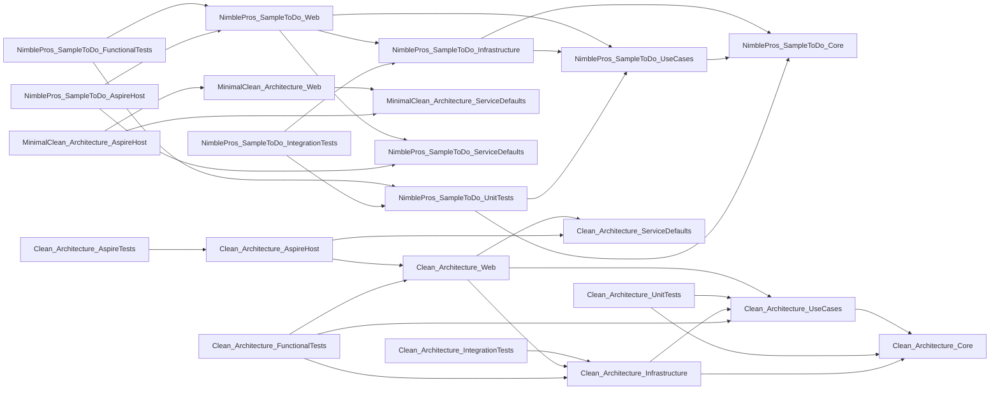

# DevContext -. NET Project Analysis
*Generated*: 2026-05-31 01: 00: 19
*Profile*: Depth=Balanced, Focus=General
*Token-Compact*: ON

# Solution Overview
*Root*: C: \code\DevContext\experiments\CleanArchitecture
*Tot. csproj*: 22
*Frameworks*: net9. 0
*Type*: Library/App

# Dependency Graph

# Code Structure
*Files*: 0. cs
_Showing only files near the provided entry point(s) for targeted context. _

### src\Clean. Architecture. Infrastructure\InfrastructureServiceExtensions. cs
pub stat ISC AddInfrastructureServices(ISC, ConfigurationManager, ILogger)

### src\Clean. Architecture. ServiceDefaults\Ext. cs
pub stat TBuilder AddServiceDefaults(TBuilder) ; pub stat TBuilder ConfigureOpenTelemetry(TBuilder) ; pub stat TBuilder AddDefaultHealthChecks(TBuilder) ; pub stat WebApplication MapDefaultEndpoints(WebApplication)

### tests\Clean. Architecture. FunctionalTests\CustomWebApplicationFactory. cs
pub async VT InitializeAsync()

### tests\Clean. Architecture. FunctionalTests\DockerAvailabilityTests. cs
pub async T Docker_ShouldBeRunning_ForFullFunctionalTestCoverage()

### tests\Clean. Architecture. UnitTests\NoOpMediator. cs
pub async T<IAE<TResponse>>CreateStream(IStreamQuery<TResponse>, CT) ; pub IAE<TResponse>CreateStream(IStreamRequest<TResponse>, CT) ; pub IAE<TResponse>CreateStream(IStreamCommand<TResponse>, CT) ; pub IAE<obj? >CreateStream(obj, CT) ; pub VT Publish(TNotification, CT) ; pub VT Publish(obj, CT) ; pub VT<TResponse>Send(IRequest<TResponse>, CT) ; pub VT<TResponse>Send(ICommand<TResponse>, CT) ; pub VT<TResponse>Send(IQuery<TResponse>, CT) ; pub VT<obj? >Send(obj, CT)

### MinimalClean\src\MinimalClean. Architecture. ServiceDefaults\Ext. cs
pub stat TBuilder AddServiceDefaults(TBuilder) ; pub stat TBuilder ConfigureOpenTelemetry(TBuilder) ; pub stat TBuilder AddDefaultHealthChecks(TBuilder) ; pub stat WebApplication MapDefaultEndpoints(WebApplication)

### sample\src\NimblePros. SampleToDo. Core\CoreServiceExtensions. cs
pub stat ISC AddCoreServices(ISC, ILogger)

### sample\src\NimblePros. SampleToDo. Infrastructure\InfrastructureServiceExtensions. cs
pub stat ISC AddInfrastructureServices(ISC, ICfg, ILogger, str)

### sample\src\NimblePros. SampleToDo. ServiceDefaults\Ext. cs
pub stat TBuilder AddServiceDefaults(TBuilder) ; pub stat TBuilder ConfigureOpenTelemetry(TBuilder) ; pub stat TBuilder AddDefaultHealthChecks(TBuilder) ; pub stat WebApplication MapDefaultEndpoints(WebApplication)

### sample\src\NimblePros. SampleToDo. Web\CachingBehavior. cs
pub async VT<TResponse? >Handle(TRequest, Mediator. MessageHandlerDelegate<TRequest, TResponse? >, CT)

### sample\src\NimblePros. SampleToDo. Web\LoggingBehavior. cs
pub async VT<TResponse>Handle(TRequest, MessageHandlerDelegate<TRequest, TResponse>, CT)

### sample\src\NimblePros. SampleToDo. Web\SeedData. cs
pub stat async T InitializeAsync(AppDbContext) ; pub stat async T PopulateTestDataAsync(AppDbContext)

### sample\tests\NimblePros. SampleToDo. FunctionalTests\TestBase. cs
pub virt VT InitializeAsync()

### sample\tests\NimblePros. SampleToDo. UnitTests\NoOpMediator. cs
pub async T<IAE<TResponse>>CreateStream(IStreamQuery<TResponse>, CT) ; pub IAE<TResponse>CreateStream(IStreamRequest<TResponse>, CT) ; pub IAE<TResponse>CreateStream(IStreamCommand<TResponse>, CT) ; pub IAE<obj? >CreateStream(obj, CT) ; pub VT Publish(TNotification, CT) ; pub VT Publish(obj, CT) ; pub VT<TResponse>Send(IRequest<TResponse>, CT) ; pub VT<TResponse>Send(ICommand<TResponse>, CT) ; pub VT<TResponse>Send(IQuery<TResponse>, CT) ; pub VT<obj? >Send(obj, CT)

### sample\tests\NimblePros. SampleToDo. UnitTests\ToDoItemBuilder. cs
pub ToDoItemBuilder Id(int) ; pub ToDoItemBuilder Title(String) ; pub ToDoItemBuilder Description(String) ; pub ToDoItemBuilder WithDefaultValues() ; pub ToDoItem Build()

### src\Clean. Architecture. Core\ContributorAggregate\Contributor. cs
pub Contributor UpdatePhoneNumber(PhoneNumber) ; pub Contributor UpdateName(ContributorName)

### src\Clean. Architecture. Core\ContributorAggregate\PhoneNumber. cs
pub ovr str ToString()

### src\Clean. Architecture. Core\Interfaces\IDeleteContributorService. cs
pub VT<Result>DeleteContributor(ContributorId)

### src\Clean. Architecture. Core\Services\DeleteContributorService. cs
pub async VT<Result>DeleteContributor(ContributorId)

### src\Clean. Architecture. Infrastructure\Data\AppDbContext. cs
pub ovr int SaveChanges()

### src\Clean. Architecture. Infrastructure\Data\AppDbContextExtensions. cs
pub stat void AddApplicationDbContext(ISC, str)

### src\Clean. Architecture. Infrastructure\Data\EventDispatcherInterceptor. cs
pub ovr async VT<int>SavedChangesAsync(SaveChangesCompletedEventData, int, CT)

### src\Clean. Architecture. Infrastructure\Data\SeedData. cs
pub stat async T InitializeAsync(AppDbContext) ; pub stat async T PopulateTestDataAsync(AppDbContext)

### src\Clean. Architecture. Infrastructure\Email\FakeEmailSender. cs
pub T SendEmailAsync(str, str, str, str)

### src\Clean. Architecture. Infrastructure\Email\MimeKitEmailSender. cs
pub async T SendEmailAsync(str, str, str, str)

### src\Clean. Architecture. Web\Configurations\LoggerConfigs. cs
pub stat WebApplicationBuilder AddLoggerConfigs(WebApplicationBuilder)

### src\Clean. Architecture. Web\Configurations\MediatorConfig. cs
pub stat ISC AddMediatorSourceGen(ISC, MEL. ILogger)

### src\Clean. Architecture. Web\Configurations\MiddlewareConfig. cs
pub stat async T<IAB>UseAppMiddlewareAndSeedDatabase(WebApplication)

### src\Clean. Architecture. Web\Configurations\OptionConfigs. cs
pub stat ISC AddOptionConfigs(ISC, ICfg, MEL. ILogger, WebApplicationBuilder)

### src\Clean. Architecture. Web\Configurations\ServiceConfigs. cs
pub stat ISC AddServiceConfigs(ISC, MEL. ILogger, WebApplicationBuilder)

### src\Clean. Architecture. Web\Contributors\Create. cs
pub ovr void Configure() ; pub ovr async T<Results<Created<CreateContributorResponse>, ValidationProblem, ProblemHttpResult>>ExecuteAsync(CreateContributorRequest, CT)

### src\Clean. Architecture. Web\Contributors\Delete. cs
pub ovr void Configure() ; pub ovr async T<Results<NoContent, NotFound, ProblemHttpResult>>ExecuteAsync(DeleteContributorRequest, CT)

### src\Clean. Architecture. Web\Contributors\Delete. DeleteContributorRequest. cs
pub stat str BuildRoute(int)

### src\Clean. Architecture. Web\Contributors\GetById. cs
pub ovr void Configure() ; pub ovr async T<Results<Ok<ContributorRecord>, NotFound, ProblemHttpResult>>ExecuteAsync(GetContributorByIdRequest, CT) ; pub ovr ContributorRecord FromEntity(ContributorDto)

### src\Clean. Architecture. Web\Contributors\GetById. GetContributorByIdRequest. cs
PSSB

### src\Clean. Architecture. Web\Contributors\List. cs
pub ovr void Configure() ; pub ovr async T HandleAsync(ListContributorsRequest, CT) ; pub ovr ContributorListResponse FromEntity(UseCases. PagedResult<ContributorDto>)

### src\Clean. Architecture. Web\Contributors\Update. cs
pub ovr void Configure() ; pub ovr async T<Results<Ok<UpdateContributorResponse>, NotFound, ProblemHttpResult>>ExecuteAsync(UpdateContributorRequest, CT) ; pub ovr UpdateContributorResponse FromEntity(ContributorDto)

### src\Clean. Architecture. Web\Contributors\Update. UpdateContributorRequest. cs
PSSB

### src\Clean. Architecture. Web\Extensions\ResultExtensions. cs
pub stat Results<Created<TResponse>, ValidationProblem, ProblemHttpResult>ToCreatedResult(Result<TValue>, F<TValue, str>, F<TValue, TResponse>) ; pub stat Results<Ok<TResponse>, NotFound, ProblemHttpResult>ToGetByIdResult(Result<TValue>, F<TValue, TResponse>) ; pub stat Results<Ok<TResponse>, NotFound, ProblemHttpResult>ToUpdateResult(Result<TValue>, F<TValue, TResponse>) ; pub stat Results<NoContent, NotFound, ProblemHttpResult>ToDeleteResult(Result) ; pub stat Ok<TResponse>ToOkOnlyResult(Result<TValue>, F<TValue, TResponse>)

### tests\Clean. Architecture. FunctionalTests\ApiEndpoints\ContributorGetById. cs
pub async T ReturnsSeedContributorGivenId1() ; pub async T ReturnsNotFoundGivenId1000()

### tests\Clean. Architecture. FunctionalTests\ApiEndpoints\ContributorList. cs
pub async T ReturnsTwoContributors()

### tests\Clean. Architecture. IntegrationTests\Data\EfRepositoryAdd. cs
pub async T AddsContributorAndSetsId() ; pub async T AddsTwoContributorsWithDistinctDbGeneratedIds()

### tests\Clean. Architecture. IntegrationTests\Data\EfRepositoryDelete. cs
pub async T DeletesItemAfterAddingIt()

### tests\Clean. Architecture. IntegrationTests\Data\EfRepositoryUpdate. cs
pub async T UpdatesItemAfterAddingIt()

### MinimalClean\src\MinimalClean. Architecture. Web\Configurations\LoggerConfigs. cs
pub stat WebApplicationBuilder AddLoggerConfigs(WebApplicationBuilder)

### MinimalClean\src\MinimalClean. Architecture. Web\Configurations\LoggingBehavior. cs
pub async VT<TResponse>Handle(TRequest, MessageHandlerDelegate<TRequest, TResponse>, CT)

### MinimalClean\src\MinimalClean. Architecture. Web\Configurations\MediatorConfig. cs
pub stat ISC AddMediatorSourceGen(ISC, ILogger)

### MinimalClean\src\MinimalClean. Architecture. Web\Configurations\MiddlewareConfig. cs
pub stat async T<IAB>UseAppMiddlewareAndSeedDatabase(WebApplication)

### MinimalClean\src\MinimalClean. Architecture. Web\Configurations\OptionConfigs. cs
pub stat ISC AddOptionConfigs(ISC, ICfg, MEL. ILogger, WebApplicationBuilder)

### MinimalClean\src\MinimalClean. Architecture. Web\Configurations\ServiceConfigs. cs
pub stat ISC AddServiceConfigs(ISC, MEL. ILogger, WebApplicationBuilder)

### MinimalClean\src\MinimalClean. Architecture. Web\Extensions\ResultExtensions. cs
pub stat Results<Created<TResponse>, ValidationProblem, ProblemHttpResult>ToCreatedResult(Result<TValue>, F<TValue, str>, F<TValue, TResponse>) ; pub stat Results<Ok<TResponse>, NotFound, ProblemHttpResult>ToGetByIdResult(Result<TValue>, F<TValue, TResponse>) ; pub stat Results<Ok<TResponse>, NotFound, ProblemHttpResult>ToUpdateResult(Result<TValue>, F<TValue, TResponse>) ; pub stat Results<NoContent, NotFound, ProblemHttpResult>ToDeleteResult(Result) ; pub stat Ok<TResponse>ToOkOnlyResult(Result<TValue>, F<TValue, TResponse>)

### MinimalClean\src\MinimalClean. Architecture. Web\Infrastructure\InfrastructureServiceExtensions. cs
pub stat ISC AddInfrastructureServices(ISC, ConfigurationManager, ILogger)

### sample\src\NimblePros. SampleToDo. Core\ContributorAggregate\Contributor. cs
pub Contributor UpdateName(ContributorName)

### sample\src\NimblePros. SampleToDo. Core\Interfaces\IDeleteContributorService. cs
pub T<Result>DeleteContributor(ContributorId)

### sample\src\NimblePros. SampleToDo. Core\ProjectAggregate\Project. cs
pub Project AddItem(ToDoItem) ; pub Project UpdateName(ProjectName)

### sample\src\NimblePros. SampleToDo. Core\ProjectAggregate\ProjectErrorMessages. cs
pub stat str CoreProjectNameTooLong(int) ; pub stat str CoreToDoItemDescriptionTooLong(int) ; pub stat str CoreToDoItemTitleTooLong(int)

### sample\src\NimblePros. SampleToDo. Core\ProjectAggregate\ToDoItem. cs
pub ToDoItem MarkComplete() ; pub ToDoItem AddContributor(ContributorId) ; pub ToDoItem RemoveContributor() ; pub ToDoItem UpdateTitle(ToDoItemTitle) ; pub ToDoItem UpdateDescription(ToDoItemDescription) ; pub ovr str ToString()

### sample\src\NimblePros. SampleToDo. Core\Services\DeleteContributorService. cs
pub async T<Result>DeleteContributor(ContributorId)

### sample\src\NimblePros. SampleToDo. Core\Services\ToDoItemSearchService. cs
pub async T<Result<L<ToDoItem>>>GetAllIncompleteItemsAsync(ProjectId, str) ; pub async T<Result<ToDoItem>>GetNextIncompleteItemAsync(ProjectId)

### sample\src\NimblePros. SampleToDo. Infrastructure\Data\AppDbContext. cs
pub ovr int SaveChanges()

### sample\src\NimblePros. SampleToDo. Infrastructure\Data\EventDispatchInterceptor. cs
pub ovr async VT<int>SavedChangesAsync(SaveChangesCompletedEventData, int, CT)

### sample\src\NimblePros. SampleToDo. Infrastructure\Email\FakeEmailSender. cs
pub T SendEmailAsync(str, str, str, str)

### sample\src\NimblePros. SampleToDo. Infrastructure\Email\MimeKitEmailSender. cs
pub async T SendEmailAsync(str, str, str, str)

### sample\src\NimblePros. SampleToDo. Infrastructure\Email\SmtpEmailSender. cs

### sample\src\NimblePros. SampleToDo. Web\Configurations\GlobalExceptionHandler. cs
pub async VT<bool>TryHandleAsync(HC, Exception, CT)

### sample\src\NimblePros. SampleToDo. Web\Configurations\LoggerConfig. cs
pub stat WebApplicationBuilder AddLoggerConfigs(WebApplicationBuilder)

### sample\src\NimblePros. SampleToDo. Web\Configurations\MediatorConfig. cs
pub stat ISC AddMediatorSourceGen(ISC, MEL. ILogger)

### sample\src\NimblePros. SampleToDo. Web\Configurations\MiddlewareConfig. cs
pub stat async T<IAB>UseAppMiddleware(WebApplication)

### sample\src\NimblePros. SampleToDo. Web\Configurations\OptionConfigs. cs
pub stat ISC AddOptionConfigs(ISC, ICfg, MEL. ILogger, WebApplicationBuilder)

### sample\src\NimblePros. SampleToDo. Web\Configurations\ServiceConfigs. cs
pub stat ISC AddServiceConfigs(ISC, MEL. ILogger, WebApplicationBuilder)

### sample\src\NimblePros. SampleToDo. Web\Contributors\Create. cs
pub ovr void Configure() ; pub ovr async T<Results<Created<CreateContributorResponse>, ValidationProblem, ProblemHttpResult>>ExecuteAsync(CreateContributorRequest, CT)

### sample\src\NimblePros. SampleToDo. Web\Contributors\Delete. cs
pub ovr void Configure() ; pub ovr async T<Results<NoContent, NotFound, ProblemHttpResult>>ExecuteAsync(DeleteContributorRequest, CT)

### sample\src\NimblePros. SampleToDo. Web\Contributors\Delete. DeleteContributorRequest. cs
PSSB

### sample\src\NimblePros. SampleToDo. Web\Contributors\GetById. cs
pub ovr void Configure() ; pub ovr async T<Results<Ok<ContributorRecord>, NotFound, ProblemHttpResult>>ExecuteAsync(GetContributorByIdRequest, CT)

### sample\src\NimblePros. SampleToDo. Web\Contributors\GetById. GetContributorByIdMapper. cs
pub ovr ContributorRecord FromEntity(ContributorDto)

### sample\src\NimblePros. SampleToDo. Web\Contributors\GetById. GetContributorByIdRequest. cs
PSSB

### sample\src\NimblePros. SampleToDo. Web\Contributors\List. cs
pub ovr void Configure() ; pub ovr async T HandleAsync(ListContributorsRequest, CT) ; pub ovr ContributorListResponse FromEntity(UseCases. PagedResult<ContributorDto>)

### sample\src\NimblePros. SampleToDo. Web\Contributors\Update. cs
pub ovr void Configure() ; pub ovr async T<Results<Ok<UpdateContributorResponse>, NotFound, ProblemHttpResult>>ExecuteAsync(UpdateContributorRequest, CT) ; pub ovr UpdateContributorResponse FromEntity(ContributorDto)

### sample\src\NimblePros. SampleToDo. Web\Contributors\Update. UpdateContributorRequest. cs
PSSB

### sample\src\NimblePros. SampleToDo. Web\Extensions\ResultExtensions. cs
pub stat Results<Created<TResponse>, ValidationProblem, ProblemHttpResult>ToCreatedResult(Result<TValue>, F<TValue, str>, F<TValue, TResponse>) ; pub stat Results<Ok<TResponse>, NotFound, ProblemHttpResult>ToGetByIdResult(Result<TValue>, F<TValue, TResponse>) ; pub stat Results<Ok<TResponse>, NotFound, ProblemHttpResult>ToUpdateResult(Result<TValue>, F<TValue, TResponse>) ; pub stat Results<NoContent, NotFound, ProblemHttpResult>ToDeleteResult(Result) ; pub stat Ok<TResponse>ToOkOnlyResult(Result<TValue>, F<TValue, TResponse>)

### sample\src\NimblePros. SampleToDo. Web\Projects\Create. cs
pub ovr void Configure() ; pub ovr async T<Results<Created<CreateProjectResponse>, ValidationProblem, ProblemHttpResult>>ExecuteAsync(CreateProjectRequest, CT)

### sample\src\NimblePros. SampleToDo. Web\Projects\CreateToDoItem. CreateToDoItemRequest. cs
PSSB

### sample\src\NimblePros. SampleToDo. Web\Projects\CreateToDoItem. cs
pub ovr void Configure() ; pub ovr async T<Results<Created, NotFound, ProblemHttpResult>>ExecuteAsync(CreateToDoItemRequest, CT)

### sample\src\NimblePros. SampleToDo. Web\Projects\Delete. cs
pub ovr void Configure() ; pub ovr async T<Results<NoContent, NotFound, ProblemHttpResult>>ExecuteAsync(DeleteProjectRequest, CT)

### sample\src\NimblePros. SampleToDo. Web\Projects\Delete. DeleteProjectRequest. cs
PSSB

### sample\src\NimblePros. SampleToDo. Web\Projects\GetById. cs
pub ovr void Configure() ; pub ovr async T<Results<Ok<GetProjectByIdResponse>, NotFound, ProblemHttpResult>>ExecuteAsync(GetProjectByIdRequest, CT)

### sample\src\NimblePros. SampleToDo. Web\Projects\GetById. GetProjectByIdRequest. cs
PSSB

### sample\src\NimblePros. SampleToDo. Web\Projects\List. cs
pub ovr void Configure() ; pub ovr async T HandleAsync(ListProjectsRequest, CT) ; pub ovr ProjectListResponse FromEntity(UseCases. PagedResult<ProjectDto>)

### sample\src\NimblePros. SampleToDo. Web\Projects\ListIncompleteItems. cs
pub ovr void Configure() ; pub ovr async T HandleAsync(ListIncompleteItemsRequest, CT)

### sample\src\NimblePros. SampleToDo. Web\Projects\ListIncompleteItems. ListIncompleteItemsRequest. cs
PSSB

### sample\src\NimblePros. SampleToDo. Web\Projects\MarkItemComplete. cs
pub ovr void Configure() ; pub ovr async T HandleAsync(MarkItemCompleteRequest, CT)

### sample\src\NimblePros. SampleToDo. Web\Projects\MarkItemComplete. MarkItemCompleteRequest. cs
pub stat str BuildRoute(int, int)

### sample\src\NimblePros. SampleToDo. Web\Projects\Update. cs
pub ovr void Configure() ; pub ovr async T<Results<Ok<UpdateProjectResponse>, NotFound, ProblemHttpResult>>ExecuteAsync(UpdateProjectRequest, CT) ; pub ovr UpdateProjectResponse FromEntity(ProjectDto)

### sample\src\NimblePros. SampleToDo. Web\Projects\Update. UpdateProjectRequest. cs
PSSB

### sample\tests\NimblePros. SampleToDo. FunctionalTests\Contributors\ContributorCreate. cs
pub async T ReturnsOneContributor()

### sample\tests\NimblePros. SampleToDo. FunctionalTests\Contributors\ContributorDelete. cs
pub async T DeletesExistingContributor() ; pub async T ReturnsNotFoundGivenMissingContributorId()

### sample\tests\NimblePros. SampleToDo. FunctionalTests\Contributors\ContributorGetById. cs
pub async T ReturnsSeedContributorGivenId1() ; pub async T ReturnsNotFoundGivenInvalidId1000()

### sample\tests\NimblePros. SampleToDo. FunctionalTests\Contributors\ContributorList. cs
pub async T ReturnsTwoContributors()

### sample\tests\NimblePros. SampleToDo. FunctionalTests\Contributors\ContributorUpdate. cs
pub async T UpdatesContributorNameAndReturnsUpdatedRecord() ; pub async T ReturnsNotFoundGivenMissingContributorId() ; pub async T ReturnsBadRequestIfRouteIdDoesNotMatchBodyId()

### sample\tests\NimblePros. SampleToDo. FunctionalTests\Fixtures\SmtpServerFixture. cs
pub async VT InitializeAsync() ; pub void EnsureContainerIsRunning()

### sample\tests\NimblePros. SampleToDo. FunctionalTests\Projects\CreateToDoItemRequestBuilder. cs
pub CreateToDoItemRequestBuilder WithProjectId(int) ; pub CreateToDoItemRequestBuilder WithTitle(str) ; pub CreateToDoItemRequestBuilder WithDescription(str) ; pub CreateToDoItemRequestBuilder WithContributorId(int? ) ; pub CreateToDoItemRequestBuilder WithValidDefaults() ; pub CreateToDoItemRequest Build() ; pub stat CreateToDoItemRequestBuilder Create()

### sample\tests\NimblePros. SampleToDo. FunctionalTests\Projects\ProjectAddToDoItem. cs
pub async T ReturnsBadRequestWhenTitleIsMissing() ; pub async T ReturnsBadRequestWhenDescriptionIsMissing() ; pub async T ReturnsBadRequestWhenProjectIdIsZero() ; pub async T ReturnsNotFoundWhenProjectDoesNotExist() ; pub async T AddsItemWithValidContributor() ; pub async T ReturnsBadRequestWhenTitleExceedsMaxLength() ; pub async T ReturnsBadRequestWhenDescriptionExceedsMaxLength() ; pub async T HandlesWhitespaceOnlyTitleAndDescription() ; pub async T ReturnsCorrectStatusCodeAndContentType() ; pub async T DoesNotReturnResponseBodyOnSuccess()

### sample\tests\NimblePros. SampleToDo. FunctionalTests\Projects\ProjectCreate. cs
pub async T ReturnsOneProject()

### sample\tests\NimblePros. SampleToDo. FunctionalTests\Projects\ProjectGetById. cs
pub async T ReturnsSeedProjectGivenId1() ; pub async T ReturnsNotFoundGivenInvalidId1000()

### sample\tests\NimblePros. SampleToDo. FunctionalTests\Projects\ProjectItemMarkComplete. cs
pub async T MarksIncompleteItemComplete()

### sample\tests\NimblePros. SampleToDo. FunctionalTests\Projects\ProjectList. cs
pub async T ReturnsOneProject()

### sample\tests\NimblePros. SampleToDo. IntegrationTests\Data\EfRepositoryAdd. cs
pub async T AddsProjectAndSetsId()

### sample\tests\NimblePros. SampleToDo. IntegrationTests\Data\EfRepositoryDelete. cs
pub async T DeletesItemAfterAddingIt()

### sample\tests\NimblePros. SampleToDo. IntegrationTests\Data\EfRepositoryUpdate. cs
pub async T UpdatesItemAfterAddingIt()

### src\Clean. Architecture. Core\ContributorAggregate\Handlers\ContributorDeletedHandler. cs
pub async VT Handle(ContributorDeletedEvent, CT)

### src\Clean. Architecture. Core\ContributorAggregate\Handlers\ContributorNameUpdatedEmailNotificationHandler. cs
pub async VT Handle(ContributorNameUpdatedEvent, CT)

### src\Clean. Architecture. Infrastructure\Data\Config\ContributorConfiguration. cs
pub void Configure(EntityTypeBuilder<Contributor>)

### src\Clean. Architecture. Infrastructure\Data\Queries\FakeListContributorsQueryService. cs
pub T<UseCases. PagedResult<ContributorDto>>ListAsync(int, int)

### src\Clean. Architecture. Infrastructure\Data\Queries\ListContributorsQueryService. cs
pub async T<UseCases. PagedResult<ContributorDto>>ListAsync(int, int)

### src\Clean. Architecture. UseCases\Contributors\Create\CreateContributorHandler. cs
pub async VT<Result<ContributorId>>Handle(CreateContributorCommand, CT)

### src\Clean. Architecture. UseCases\Contributors\Delete\DeleteContributorHandler. cs
pub async VT<Result>Handle(DeleteContributorCommand, CT)

### src\Clean. Architecture. UseCases\Contributors\Get\GetContributorHandler. cs
pub async VT<Result<ContributorDto>>Handle(GetContributorQuery, CT)

### src\Clean. Architecture. UseCases\Contributors\List\ListContributorsHandler. cs
pub async VT<Result<PagedResult<ContributorDto>>>Handle(ListContributorsQuery, CT)

### src\Clean. Architecture. UseCases\Contributors\Update\UpdateContributorHandler. cs
pub async VT<Result<ContributorDto>>Handle(UpdateContributorCommand, CT)

### tests\Clean. Architecture. UnitTests\Core\ContributorAggregate\ContributorConstructor. cs
pub void InitializesName()

### tests\Clean. Architecture. UnitTests\Core\ContributorAggregate\ContributorIdFrom. cs
pub void CreatesGivenValidValue() ; pub void ThrowsGivenInvalidValue(int)

### tests\Clean. Architecture. UnitTests\Core\ContributorAggregate\ContributorNameFrom. cs
pub void CreatesGivenValidValue() ; pub void ThrowsGivenInvalidValue(str? )

### tests\Clean. Architecture. UnitTests\Core\ContributorAggregate\ContributorUpdateName. cs
pub void UpdatesName() ; pub void RegistersDomainEvent() ; pub void DoesNotRegisterDomainEventGivenCurrentName()

### tests\Clean. Architecture. UnitTests\Core\Services\DeleteContributorSevice_DeleteContributor. cs
pub async T ReturnsNotFoundGivenCantFindContributor()

### tests\Clean. Architecture. UnitTests\Core\Services\ToDoItemSearchService_GetAllIncompleteItems. cs
pub async T ReturnsInvalidGivenNullSearchString() ; pub async T ReturnsErrorGivenDataAccessException() ; pub async T ReturnsListGivenSearchString()

### tests\Clean. Architecture. UnitTests\Core\Services\ToDoItemSearchService_GetNextIncompleteItem. cs
pub async T ReturnsNotFoundGivenNoRemainingItems() ; pub async T ReturnsFirstItemFromList()

### tests\Clean. Architecture. UnitTests\UseCases\Contributors\CreateContributorHandlerHandle. cs
pub async T ReturnsSuccessGivenValidName()

### MinimalClean\src\MinimalClean. Architecture. Web\CartFeatures\AddToCart\AddToCartEndpoint. cs
pub ovr void Configure() ; pub ovr async T<Results<Ok<CartResponse>, NotFound, ValidationProblem, ProblemHttpResult>>ExecuteAsync(AddToCartRequest, CT) ; pub ovr CartResponse FromEntity(CartDto)

### MinimalClean\src\MinimalClean. Architecture. Web\CartFeatures\AddToCart\AddToCartHandler. cs
pub async VT<Result<CartDto>>Handle(AddToCartCommand, CT)

### MinimalClean\src\MinimalClean. Architecture. Web\CartFeatures\Checkout\CheckoutEndpoint. cs
pub ovr void Configure() ; pub ovr async T<Results<Ok<CheckoutResponse>, NotFound, ValidationProblem, ProblemHttpResult>>ExecuteAsync(CheckoutRequest, CT) ; pub ovr CheckoutResponse FromEntity(CheckoutResult)

### MinimalClean\src\MinimalClean. Architecture. Web\CartFeatures\Checkout\CheckoutHandler. cs
pub async VT<Result<CheckoutResult>>Handle(CheckoutCommand, CT)

### MinimalClean\src\MinimalClean. Architecture. Web\CartFeatures\GetById\GetByIdEndpoint. cs
pub ovr void Configure() ; pub ovr async T<Results<Ok<CartResponse>, NotFound, ProblemHttpResult>>ExecuteAsync(GetCartRequest, CT) ; pub ovr CartResponse FromEntity(CartDto)

### MinimalClean\src\MinimalClean. Architecture. Web\CartFeatures\GetById\GetCartHandler. cs
pub async VT<Result<CartDto>>Handle(GetCartQuery, CT)

### MinimalClean\src\MinimalClean. Architecture. Web\Domain\CartAggregate\Cart. cs
pub void AddItem(int, int, dec) ; pub void MarkAsDeleted()

### MinimalClean\src\MinimalClean. Architecture. Web\Domain\GuestUserAggregate\GuestUser. cs
pub GuestUser UpdateEmail(str)

### MinimalClean\src\MinimalClean. Architecture. Web\Domain\OrderAggregate\Order. cs
pub void AddItem(ProductId, Quantity, Price) ; pub void ConfirmPayment(DateTimeOffset, str)

### MinimalClean\src\MinimalClean. Architecture. Web\Domain\ProductAggregate\Product. cs
pub stat Product Create(str, dec) ; pub Product UpdateName(str) ; pub Product UpdatePrice(dec)

### MinimalClean\src\MinimalClean. Architecture. Web\Infrastructure\Data\AppDbContext. cs
pub ovr int SaveChanges()

### MinimalClean\src\MinimalClean. Architecture. Web\Infrastructure\Data\AppDbContextExtensions. cs
pub stat void AddApplicationDbContext(ISC, str)

### MinimalClean\src\MinimalClean. Architecture. Web\Infrastructure\Data\AppDbContextFactory. cs
pub AppDbContext CreateDbContext(str[])

### MinimalClean\src\MinimalClean. Architecture. Web\Infrastructure\Data\EventDispatcherInterceptor. cs
pub ovr async VT<int>SavedChangesAsync(SaveChangesCompletedEventData, int, CT)

### MinimalClean\src\MinimalClean. Architecture. Web\Infrastructure\Data\SeedData. cs
pub stat async T InitializeAsync(AppDbContext, ILogger) ; pub stat async T PopulateTestDataAsync(AppDbContext, ILogger)

### MinimalClean\src\MinimalClean. Architecture. Web\Infrastructure\Email\FakeEmailSender. cs
pub T SendEmailAsync(str, str, str, str)

### MinimalClean\src\MinimalClean. Architecture. Web\Infrastructure\Email\MimeKitEmailSender. cs
pub async T SendEmailAsync(str, str, str, str)

### MinimalClean\src\MinimalClean. Architecture. Web\ProductFeatures\Create\CreateEndpoint. cs
pub ovr void Configure() ; pub ovr async T<Results<Created<ProductRecord>, ValidationProblem, ProblemHttpResult>>ExecuteAsync(CreateProductRequest, CT)

### MinimalClean\src\MinimalClean. Architecture. Web\ProductFeatures\GetById\GetByIdEndpoint. cs
pub ovr void Configure() ; pub ovr async T<Results<Ok<ProductRecord>, NotFound, ProblemHttpResult>>ExecuteAsync(GetProductByIdRequest, CT) ; pub ovr ProductRecord FromEntity(ProductDto)

### MinimalClean\src\MinimalClean. Architecture. Web\ProductFeatures\GetById\GetProductHandler. cs
pub async VT<Result<ProductDto>>Handle(GetProductQuery, CT)

### MinimalClean\src\MinimalClean. Architecture. Web\ProductFeatures\List\ListEndpoint. cs
pub ovr void Configure() ; pub ovr async T HandleAsync(ListProductsRequest, CT) ; pub ovr ProductListResponse FromEntity(PagedResult<ProductDto>)

### MinimalClean\src\MinimalClean. Architecture. Web\ProductFeatures\List\ListProductsHandler. cs
pub async VT<Result<PagedResult<ProductDto>>>Handle(ListProductsQuery, CT)

### sample\src\NimblePros. SampleToDo. Core\ContributorAggregate\Handlers\ContributorDeletedHandler. cs
pub async VT Handle(ContributorDeletedEvent, CT)

### sample\src\NimblePros. SampleToDo. Core\ContributorAggregate\Handlers\ContributorNameUpdatedEventLoggingHandler. cs
pub VT Handle(ContributorNameUpdatedEvent, CT)

### sample\src\NimblePros. SampleToDo. Core\ProjectAggregate\Handlers\ContributorAddedToItemLoggingHandler. cs
pub VT Handle(ContributorAddedToItemEvent, CT)

### sample\src\NimblePros. SampleToDo. Core\ProjectAggregate\Handlers\ItemCompletedEmailNotificationHandler. cs
pub async VT Handle(ToDoItemCompletedEvent, CT)

### sample\src\NimblePros. SampleToDo. Core\ProjectAggregate\Handlers\NewItemAddedLoggingHandler. cs
pub VT Handle(NewItemAddedEvent, CT)

### sample\src\NimblePros. SampleToDo. Infrastructure\Data\Config\ContributorConfiguration. cs
pub void Configure(EntityTypeBuilder<Contributor>)

### sample\src\NimblePros. SampleToDo. Infrastructure\Data\Config\ProjectConfiguration. cs
pub void Configure(EntityTypeBuilder<Project>)

### sample\src\NimblePros. SampleToDo. Infrastructure\Data\Config\ToDoItemConfiguration. cs
pub void Configure(EntityTypeBuilder<ToDoItem>)

### sample\src\NimblePros. SampleToDo. Infrastructure\Data\Queries\FakeListContributorsQueryService. cs
pub T<PagedResult<ContributorDto>>ListAsync(int, int)

### sample\src\NimblePros. SampleToDo. Infrastructure\Data\Queries\FakeListIncompleteItemsQueryService. cs
pub async T<IE<ToDoItemDto>>ListAsync(int)

### sample\src\NimblePros. SampleToDo. Infrastructure\Data\Queries\FakeListProjectsShallowQueryService. cs
pub async T<IE<ProjectDto>>ListAsync()

### sample\src\NimblePros. SampleToDo. Infrastructure\Data\Queries\ListContributorsQueryService. cs
pub async T<PagedResult<ContributorDto>>ListAsync(int, int)

### sample\src\NimblePros. SampleToDo. Infrastructure\Data\Queries\ListIncompleteItemsQueryService. cs
pub async T<IE<ToDoItemDto>>ListAsync(int)

### sample\src\NimblePros. SampleToDo. Infrastructure\Data\Queries\ListProjectsShallowQueryService. cs
pub async T<IE<ProjectDto>>ListAsync()

### sample\src\NimblePros. SampleToDo. UseCases\Projects\AddToDoItem\AddToDoItemHandler. cs
pub async VT<Result<ToDoItemId>>Handle(AddToDoItemCommand, CT)

### sample\src\NimblePros. SampleToDo. UseCases\Projects\Create\CreateProjectHandler. cs
pub async VT<Result<ProjectId>>Handle(CreateProjectCommand, CT)

### sample\src\NimblePros. SampleToDo. UseCases\Projects\Delete\DeleteProjectHandler. cs
pub async VT<Result>Handle(DeleteProjectCommand, CT)

### sample\src\NimblePros. SampleToDo. UseCases\Projects\GetWithAllItems\GetProjectWithAllItemsHandler. cs
pub async VT<Result<ProjectWithAllItemsDto>>Handle(GetProjectWithAllItemsQuery, CT)

### sample\src\NimblePros. SampleToDo. UseCases\Projects\GetWithAllItems\GetProjectWithAllItemsQuery. cs
pub str GetCacheKey()

### sample\src\NimblePros. SampleToDo. UseCases\Projects\ListIncompleteItems\ListIncompleteItemsByProjectHandler. cs
pub async VT<Result<IE<ToDoItemDto>>>Handle(ListIncompleteItemsByProjectQuery, CT)

### sample\src\NimblePros. SampleToDo. UseCases\Projects\ListIncompleteItems\ListIncompleteItemsByProjectQuery. cs
PSG

### sample\src\NimblePros. SampleToDo. UseCases\Projects\ListShallow\ListProjectsShallowHandler. cs
pub async VT<Result<IE<ProjectDto>>>Handle(ListProjectsShallowQuery, CT)

### sample\src\NimblePros. SampleToDo. UseCases\Projects\ListShallow\ListProjectsShallowQuery. cs
PSG

### sample\src\NimblePros. SampleToDo. UseCases\Projects\MarkToDoItemComplete\MarkToDoItemCompleteHandler. cs
pub async VT<Result>Handle(MarkToDoItemCompleteCommand, CT)

### sample\src\NimblePros. SampleToDo. UseCases\Projects\Update\UpdateProjectHandler. cs
pub async VT<Result<ProjectDto>>Handle(UpdateProjectCommand, CT)

### sample\tests\NimblePros. SampleToDo. UnitTests\Core\ContributorAggregate\ContributorConstructor. cs
pub void InitializesName() ; pub void DoesNothingGivenSameName() ; pub void UpdatesNameAndRegistersEventGivenNewName()

### sample\tests\NimblePros. SampleToDo. UnitTests\Core\ContributorAggregate\ContributorIdFrom. cs
pub void CreatesGivenValidValue() ; pub void ThrowsGivenInvalidValue(int)

### sample\tests\NimblePros. SampleToDo. UnitTests\Core\Handlers\ItemCompletedEmailNotificationHandlerHandle. cs
pub async T ThrowsExceptionGivenNullEventArgument() ; pub async T SendsEmailGivenEventInstance()

### sample\tests\NimblePros. SampleToDo. UnitTests\Core\ProjectAggregate\ProjectConstructor. cs
pub void InitializesName() ; pub void InitializesTaskListToEmptyList() ; pub void InitializesStatusToInProgress() ; pub void ProjectName_TooLong_ReturnsLocalizedMessage()

### sample\tests\NimblePros. SampleToDo. UnitTests\Core\ProjectAggregate\ProjectNameFrom. cs
pub void ThrowsGivenNullOrEmpty(str? ) ; pub void DoesNotThrowGivenValidData()

### sample\tests\NimblePros. SampleToDo. UnitTests\Core\ProjectAggregate\Project_AddItem. cs
pub void AddsItemToItems() ; pub void ThrowsExceptionGivenNullItem()

### sample\tests\NimblePros. SampleToDo. UnitTests\Core\ProjectAggregate\ToDoItemConstructor. cs
pub void InitializesPriority()

### sample\tests\NimblePros. SampleToDo. UnitTests\Core\ProjectAggregate\ToDoItemMarkComplete. cs
pub void SetsIsDoneToTrue() ; pub void RaisesToDoItemCompletedEvent()

### sample\tests\NimblePros. SampleToDo. UnitTests\Core\Services\DeleteContributorSevice_DeleteContributor. cs
pub async T ReturnsNotFoundGivenCantFindContributor()

### sample\tests\NimblePros. SampleToDo. UnitTests\Core\Services\ToDoItemSearchServiceTests. cs
pub async T ReturnsValidationErrors() ; pub async T ReturnsProjectNotFound() ; pub async T ReturnsAllIncompleteItems()

### sample\tests\NimblePros. SampleToDo. UnitTests\Core\Services\ToDoItemSearchService_GetAllIncompleteItems. cs
pub async T ReturnsInvalidGivenNullSearchString() ; pub async T ReturnsErrorGivenDataAccessException() ; pub async T ReturnsListGivenSearchString()

### sample\tests\NimblePros. SampleToDo. UnitTests\Core\Services\ToDoItemSearchService_GetNextIncompleteItem. cs
pub async T ReturnsNotFoundGivenNoRemainingItems() ; pub async T ReturnsFirstItemFromList()

### sample\tests\NimblePros. SampleToDo. UnitTests\Core\Specifications\IncompleteItemSpecificationsConstructor. cs
pub void FilterCollectionToOnlyReturnItemsWithIsDoneFalse()

### sample\tests\NimblePros. SampleToDo. UnitTests\UseCases\Contributors\CreateContributorHandlerHandle. cs
pub async T ReturnsSuccessGivenValidName()

### sample\tests\NimblePros. SampleToDo. UnitTests\UseCases\Contributors\GetContributorHandlerHandle. cs
pub async T ReturnsRecordGivenValidId() ; pub async T ReturnsNotFoundGivenInvalidId()

### sample\tests\NimblePros. SampleToDo. UnitTests\UseCases\Contributors\UpdateContributorHandlerHandle. cs
pub async T ReturnsRecordGivenValidId() ; pub async T ReturnsNotFoundGivenNonexistentId()

### MinimalClean\src\MinimalClean. Architecture. Web\Infrastructure\Data\Config\CartConfiguration. cs
pub void Configure(EntityTypeBuilder<Cart>)

### MinimalClean\src\MinimalClean. Architecture. Web\Infrastructure\Data\Config\CartItemConfiguration. cs
pub void Configure(EntityTypeBuilder<CartItem>)

### MinimalClean\src\MinimalClean. Architecture. Web\Infrastructure\Data\Config\GuestUserConfiguration. cs
pub void Configure(EntityTypeBuilder<GuestUser>)

### MinimalClean\src\MinimalClean. Architecture. Web\Infrastructure\Data\Config\OrderConfiguration. cs
pub void Configure(EntityTypeBuilder<Order>)

### MinimalClean\src\MinimalClean. Architecture. Web\Infrastructure\Data\Config\OrderItemConfiguration. cs
pub void Configure(EntityTypeBuilder<OrderItem>)

### MinimalClean\src\MinimalClean. Architecture. Web\Infrastructure\Data\Config\ProductConfiguration. cs
pub void Configure(EntityTypeBuilder<Product>)

### MinimalClean\src\MinimalClean. Architecture. Web\Infrastructure\Data\Config\VogenGuidIdValueGenerator. cs
pub ovr TId Next(EntityEntry)

### MinimalClean\src\MinimalClean. Architecture. Web\Infrastructure\Data\Config\VogenIntIdValueGenerator. cs

### MinimalClean\src\MinimalClean. Architecture. Web\Infrastructure\Data\Queries\ListProductsQueryService. cs
pub async T<PagedResult<ProductDto>>ListAsync(int, int)

### sample\src\NimblePros. SampleToDo. UseCases\Contributors\Commands\Create\CreateContributorHandler. cs
pub async VT<Result<int>>Handle(CreateContributorCommand, CT)

### sample\src\NimblePros. SampleToDo. UseCases\Contributors\Commands\Delete\DeleteContributorHandler. cs
pub async VT<Result>Handle(DeleteContributorCommand, CT)

### sample\src\NimblePros. SampleToDo. UseCases\Contributors\Commands\Update\UpdateContributorHandler. cs
pub async VT<Result<ContributorDto>>Handle(UpdateContributorCommand, CT)

### sample\src\NimblePros. SampleToDo. UseCases\Contributors\Queries\Get\GetContributorHandler. cs
pub async VT<Result<ContributorDto>>Handle(GetContributorQuery, CT)

### sample\src\NimblePros. SampleToDo. UseCases\Contributors\Queries\Get\GetContributorQuery. cs
PSG

### sample\src\NimblePros. SampleToDo. UseCases\Contributors\Queries\List\ListContributorsHandler. cs
pub async VT<Result<PagedResult<ContributorDto>>>Handle(ListContributorsQuery, CT)

### sample\src\NimblePros. SampleToDo. UseCases\Contributors\Queries\List\ListContributorsQuery. cs
PSG

# Domain Model

---
**Total Time**: 0.40s
**Memory Used**: 18MB